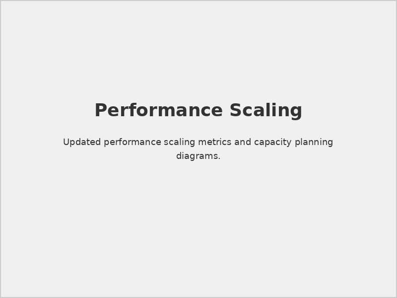
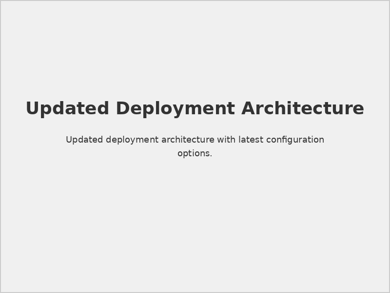

# Prerequisites for SIA, SOAR, TIP & CSAM (Edited)

## 📋 Document Overview

**Document Name:** Prerequisites for SIA, SOAR, TIP & CSAM_Edited.pdf  
**Pages:** 8 pages  
**Category:** Prerequisites and Setup  
**Version:** Edited/Updated Version  
**Last Updated:** As per document timestamp  

## 📝 Description

This updated and edited version of the prerequisites document provides refined and enhanced requirements for implementing Securaa's integrated security solutions. It includes corrections, clarifications, and additional requirements based on field deployment experience and customer feedback.

## 🎯 Purpose

To provide deployment teams with the most current and accurate prerequisite information for successful implementation of the complete Securaa security platform suite, ensuring optimal performance and reliability.

## 🆕 Key Updates in Edited Version

### Enhanced Requirements
- **Updated Hardware Specifications:** Revised based on performance analysis
- **Refined Network Requirements:** Optimized for better performance
- **Additional Security Considerations:** Enhanced security prerequisites
- **Improved Compatibility Matrix:** Updated third-party compatibility
- **Expanded Environment Support:** Additional deployment scenarios

### Clarifications Added
- **Installation Order Dependencies:** Clear sequence requirements
- **Configuration Prerequisites:** Detailed pre-configuration needs
- **Integration Readiness:** Enhanced integration prerequisites
- **Performance Baselines:** Established performance expectations

## 🔧 Revised System Requirements

### 1. **Enhanced Hardware Specifications**

#### Minimum Requirements (Updated)
| Component | Small Deployment | Medium Deployment | Large Deployment |
|-----------|------------------|-------------------|------------------|
| **CPU** | 16 cores, 2.4 GHz | 32 cores, 2.6 GHz | 64+ cores, 3.0 GHz |
| **Memory** | 64 GB RAM | 128 GB RAM | 256+ GB RAM |
| **Storage** | 2 TB NVMe SSD | 8 TB NVMe SSD | 20+ TB NVMe SSD |
| **Network** | 10 Gbps | 25 Gbps | 40+ Gbps |

#### Performance Considerations

*Updated performance scaling recommendations*

### 2. **Network Requirements Refinement**

#### Bandwidth Allocation
```yaml
# Updated Network Requirements
network_requirements:
  core_platform:
    minimum_bandwidth: "1 Gbps"
    recommended_bandwidth: "10 Gbps"
    latency_max: "10ms"
  
  data_ingestion:
    peak_throughput: "5 Gbps"
    sustained_throughput: "2 Gbps"
    buffer_capacity: "1 TB"
  
  integration_traffic:
    api_connections: "1000 concurrent"
    webhook_capacity: "10,000/minute"
    bulk_transfer: "100 MB/s"
```

#### Port Configuration (Updated)
| Service | Port | Protocol | Direction | Notes |
|---------|------|----------|-----------|-------|
| Web Interface | 443 | HTTPS | Inbound | SSL required |
| API Gateway | 8443 | HTTPS | Bidirectional | REST/GraphQL |
| Database | 5432 | PostgreSQL | Internal | Encrypted |
| Message Queue | 9092 | Kafka | Internal | SASL/SSL |
| Elasticsearch | 9200 | HTTPS | Internal | Cluster communication |
| Redis Cache | 6379 | Redis | Internal | In-memory cache |

### 3. **Enhanced Security Prerequisites**

#### Certificate Requirements
- **Root CA Certificates:** Enterprise certificate authority
- **SSL/TLS Certificates:** Wildcard or SAN certificates
- **Client Certificates:** Mutual authentication support
- **Code Signing:** Software integrity verification

#### Authentication Integration
```ldap
# Enhanced LDAP Configuration
dn: cn=securaa-service,ou=service-accounts,dc=company,dc=com
objectClass: user
sAMAccountName: securaa-service
userPrincipalName: securaa-service@company.com
memberOf: cn=SecurityAdmins,ou=groups,dc=company,dc=com
pwdLastSet: 0
userAccountControl: 66048
```

## 📊 Updated Architecture Diagrams

### Deployment Architecture (Revised)

*Refined deployment architecture with enhanced components*

### Data Flow (Enhanced)

*Updated data flow patterns with optimization points*

### Integration Topology (Improved)

*Enhanced integration patterns and connection methods*

## 🏗️ Infrastructure Prerequisites (Enhanced)

### 1. **Virtualization Platform Requirements**

#### VMware vSphere (Updated)
- **Version:** vSphere 7.0 U3 or later
- **vCenter:** vCenter Server 7.0 U3 or later
- **ESXi:** ESXi 7.0 U3 on all hosts
- **vSAN:** vSAN 7.0 U3 (if using vSAN storage)
- **NSX:** NSX-T 3.2 or later (recommended)

#### Microsoft Hyper-V (Updated)
- **Version:** Windows Server 2019/2022 Hyper-V
- **Clustering:** Windows Server Failover Clustering
- **Storage:** Cluster Shared Volumes (CSV)
- **Networking:** Hyper-V Virtual Switch with SR-IOV

#### Kubernetes (New Addition)
```yaml
# Kubernetes Cluster Requirements
kubernetes_requirements:
  version: "1.24+"
  nodes:
    master: 3
    worker: 5
  resources_per_node:
    cpu: "16 cores"
    memory: "32 GB"
    storage: "500 GB SSD"
  networking:
    cni: "Calico or Cilium"
    ingress: "NGINX or Istio"
  storage:
    class: "fast-ssd"
    provisioner: "dynamic"
```

### 2. **Database Platform Requirements (Updated)**

#### PostgreSQL (Primary Database)
- **Version:** PostgreSQL 14.x or 15.x
- **Extensions:** Required extensions list
- **Configuration:** Optimized for OLTP/OLAP workloads
- **Replication:** Streaming replication for HA
- **Backup:** Point-in-time recovery capability

#### Elasticsearch (Enhanced Requirements)
- **Version:** Elasticsearch 8.x
- **Cluster Size:** Minimum 3 nodes for production
- **Index Templates:** Pre-configured for security data
- **Security:** X-Pack security enabled
- **Monitoring:** Elastic monitoring stack

#### Redis (New Requirement)
- **Version:** Redis 7.x
- **Mode:** Cluster mode for high availability
- **Persistence:** RDB + AOF for data durability
- **Memory:** Dedicated memory allocation
- **Security:** AUTH and TLS encryption

### 3. **Message Queue Requirements (New)**

#### Apache Kafka
```properties
# Kafka Configuration Requirements
num.network.threads=8
num.io.threads=16
socket.send.buffer.bytes=102400
socket.receive.buffer.bytes=102400
socket.request.max.bytes=104857600
log.retention.hours=168
log.segment.bytes=1073741824
num.partitions=12
default.replication.factor=3
min.insync.replicas=2
```

## 🔐 Enhanced Security Prerequisites

### 1. **Identity and Access Management**

#### Multi-Factor Authentication
- **TOTP Support:** Time-based one-time passwords
- **Hardware Tokens:** FIDO2/WebAuthn support
- **Biometric Integration:** Fingerprint/facial recognition
- **Risk-Based Authentication:** Adaptive authentication

#### Privileged Access Management
- **Just-in-Time Access:** Temporary elevated privileges
- **Session Recording:** Administrative session logging
- **Approval Workflows:** Multi-person authorization
- **Emergency Access:** Break-glass procedures

### 2. **Network Security Enhancements**

#### Zero Trust Architecture
```yaml
# Zero Trust Network Configuration
zero_trust_config:
  micro_segmentation:
    enabled: true
    policy_enforcement: "strict"
  device_trust:
    certificate_based: true
    device_compliance: "required"
  user_verification:
    continuous_authentication: true
    risk_scoring: "enabled"
```

#### Network Monitoring
- **Deep Packet Inspection:** Traffic analysis capability
- **Network Detection and Response:** NDR integration
- **Threat Hunting:** Network-based threat hunting
- **Forensics:** Network traffic retention

## 🔍 Validation and Testing (Enhanced)

### 1. **Pre-Deployment Validation**

#### Infrastructure Testing
```bash
#!/bin/bash
# Enhanced Infrastructure Validation Script

echo "=== Securaa Infrastructure Validation ==="

# Hardware validation
echo "Checking hardware requirements..."
check_cpu_cores
check_memory_capacity
check_storage_performance
check_network_bandwidth

# Software validation
echo "Validating software prerequisites..."
check_os_version
check_docker_version
check_kubernetes_cluster
check_database_connectivity

# Security validation
echo "Validating security configuration..."
check_ssl_certificates
check_firewall_rules
check_authentication_integration
check_encryption_settings

echo "Validation complete. Review results above."
```

#### Performance Baseline
- **Throughput Testing:** Data processing capacity
- **Latency Measurement:** Response time baselines
- **Concurrency Testing:** Multi-user performance
- **Stress Testing:** Peak load validation

### 2. **Security Validation**

#### Penetration Testing
- **External Testing:** Internet-facing components
- **Internal Testing:** Network segmentation validation
- **Application Testing:** Web application security
- **API Testing:** RESTful API security validation

#### Compliance Validation
- **Framework Mapping:** SOC 2, ISO 27001, PCI DSS
- **Control Testing:** Security control validation
- **Gap Analysis:** Compliance gap identification
- **Remediation Planning:** Control improvement roadmap

## ⚠️ Critical Implementation Notes

> **Breaking Changes:** This edited version includes breaking changes from the original. Review all requirements carefully.

> **Migration Path:** Existing installations may require updates to meet new requirements.

> **Performance Impact:** New requirements may affect system performance during transition.

> **Support Compatibility:** Ensure support team is aware of updated requirements.

## 🔗 Related Documents

- [Prerequisites for SIA, SOAR, TIP & CSAM](./Prerequisites-for-SIA-SOAR-TIP-CSAM-README.md) - Original version
- [SIA Hardware Specs](./SIA-Hardware-Specs-README.md) - Detailed hardware requirements
- [STS-Securaa Solution Architecture](./STS-Securaa-Solution-Architecture-README.md) - Architecture overview
- [Securaa Installation and Deployment Guide](./Securaa-Installation-and-Deployment-Guide-README.md) - Installation procedures

## 📞 Support Information

For updated prerequisites and implementation guidance:

- **Technical Architecture:** Updated architecture consultation
- **Migration Services:** Assistance with requirement updates
- **Validation Support:** Pre-deployment validation assistance
- **Emergency Support:** Critical implementation issues

---

*This README provides an overview of the edited Prerequisites for SIA, SOAR, TIP & CSAM document. For complete updated requirements and implementation procedures, refer to the full PDF document.*