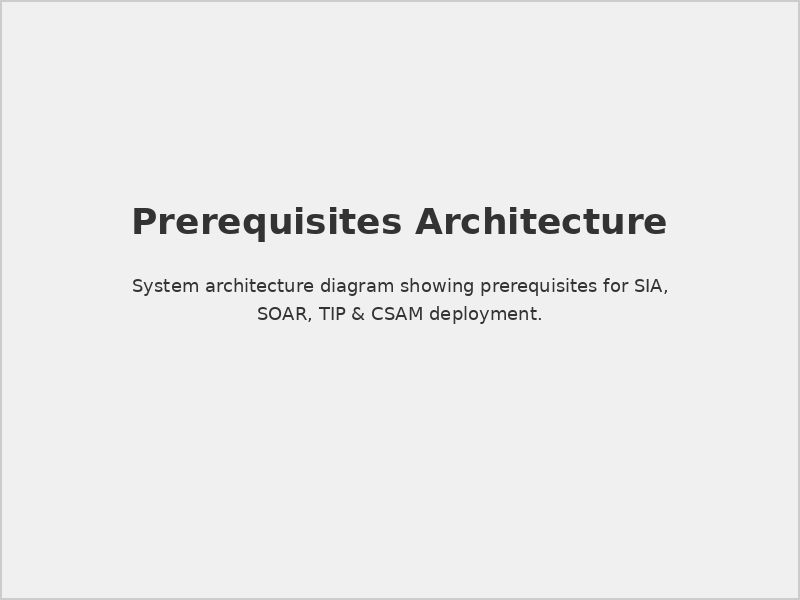
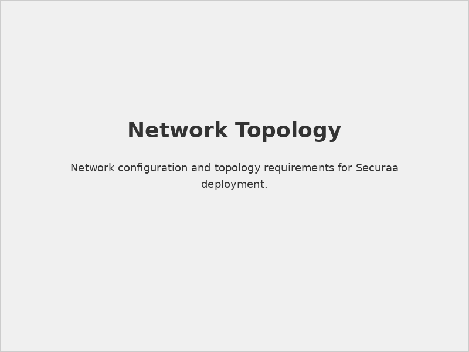
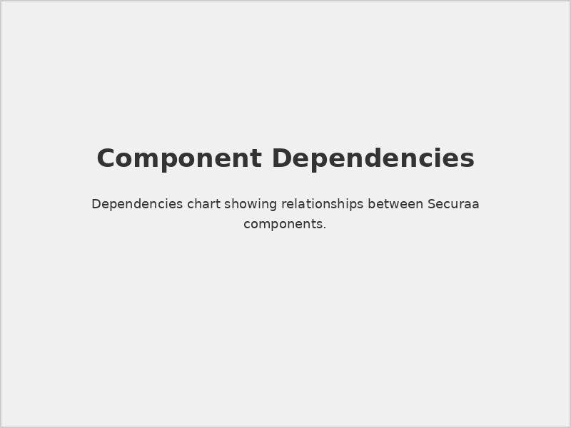

# Prerequisites for SIA, SOAR, TIP & CSAM

## 📋 Document Overview

**Document Name:** Prerequisites for SIA, SOAR, TIP & CSAM.pdf  
**Pages:** 8 pages  
**Category:** Prerequisites and Setup  
**Last Updated:** As per document timestamp  

## 📝 Description

This comprehensive document outlines the essential prerequisites and requirements for implementing Securaa's integrated security solutions including Security Intelligence & Analytics (SIA), Security Orchestration, Automation and Response (SOAR), Threat Intelligence Platform (TIP), and Cyber Security Asset Management (CSAM).

## 🎯 Purpose

The document serves as a pre-implementation checklist to ensure all necessary components, configurations, and dependencies are in place before deploying Securaa's security platform suite.

## 🔧 Key Components Covered

### 1. **System Requirements**
   - Hardware specifications
   - Operating system compatibility
   - Network configuration requirements
   - Storage and memory allocations

### 2. **Software Dependencies**
   - Required software packages
   - Database prerequisites
   - Third-party integrations
   - Licensing requirements

### 3. **Network Prerequisites**
   - Port configurations
   - Firewall settings
   - DNS requirements
   - SSL/TLS certificates

### 4. **Security Considerations**
   - Authentication mechanisms
   - Access control requirements
   - Encryption standards
   - Compliance prerequisites

## 📊 Visual Elements

### Architecture Diagrams

*Comprehensive architecture diagram showing component relationships*

### Network Topology

*Required network configuration and connectivity*

### Component Dependencies

*Visual representation of system dependencies*

## ✅ Prerequisites Checklist

### Infrastructure Requirements
- [ ] Server hardware meeting minimum specifications
- [ ] Network connectivity with required bandwidth
- [ ] Storage capacity for data and logs
- [ ] Backup and disaster recovery setup

### Software Requirements
- [ ] Compatible operating system installed
- [ ] Required database systems configured
- [ ] Third-party software dependencies installed
- [ ] Security patches and updates applied

### Security Setup
- [ ] SSL certificates obtained and configured
- [ ] Firewall rules configured according to specifications
- [ ] User authentication system prepared
- [ ] Access control policies defined

### Integration Readiness
- [ ] SIEM systems prepared for integration
- [ ] Threat intelligence feeds configured
- [ ] Asset inventory systems ready
- [ ] Monitoring and alerting systems prepared

## 🚀 Implementation Steps

1. **Environment Preparation**
   - Validate hardware requirements
   - Configure network settings
   - Install base operating systems

2. **Software Installation**
   - Install required databases
   - Configure web servers
   - Set up monitoring tools

3. **Security Configuration**
   - Configure SSL/TLS
   - Set up authentication
   - Apply security policies

4. **Integration Setup**
   - Connect to existing systems
   - Configure data feeds
   - Test connectivity

## 📋 Validation Criteria

### Performance Benchmarks
- System response times
- Data processing throughput
- Concurrent user capacity
- Resource utilization metrics

### Security Validation
- Authentication functionality
- Data encryption verification
- Access control testing
- Compliance audit preparation

## ⚠️ Important Notes

> **Warning:** Ensure all prerequisites are met before proceeding with installation. Missing requirements may cause deployment failures or security vulnerabilities.

> **Tip:** Use the provided checklists to systematically verify each requirement before moving to the next phase.

## 🔗 Related Documents

- [SIA Hardware Specs](./SIA-Hardware-Specs-README.md) - Detailed hardware requirements
- [STS-Securaa Solution Architecture](./STS-Securaa-Solution-Architecture-README.md) - Overall solution architecture
- [Securaa Installation and Deployment Guide](./Securaa-Installation-and-Deployment-Guide-README.md) - Installation procedures

## 📞 Support Information

For questions regarding prerequisites or implementation planning:

- **Technical Support:** Refer to Securaa technical documentation
- **Implementation Assistance:** Contact Securaa professional services
- **Community Resources:** Access Securaa community forums

---

*This README provides an overview of the Prerequisites for SIA, SOAR, TIP & CSAM document. For complete details, refer to the full PDF document.*