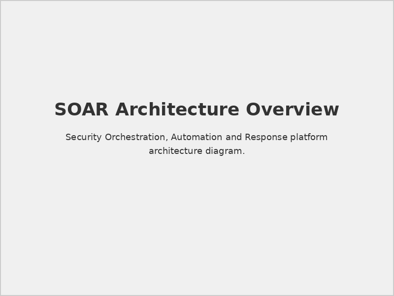
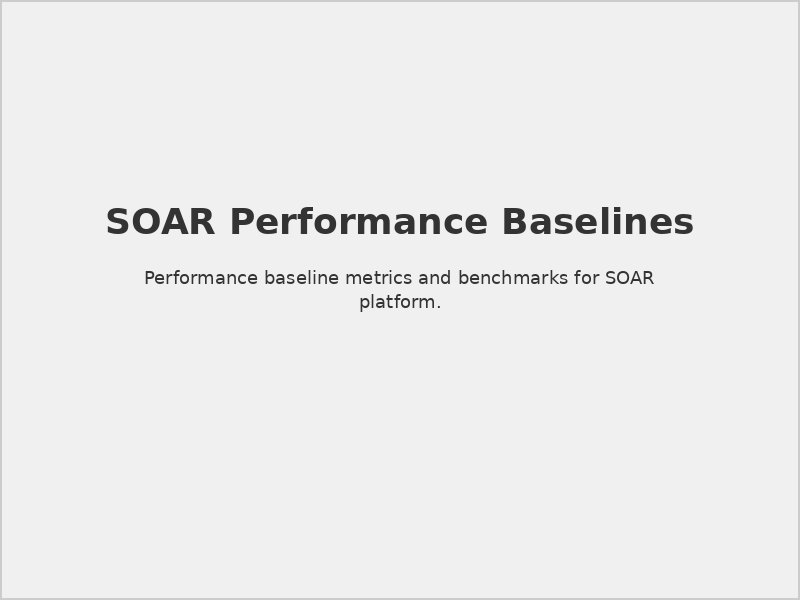

# Prerequisites for SOAR

## 📋 Document Overview

**Document Name:** Prerequisites for SOAR.pdf  
**Pages:** 7 pages  
**Category:** Prerequisites and Setup  
**Last Updated:** As per document timestamp  

## 📝 Description

This focused document outlines the specific prerequisites and requirements for implementing Securaa's Security Orchestration, Automation and Response (SOAR) platform. It provides detailed technical requirements, infrastructure specifications, and preparation guidelines for successful SOAR deployment.

## 🎯 Purpose

To enable technical teams to properly prepare environments for SOAR platform deployment, ensuring all necessary components, integrations, and configurations are in place for optimal automation and orchestration capabilities.

## 🤖 SOAR Platform Overview

### Core Functionality
- **Security Orchestration:** Coordinated multi-tool security operations
- **Process Automation:** Automated security response workflows
- **Incident Response:** Structured incident management and resolution
- **Playbook Execution:** Automated security procedure execution
- **Integration Hub:** Centralized security tool connectivity

### Key Components
- **Workflow Engine:** Automation and orchestration core
- **Case Management:** Incident tracking and management
- **Integration Framework:** Third-party tool connectivity
- **Playbook Library:** Pre-built and custom automation scripts
- **Dashboard Interface:** Operational visibility and control

## 🔧 Technical Prerequisites

### 1. **Infrastructure Requirements**

#### Server Specifications
```yaml
# SOAR Server Requirements
soar_infrastructure:
  production_deployment:
    cpu_cores: 16
    memory_gb: 64
    storage_gb: 1000
    storage_type: "NVMe SSD"
    network_bandwidth: "10 Gbps"
  
  development_deployment:
    cpu_cores: 8
    memory_gb: 32
    storage_gb: 500
    storage_type: "SSD"
    network_bandwidth: "1 Gbps"
```

#### Architecture Components

*SOAR platform component architecture and data flows*

### 2. **Operating System Requirements**

#### Supported Platforms
- **Linux Distributions:**
  - Red Hat Enterprise Linux 8.x/9.x
  - CentOS 8/Rocky Linux 9
  - Ubuntu Server 20.04 LTS/22.04 LTS
  - SUSE Linux Enterprise Server 15

- **Container Platforms:**
  - Docker Engine 20.10+
  - Kubernetes 1.24+
  - Red Hat OpenShift 4.10+

#### System Configuration
```bash
# Required system configuration
echo "Configuring system for SOAR deployment..."

# Kernel parameters
echo 'vm.max_map_count=262144' >> /etc/sysctl.conf
echo 'fs.file-max=1000000' >> /etc/sysctl.conf
echo 'net.core.somaxconn=32768' >> /etc/sysctl.conf

# User limits
echo 'securaa soft nofile 65536' >> /etc/security/limits.conf
echo 'securaa hard nofile 65536' >> /etc/security/limits.conf
echo 'securaa soft nproc 32768' >> /etc/security/limits.conf
echo 'securaa hard nproc 32768' >> /etc/security/limits.conf

sysctl -p
```

### 3. **Database Requirements**

#### Primary Database (PostgreSQL)
- **Version:** PostgreSQL 13.x or later
- **Extensions:** Required PostgreSQL extensions
- **Configuration:** Optimized for SOAR workloads
- **Storage:** Dedicated high-performance storage
- **Backup:** Automated backup and point-in-time recovery

#### Database Configuration
```sql
-- SOAR-specific PostgreSQL configuration
-- postgresql.conf optimizations
shared_buffers = '16GB'
effective_cache_size = '48GB'
work_mem = '256MB'
maintenance_work_mem = '2GB'
max_connections = 200
max_parallel_workers_per_gather = 4

-- Required extensions
CREATE EXTENSION IF NOT EXISTS "uuid-ossp";
CREATE EXTENSION IF NOT EXISTS "pg_trgm";
CREATE EXTENSION IF NOT EXISTS "btree_gin";
CREATE EXTENSION IF NOT EXISTS "pg_stat_statements";
```

#### Cache Layer (Redis)
- **Version:** Redis 6.x or later
- **Configuration:** Cluster mode for high availability
- **Memory:** Dedicated memory allocation for caching
- **Persistence:** RDB snapshots with AOF logging

## 🌐 Network Requirements

### 1. **Connectivity Specifications**

#### Internal Network
```yaml
# Network Configuration
network_config:
  management_network:
    subnet: "192.168.100.0/24"
    vlan_id: 100
    purpose: "Management and administration"
  
  data_network:
    subnet: "192.168.200.0/24"
    vlan_id: 200
    purpose: "Data processing and storage"
  
  integration_network:
    subnet: "192.168.300.0/24"
    vlan_id: 300
    purpose: "External integrations"
```

#### Port Requirements
| Service | Port | Protocol | Direction | Purpose |
|---------|------|----------|-----------|---------|
| Web UI | 443 | HTTPS | Inbound | User interface |
| API Gateway | 8443 | HTTPS | Bidirectional | REST API |
| Webhook Receiver | 9443 | HTTPS | Inbound | External webhooks |
| Database | 5432 | PostgreSQL | Internal | Database access |
| Redis | 6379 | TCP | Internal | Cache access |
| LDAP | 389/636 | LDAP/LDAPS | Outbound | Authentication |

### 2. **Security Requirements**

#### SSL/TLS Configuration
```nginx
# NGINX SSL Configuration for SOAR
server {
    listen 443 ssl http2;
    server_name soar.company.com;
    
    ssl_certificate /etc/ssl/certs/soar.crt;
    ssl_certificate_key /etc/ssl/private/soar.key;
    ssl_protocols TLSv1.2 TLSv1.3;
    ssl_ciphers ECDHE-RSA-AES128-GCM-SHA256:ECDHE-RSA-AES256-GCM-SHA384;
    ssl_prefer_server_ciphers off;
    
    # Security headers
    add_header Strict-Transport-Security "max-age=31536000; includeSubDomains" always;
    add_header X-Frame-Options DENY always;
    add_header X-Content-Type-Options nosniff always;
    add_header X-XSS-Protection "1; mode=block" always;
}
```

#### Firewall Configuration
```bash
# Firewall rules for SOAR
firewall-cmd --permanent --add-port=443/tcp --zone=public
firewall-cmd --permanent --add-port=8443/tcp --zone=internal
firewall-cmd --permanent --add-port=9443/tcp --zone=integration
firewall-cmd --permanent --add-service=postgresql --zone=database
firewall-cmd --reload
```

## 🔗 Integration Prerequisites

### 1. **SIEM Integration Readiness**

#### Supported SIEM Platforms

*Supported SIEM platforms and integration methods*

#### Integration Requirements
```json
{
  "siem_integrations": {
    "splunk": {
      "version": "8.2+",
      "api_access": "REST API enabled",
      "authentication": "Token-based",
      "permissions": ["search", "dispatch", "write"]
    },
    "qradar": {
      "version": "7.4+",
      "api_access": "REST API enabled", 
      "authentication": "API key",
      "permissions": ["admin", "offense_read", "reference_data"]
    },
    "elasticsearch": {
      "version": "7.10+",
      "api_access": "REST API enabled",
      "authentication": "API key or certificate",
      "permissions": ["read", "write", "monitor"]
    }
  }
}
```

### 2. **Security Tool Integration**

#### Endpoint Security
- **CrowdStrike Falcon:** API access and permissions
- **Microsoft Defender:** Graph API integration
- **Carbon Black:** REST API connectivity
- **SentinelOne:** Management console API

#### Network Security
- **Palo Alto Networks:** PAN-OS API access
- **Cisco Firepower:** FMC API integration
- **Fortinet FortiGate:** FortiOS API access
- **Check Point:** Management API access

#### Vulnerability Management
- **Tenable Nessus:** Tenable.io/Security Center API
- **Qualys VMDR:** Qualys API platform access
- **Rapid7 InsightVM:** Platform API integration

### 3. **Communication Platforms**

#### Email Integration
```yaml
# Email service configuration
email_config:
  smtp_server: "smtp.company.com"
  port: 587
  encryption: "STARTTLS"
  authentication: "username_password"
  from_address: "soar-noreply@company.com"
```

#### Collaboration Tools
- **Microsoft Teams:** Graph API integration
- **Slack:** Bot API and webhook integration
- **ServiceNow:** REST API table access
- **Jira:** REST API project access

## 👥 User and Access Prerequisites

### 1. **Identity Management Integration**

#### Active Directory Integration
```ldap
# LDAP configuration for AD integration
ldap_config:
  server_uri: "ldaps://dc.company.com:636"
  bind_dn: "CN=soar-service,OU=Service Accounts,DC=company,DC=com"
  search_base: "DC=company,DC=com"
  user_filter: "(&(objectClass=user)(sAMAccountName=%(user)s))"
  group_filter: "(&(objectClass=group)(member=%(user_dn)s))"
  attributes:
    username: "sAMAccountName"
    email: "mail"
    first_name: "givenName"
    last_name: "sn"
```

#### Single Sign-On (SSO)
- **SAML 2.0:** Identity provider integration
- **OAuth 2.0/OpenID Connect:** Modern authentication
- **Multi-Factor Authentication:** MFA provider integration

### 2. **Role-Based Access Control**

#### SOAR User Roles
| Role | Permissions | Description |
|------|-------------|-------------|
| **SOC Analyst** | View cases, execute playbooks | Operational security analysis |
| **Incident Manager** | Manage cases, approve actions | Incident response coordination |
| **Playbook Developer** | Create/edit playbooks | Automation development |
| **Integration Admin** | Configure integrations | System integration management |
| **System Admin** | Full system access | Complete platform administration |

## 📊 Performance and Capacity Planning

### 1. **Capacity Requirements**

#### Workload Estimation
```yaml
# Capacity planning parameters
capacity_planning:
  daily_events: 100000
  concurrent_playbooks: 50
  case_volume: 500
  integration_calls: 10000
  user_sessions: 100
  
  storage_growth:
    events_per_day: "10 GB"
    cases_per_month: "5 GB"
    logs_per_day: "2 GB"
    retention_period: "365 days"
```

#### Performance Baselines

*Expected performance metrics and capacity thresholds*

### 2. **Monitoring Prerequisites**

#### System Monitoring
- **Infrastructure Monitoring:** CPU, memory, disk, network
- **Application Monitoring:** Response times, error rates
- **Database Monitoring:** Query performance, connection pools
- **Integration Monitoring:** API response times, error rates

#### Alerting Configuration
```yaml
# Monitoring and alerting configuration
monitoring_config:
  metrics:
    - name: "playbook_execution_time"
      threshold: "300s"
      severity: "warning"
    - name: "integration_api_errors"
      threshold: "5%"
      severity: "critical"
    - name: "database_connections"
      threshold: "80%"
      severity: "warning"
  
  notifications:
    - channel: "email"
      recipients: ["soar-admins@company.com"]
    - channel: "slack"
      webhook: "https://hooks.slack.com/services/..."
```

## ⚠️ Important Considerations

> **Integration Dependencies:** Ensure all target systems have API access configured before SOAR deployment.

> **Performance Planning:** Size infrastructure based on expected automation volume and complexity.

> **Security Hardening:** Implement defense-in-depth security measures for the SOAR platform.

> **Change Management:** Establish proper change control for playbook modifications.

## 🔗 Related Documents

- [Prerequisites for SIA, SOAR, TIP & CSAM](./Prerequisites-for-SIA-SOAR-TIP-CSAM-README.md) - Complete prerequisites
- [Securaa POC Prerequisites For SOAR](./Securaa-POC-Prerequisites-For-SOAR-README.md) - POC-specific requirements
- [Securaa Datasheet Playbooks](./Securaa-Datasheet-Playbooks-README.md) - Automation capabilities
- [STS-Securaa Solution Architecture](./STS-Securaa-Solution-Architecture-README.md) - Architecture overview

## 📞 Support Information

For SOAR prerequisites and deployment planning:

- **Technical Consultation:** SOAR architecture and sizing guidance
- **Integration Planning:** Third-party integration preparation
- **Performance Planning:** Capacity and performance optimization
- **Security Review:** Security configuration validation

---

*This README provides an overview of the Prerequisites for SOAR document. For detailed technical specifications and deployment procedures, refer to the complete PDF document.*