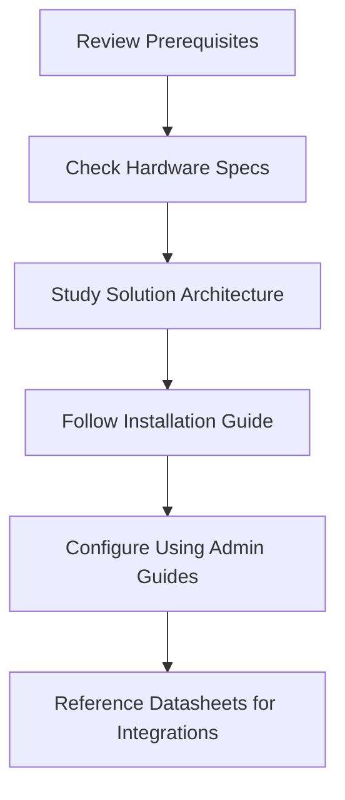

# Securaa External Documents

Welcome to the Securaa External Documents repository. This repository contains comprehensive documentation for various Securaa security solutions and their implementation guidelines.

## 📋 Document Index

### Prerequisites and Setup
- [Prerequisites for SIA, SOAR, TIP & CSAM](./Prerequisites-for-SIA-SOAR-TIP-CSAM-README.md)
- [Prerequisites for SIA, SOAR, TIP & CSAM (Edited)](./Prerequisites-for-SIA-SOAR-TIP-CSAM-Edited-README.md)
- [Prerequisites for SOAR](./Prerequisites-for-SOAR-README.md)
- [Securaa POC Prerequisites For SOAR](./Securaa-POC-Prerequisites-For-SOAR-README.md)
- [Securaa Prerequisites For SOAR & TIP](./Securaa-Prerequisites-For-SOAR-TIP-README.md)

### Hardware and Architecture
- [SIA Hardware Specs](./SIA-Hardware-Specs-README.md)
- [STS-Securaa Solution Architecture](./STS-Securaa-Solution-Architecture-README.md)

### Administration Guides
- [Securaa CSAM Administration Guide](./Securaa-CSAM-Administration-Guide-README.md)
- [Securaa TIP Administration Guide v2](./Securaa-TIP-Administration-Guide-v2-README.md)

### Installation and Deployment
- [Securaa Installation and Deployment Guide](./Securaa-Installation-and-Deployment-Guide-README.md)

### Product Datasheets
- [Securaa Datasheet Integrations](./Securaa-Datasheet-Integrations-README.md)
- [Securaa Datasheet Playbooks](./Securaa-Datasheet-Playbooks-README.md)

## 🔧 Solution Components

### SIA (Security Intelligence & Analytics)
Security Intelligence and Analytics platform for threat detection and analysis.

### SOAR (Security Orchestration, Automation and Response)
Comprehensive security orchestration platform for incident response automation.

### TIP (Threat Intelligence Platform)
Advanced threat intelligence platform for proactive security measures.

### CSAM (Cyber Security Asset Management)
Asset management solution for cybersecurity infrastructure.

## 📖 How to Use This Repository

1. **Browse by Category**: Use the document index above to find specific documentation types
2. **Prerequisites First**: Start with prerequisite documents before implementation
3. **Follow Implementation Order**: Architecture → Prerequisites → Installation → Administration
4. **Reference Datasheets**: Use datasheets for technical specifications and integrations

## 🏗️ Implementation Workflow



## 📁 File Structure

```
securaa-external-documents/
├── README.md                                          # This file
├── Prerequisites for SIA, SOAR, TIP & CSAM.pdf
├── Prerequisites for SIA, SOAR, TIP & CSAM_Edited.pdf
├── Prerequisites for SOAR.pdf
├── SIA Hardware Specs .pdf
├── STS-Securaa Solution Architecture.pdf
├── Securaa CSAM Administration Guide.pdf
├── Securaa Datasheet Integrations.pdf
├── Securaa Datasheet Playbooks.pdf
├── Securaa Installation and Deployment Guide.pdf
├── Securaa POC Prerequisites For SOAR.pdf
├── Securaa Prerequisites For SOAR & TIP.pdf
├── Securaa TIP Administration Guide_v2.pdf
└── [Individual README files for each document]
```

## 🤝 Contributing

When adding new documents to this repository:

1. Add the PDF file to the root directory
2. Create a corresponding README.md file following the naming convention
3. Update this main README.md with the new document link
4. Ensure proper documentation structure and formatting

## 📞 Support

For technical support and questions regarding Securaa solutions, please refer to the individual document README files for specific contact information and support channels.

---

*This repository is maintained to provide comprehensive documentation for Securaa security solutions. Each document includes detailed README files with proper formatting, structure, and visual references.*