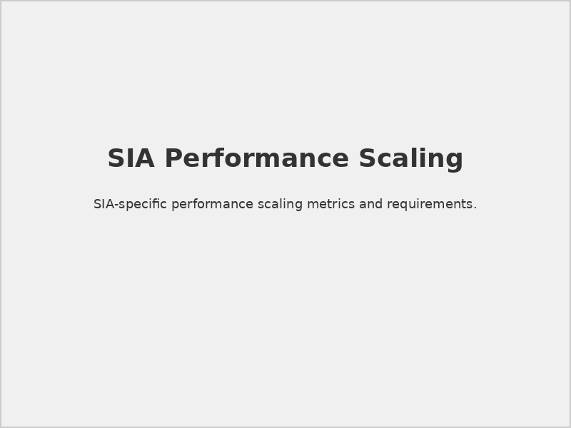
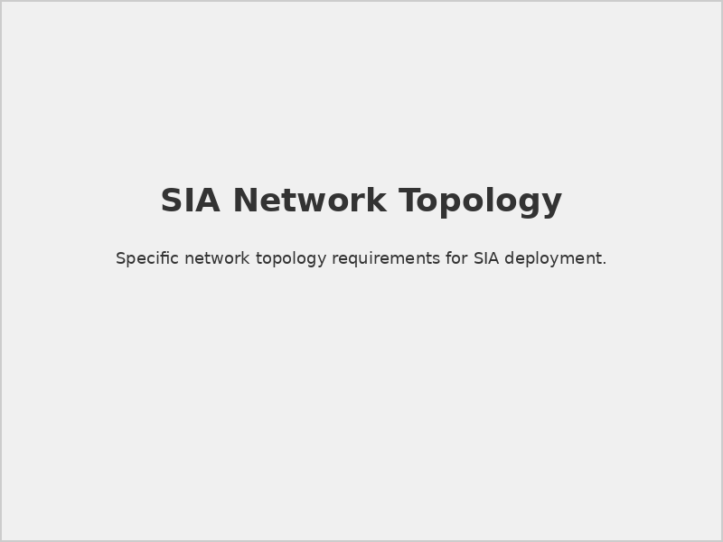

# SIA Hardware Specifications

## 📋 Document Overview

**Document Name:** SIA Hardware Specs .pdf  
**Pages:** 2 pages  
**Category:** Hardware and Architecture  
**Last Updated:** As per document timestamp  

## 📝 Description

This document outlines the essential hardware specifications and requirements for deploying and maintaining SIA (Securaa's AI service). The specifications are designed to support intensive computing tasks associated with AI workloads, including data processing, model training, and inference operations. Proper alignment with these requirements ensures smooth operation, reduced latency, and the ability to handle large datasets and complex algorithms efficiently.

## 🎯 Purpose

To ensure optimal performance and scalability for SIA: Securaa's AI service by providing minimum and recommended hardware specifications. By adhering to these recommendations, users can experience enhanced speed, efficiency, and reliability of AI operations across their security intelligence and analytics platform.

## 🔧 Core Hardware Requirements

### 1. **Processor (CPU)**
- **Model:** Intel or AMD processors
- **Minimum Cores:** 16 physical cores
- **Recommended Cores:** 32 cores for optimal performance
- **Architecture:** x86_64 compatible
- **Purpose:** Supporting intensive AI workloads including data processing, model training, and inference

### 2. **Memory (RAM)**
- **Minimum Installed:** 64GB DDR4
- **Expandable Up To:** 128GB DDR4 
- **Configuration:** 6 x 16GB DDR4-3200MHz DIMMs (for minimum requirement)
- **Slots Available:** At least 4 DIMM slots for expansion flexibility
- **Purpose:** Ensure sufficient memory for AI algorithms and large datasets

### 3. **Storage Requirements**
- **Primary Drive:** 1TB SSD (Solid State Drive)
  - **Type:** NVMe M.2 SSD
  - **Purpose:** Operating System and Application installation
- **Additional Storage Options:**
  - Consider adding another SSD or HDD for data redundancy and backups
  - Capacity depends on expected data usage and growth patterns

### 4. **Operating System**
- **OS:** Ubuntu (Latest Version)
- **Preconfigured:** Pre-installed and configured with Docker for containerized applications
- **Purpose:** Optimized environment for SIA AI service deployment

### 5. **Network Configuration**
- **Ethernet Ports:** Dual 1GbE ports (2 x 1 Gigabit Ethernet)
- **Optional:** 10GbE port if high network throughput is required
- **Network Interface:** Integrated on motherboard or dedicated NIC (Network Interface Card)
- **Purpose:** Reliable connectivity for data ingestion and processing

## 📊 Deployment Sizing Guide

### Small Deployment (Up to 10,000 events/sec)
```yaml
small_deployment:
  server_count: 1-2
  server_specs:
    cpu:
      cores: 16
      frequency: "2.4 GHz"
      architecture: "x86_64"
    memory:
      total: "64 GB"
      type: "DDR4-3200"
      configuration: "4x16GB modules"
    storage:
      primary:
        type: "NVMe M.2 SSD"
        capacity: "1 TB"
        purpose: "OS and applications"
      secondary:
        type: "SSD/HDD"
        capacity: "2-5 TB"
        purpose: "data and backups"
    network:
      primary: "2x1 Gbps"
      optional: "1x10 Gbps"
```

### Medium Deployment (10,000-50,000 events/sec)
```yaml
medium_deployment:
  server_count: 2-4
  server_specs:
    cpu:
      cores: 32
      frequency: "2.8 GHz"
      architecture: "x86_64"
    memory:
      total: "128 GB"
      type: "DDR4-3200"
      configuration: "8x16GB modules"
    storage:
      primary:
        type: "NVMe M.2 SSD"
        capacity: "2 TB"
        purpose: "OS and applications"
      secondary:
        type: "SSD/HDD"
        capacity: "10-20 TB"
        purpose: "data storage and backups"
    network:
      primary: "2x10 Gbps"
      management: "1 Gbps"
```

### Large/Enterprise Deployment (50,000+ events/sec)
```yaml
enterprise_deployment:
  server_count: 4-10
  cluster_architecture: "distributed"
  server_specs:
    cpu:
      cores: 64
      frequency: "3.0 GHz"
      architecture: "x86_64"
    memory:
      total: "256 GB"
      type: "DDR4-3200"
      configuration: "16x16GB modules"
    storage:
      primary:
        type: "NVMe M.2 SSD"
        capacity: "4 TB"
        purpose: "OS and applications"
      data:
        type: "NVMe SSD"
        capacity: "50-100 TB"
        purpose: "data analytics and ML"
    network:
      primary: "2x25 Gbps"
      management: "1 Gbps"
```

## 🔧 Configuration Guidelines

### Docker Environment Setup
- Ubuntu comes preconfigured with Docker for containerized applications
- Ensures consistent deployment and scaling of SIA services
- Facilitates maintenance and updates of AI service components

### Performance Optimization
- **Enhanced Speed:** Faster data processing with recommended CPU cores
- **Efficiency:** Optimized memory allocation for AI algorithms
- **Reliability:** Redundant storage and network configurations for high availability

### Growth Planning
- **Scalability:** Hardware specifications support growing data volumes
- **Expansion:** Memory expandable up to 128GB for future requirements
- **Flexibility:** Additional storage options based on usage patterns

## 📊 Visual References

### Hardware Architecture

*Complete hardware component layout showing recommended server configuration*

### Performance Scaling

*Hardware performance scaling with data volume and processing requirements*

### Network Configuration  

*Recommended network setup for optimal SIA deployment*

## ⚠️ Important Considerations

### Performance Notes
> **Storage Performance:** NVMe M.2 SSDs are strongly recommended for primary storage to achieve optimal SIA AI service performance.

> **Memory Requirements:** AI algorithms and large datasets require significant memory allocation. Ensure sufficient RAM is available beyond OS requirements.

> **Network Bandwidth:** Consider 10GbE upgrade if high network throughput is required for data-intensive AI operations.

### Scalability Guidelines
> **Planning for Growth:** Hardware specifications should account for expected data volume and processing growth.

> **Memory Expansion:** System supports expansion up to 128GB DDR4 for growing requirements.

> **Storage Flexibility:** Additional storage options should be evaluated based on data usage patterns and backup requirements.

### Docker Environment
> **Containerization:** Ubuntu comes preconfigured with Docker to support containerized AI applications.

> **Deployment Efficiency:** Docker environment ensures consistent deployment and scaling of SIA services.

> **Maintenance:** Facilitates easier maintenance and updates of AI service components.

## 🔗 Related Documents

- [Prerequisites for SIA, SOAR, TIP & CSAM](./Prerequisites-for-SIA-SOAR-TIP-CSAM-README.md) - Complete platform prerequisites and dependencies
- [STS-Securaa Solution Architecture](./STS-Securaa-Solution-Architecture-README.md) - Overall solution architecture and design patterns
- [Securaa Installation and Deployment Guide](./Securaa-Installation-and-Deployment-Guide-README.md) - Step-by-step installation procedures

## 📞 Support Information

For hardware specification questions and SIA deployment guidance:

- **Technical Support:** hardware-support@securaa.com
- **AI Service Consultation:** sia-support@securaa.com
- **Performance Planning:** performance@securaa.com

### Additional Resources
- Hardware sizing calculations and recommendations
- Vendor-specific configuration guidance
- Performance optimization consulting
- Deployment planning assistance

---

*This README provides comprehensive details based on the SIA Hardware Specifications document. The specifications ensure optimal performance and scalability for Securaa's AI service deployment across various environments.*