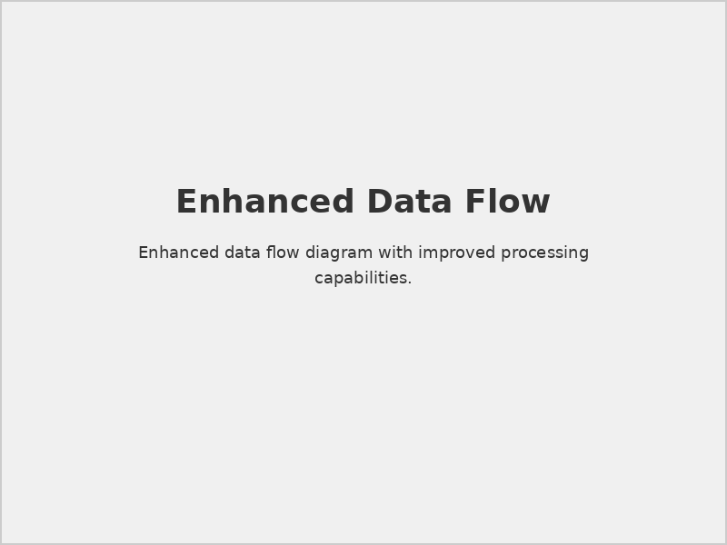

# STS-Securaa Solution Architecture

## 📋 Document Overview

**Document Name:** STS-Securaa Solution Architecture.pdf  
**Pages:** 8 pages  
**Category:** Hardware and Architecture  
**Last Updated:** As per document timestamp  

## 📝 Description

This comprehensive document presents the complete solution architecture for the STS-Securaa security platform. It identifies and provides details of all components that are part of Securaa SOAR software along with communication mechanisms with third-party tools.

## 🎯 Purpose

To provide architects, system integrators, and technical teams with a complete understanding of Securaa's solution architecture, enabling informed implementation and integration of the comprehensive security platform.

## 🌟 Platform Overview

Securaa combines the advantages of an established threat intelligence platform (TIP), cyber security asset management (CSAM), and dependable security orchestration, automation, and response (SOAR).

### Key Capabilities
- **Comprehensive Data Collection:** Security alerts, asset data, and indicators of compromise from multiple sources
- **Multi-Source Integration:** SIEMs, asset databases, network security tools, threat intelligence feeds, and mailboxes
- **Complete Visibility:** Single pane of glass for cyber assets, exposures, and incident response lifecycle automation
- **Automated Orchestration:** Playbooks coordinate across technologies, teams, and users for effective triage
- **Predictive Analytics:** Threat intelligence aggregation with scoring and contextual analysis

## 🏗️ Securaa Architecture Components

The Securaa SOAR Architecture consists of five core components:

### 1. **Securaa UI**
- **Technology:** React-based web interface deployed on Nginx server
- **Capabilities:** Configuration, integration management, case management, playbook formulation
- **Functions:** Investigation, triage activities, and SOC automation
- **Communication:** RESTful APIs for backend communication

### 2. **API Gateway**
- **Technology:** PHP gateway architecture
- **Communication:** Nginx to PHP gateway via Unix socket request forwarding
- **Purpose:** Interface between UI and backend services
- **Protocol:** HTTPS/HTTP API management

### 3. **Core Services**
- **Architecture:** REST-based web services, universally accessible
- **Functions:** Playbook execution, KPI monitoring, scheduled reporting, automated playbooks
- **Deployment:** Dockerized for seamless scalability
- **Purpose:** Foundation for system services and frontend operations

### 4. **Wrapper Services**
- **Design:** REST-based integration execution services
- **Independence:** Self-contained entities for rapid deployment
- **Advantages:** Precise integration control and data flow management
- **Deployment:** Dockerized for simplified development, testing, and deployment

### 5. **Database**
- **Primary Storage:** MongoDB for flexible, high-performance data management
- **Data Types:** User configurations, platforms, integrations, playbooks, requests, responses
- **Features:** Advanced indexing, automatic failover, high availability
- **Caching:** Redis integration using Cache-Aside Pattern for enhanced performance

## 🐳 Solution Components & Docker Services

### Process Management
All components within Securaa are containerized using Docker, providing a modular and efficient architectural approach.

**Core Binaries:**
- **zona_manager:** Orchestrates the initiation and supervision of zona_process_manager
- **zona_process_manager:** Manages container instantiation and operational continuity

### Docker Services Architecture

| Service | Port | Protocol | Exposed | Purpose |
|---------|------|----------|---------|---------|
| **securaa_ui_nginx** | 443 | HTTPS | Yes | Web Server Interface |
| **zona_user** | 8000 | HTTPS | Yes | Web Socket Communication |
| **zona_apis_manager** | 8051 | HTTPS | Yes | Core APIs |
| **phpfpm** | 9000 | HTTPS | No | API Gateway (nginx only) |
| **zona_siem** | 8223 | HTTP | No | Cases Related APIs |
| **zona_dashboard** | 8090 | HTTP | No | Dashboard Operations |
| **zona_integrations** | 8005 | HTTP | No | Wrapper Services APIs |
| **zona_playbook** | 8040 | HTTP | No | Playbook and Task Execution |
| **zona_querybuilder** | 8072 | HTTP | No | Query Filter Operations |
| **auto_purge_batch** | 10007 | HTTP | No | Automated Data Purging |

### Architecture Benefits

#### Scalability Features
- **Docker Containerization:** Modular deployment and scaling capabilities
- **MongoDB + Redis:** High-performance data storage with caching optimization
- **REST-based Services:** Universal accessibility and integration flexibility
- **Microservices Design:** Independent service deployment and maintenance

#### Performance Optimization
- **Cache-Aside Pattern:** Redis caching reduces MongoDB load and improves response times
- **Automatic Failover:** MongoDB high availability ensures continuous operation
- **Load Distribution:** Wrapper services provide independent integration processing
- **Concurrent User Support:** Enhanced architecture handles increased user loads efficiently

## 📊 Integration Architecture

### Data Flow Management
- **Multi-Source Ingestion:** SIEMs, asset databases, network tools, threat feeds, mailboxes
- **Real-time Processing:** Immediate threat detection and response capabilities
- **Automated Orchestration:** Playbook-driven incident response and case management
- **Centralized Visibility:** Single dashboard for complete security posture monitoring

### Communication Patterns
- **RESTful APIs:** Standard communication protocol for all services
- **Unix Socket Communication:** Optimized UI to gateway communication
- **HTTPS/HTTP Protocols:** Secure service-to-service communication
- **Web Socket Support:** Real-time user interface updates

## 📊 Visual Architecture

### Solution Architecture Overview

*Complete Securaa platform architecture showing all components and data flows*

### Component Dependencies  

*Detailed view of service dependencies and communication patterns*

### Data Flow Architecture

*Comprehensive data flow from ingestion through processing to response*

## ⚠️ Important Considerations

### Architecture Guidelines
> **Containerization:** All components are Docker-based for modularity and scalability.

> **Service Independence:** Wrapper services operate independently for rapid deployment and maintenance.

> **High Availability:** MongoDB automatic failover ensures continuous system operation.

### Performance Considerations
> **Caching Strategy:** Redis integration significantly improves data retrieval performance.

> **Scalability:** Docker architecture enables seamless scaling to meet varying demands.

> **Data Consistency:** MongoDB advanced indexing ensures strong data consistency and prevents data loss.

### Integration Requirements
> **API Standards:** RESTful APIs provide universal accessibility for integrations.

> **Protocol Support:** Both HTTPS and HTTP protocols supported for various integration needs.

> **Real-time Communication:** Web socket support enables immediate UI updates and notifications.

## 🔗 Related Documents

- [Prerequisites for SIA, SOAR, TIP & CSAM](./Prerequisites-for-SIA-SOAR-TIP-CSAM-README.md) - Platform deployment prerequisites
- [SIA Hardware Specs](./SIA-Hardware-Specs-README.md) - Hardware requirements for optimal performance
- [Securaa Installation and Deployment Guide](./Securaa-Installation-and-Deployment-Guide-README.md) - Installation procedures
- [Securaa Datasheet Integrations](./Securaa-Datasheet-Integrations-README.md) - Integration capabilities

## 📞 Support Information

For architecture planning and technical consultation:

- **Architecture Support:** architects@securaa.io
- **Technical Documentation:** Comprehensive architecture guides and specifications
- **Professional Services:** Custom architecture design and implementation consulting
- **Integration Planning:** Expert guidance on platform integration strategies

### Additional Resources
- Architecture best practices and implementation guides
- Docker deployment templates and configurations
- Performance tuning and optimization recommendations
- Security hardening guidelines for production deployments

---

*This README provides comprehensive details based on the STS-Securaa Solution Architecture document. The architecture demonstrates Securaa's modular, containerized approach to security orchestration with integrated TIP, CSAM, and SOAR capabilities.*