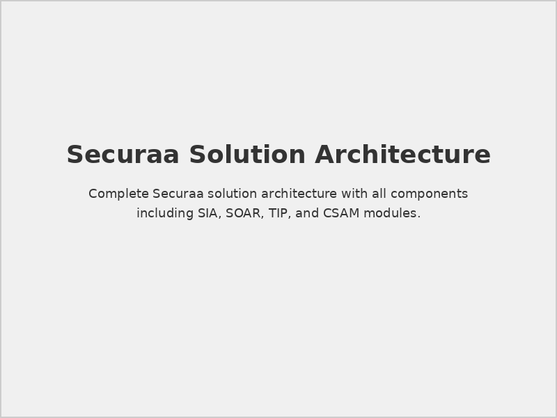
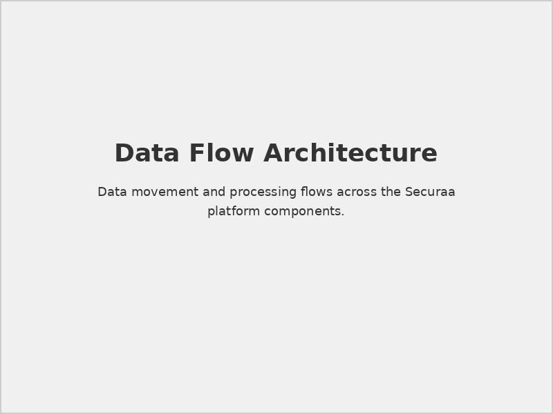
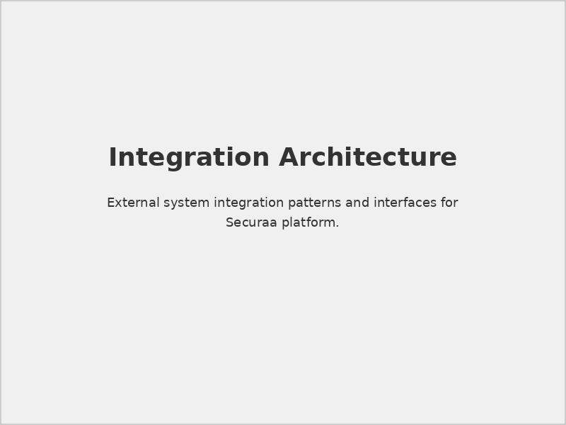
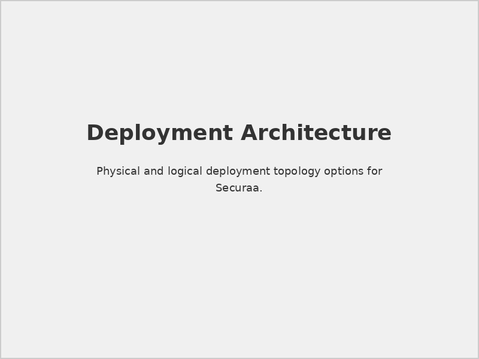
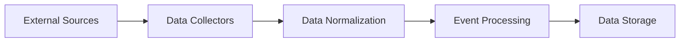
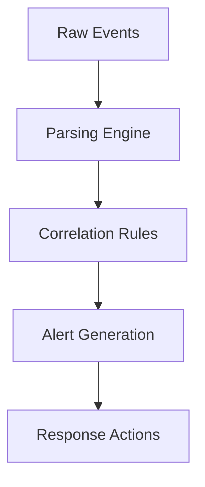
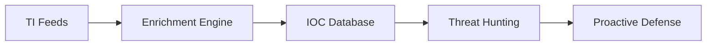

# STS-Securaa Solution Architecture

## 📋 Document Overview

**Document Name:** STS-Securaa Solution Architecture.pdf  
**Pages:** 8 pages  
**Category:** Hardware and Architecture  
**Last Updated:** As per document timestamp  

## 📝 Description

This comprehensive document presents the complete solution architecture for the STS-Securaa security platform. It provides detailed architectural views, component relationships, data flows, and integration patterns for implementing Securaa's enterprise security solutions.

## 🎯 Purpose

To provide architects, system integrators, and technical teams with a complete understanding of Securaa's solution architecture, enabling informed decision-making for implementation, integration, and customization of the security platform.

## 🏗️ Architecture Components

### 1. **Core Platform Architecture**

#### Security Intelligence & Analytics (SIA)
- **Data Collection Layer:** Multi-source data ingestion
- **Processing Engine:** Real-time analytics and correlation
- **Storage Layer:** Scalable data warehouse architecture
- **Visualization Layer:** Interactive dashboards and reports

#### Security Orchestration, Automation and Response (SOAR)
- **Workflow Engine:** Automated response orchestration
- **Integration Hub:** Third-party security tool connectivity
- **Case Management:** Incident tracking and resolution
- **Playbook Library:** Automated response procedures

#### Threat Intelligence Platform (TIP)
- **Intelligence Feeds:** External threat data sources
- **Correlation Engine:** Threat context analysis
- **IOC Management:** Indicators of Compromise handling
- **Threat Hunting:** Proactive threat discovery

#### Cyber Security Asset Management (CSAM)
- **Asset Discovery:** Automated asset identification
- **Inventory Management:** Comprehensive asset tracking
- **Vulnerability Assessment:** Security posture evaluation
- **Risk Scoring:** Asset-based risk calculations

### 2. **Integration Architecture**

#### API Gateway
- **RESTful APIs:** Standard integration interfaces
- **Authentication:** Secure API access control
- **Rate Limiting:** API usage management
- **Documentation:** Comprehensive API documentation

#### Message Bus
- **Event Streaming:** Real-time event processing
- **Queue Management:** Reliable message delivery
- **Protocol Support:** Multiple communication protocols
- **Scalability:** Horizontal scaling capabilities

## 📊 Architectural Diagrams

### High-Level Architecture

*Complete Securaa solution architecture with all components*

### Data Flow Architecture

*Data movement and processing flows across the platform*

### Integration Architecture

*External system integration patterns and interfaces*

### Deployment Architecture

*Physical and logical deployment topology options*

## 🔄 Data Flow Patterns

### 1. **Data Ingestion**

### 2. **Event Processing**

### 3. **Threat Intelligence**

## 🏭 Deployment Models

### 1. **On-Premises Deployment**

#### Single-Node Deployment
- **Use Case:** Small to medium environments
- **Components:** All services on single server
- **Scalability:** Vertical scaling options
- **Maintenance:** Simplified management

#### Multi-Node Deployment
- **Use Case:** Large enterprise environments
- **Components:** Distributed across multiple servers
- **Scalability:** Horizontal scaling capabilities
- **Availability:** High availability configurations

### 2. **Cloud Deployment**

#### Public Cloud
- **Platforms:** AWS, Azure, GCP support
- **Scaling:** Auto-scaling capabilities
- **Management:** Cloud-native services
- **Security:** Cloud security integrations

#### Private Cloud
- **Infrastructure:** Private cloud platforms
- **Control:** Enhanced security and control
- **Compliance:** Regulatory compliance support
- **Integration:** Existing infrastructure integration

#### Hybrid Cloud
- **Flexibility:** On-premises and cloud components
- **Data Governance:** Sensitive data on-premises
- **Scalability:** Cloud burst capabilities
- **Cost Optimization:** Workload placement optimization

### 3. **Container Deployment**

#### Kubernetes Architecture
- **Orchestration:** Container orchestration platform
- **Scalability:** Dynamic scaling based on demand
- **Resilience:** Self-healing capabilities
- **Management:** Declarative configuration

#### Microservices Pattern
- **Service Decomposition:** Independent service deployment
- **Technology Diversity:** Best-of-breed technology selection
- **Fault Isolation:** Service-level fault isolation
- **Development Agility:** Independent development teams

## 🔐 Security Architecture

### Identity and Access Management
- **Authentication:** Multi-factor authentication support
- **Authorization:** Role-based access control (RBAC)
- **Single Sign-On:** Enterprise SSO integration
- **Directory Services:** LDAP/AD integration

### Data Security
- **Encryption at Rest:** Database and file encryption
- **Encryption in Transit:** SSL/TLS communication
- **Key Management:** Centralized key management
- **Data Masking:** Sensitive data protection

### Network Security
- **Network Segmentation:** Micro-segmentation support
- **Firewall Integration:** Network security controls
- **VPN Support:** Secure remote access
- **Network Monitoring:** Traffic analysis and monitoring

## 📈 Scalability and Performance

### Horizontal Scaling
- **Load Balancing:** Intelligent traffic distribution
- **Auto-Scaling:** Demand-based scaling
- **Database Sharding:** Data distribution strategies
- **Caching Layers:** Performance optimization

### Performance Optimization
- **Query Optimization:** Database performance tuning
- **Indexing Strategies:** Efficient data retrieval
- **Memory Management:** Optimal memory utilization
- **Batch Processing:** Efficient bulk operations

## 🔧 Technology Stack

### Backend Technologies
- **Application Server:** Enterprise application platform
- **Database Systems:** Relational and NoSQL databases
- **Message Queues:** Reliable messaging infrastructure
- **Search Engine:** Full-text search capabilities

### Frontend Technologies
- **Web Framework:** Modern web application framework
- **Visualization:** Advanced charting and dashboards
- **User Interface:** Responsive design principles
- **Mobile Support:** Cross-platform mobile access

## ⚠️ Architecture Considerations

> **Scalability Planning:** Design for future growth and changing requirements from the initial implementation.

> **Security by Design:** Implement security controls at every architectural layer, not as an afterthought.

> **Integration Flexibility:** Ensure architecture supports current and future integration requirements.

## 🔗 Related Documents

- [Prerequisites for SIA, SOAR, TIP & CSAM](./Prerequisites-for-SIA-SOAR-TIP-CSAM-README.md) - Implementation prerequisites
- [SIA Hardware Specs](./SIA-Hardware-Specs-README.md) - Hardware requirements
- [Securaa Installation and Deployment Guide](./Securaa-Installation-and-Deployment-Guide-README.md) - Deployment procedures

## 📞 Support Information

For architecture and design consultation:

- **Solution Architects:** Securaa technical architecture team
- **Professional Services:** Implementation and customization services
- **Technical Documentation:** Complete architecture documentation

---

*This README provides an overview of the STS-Securaa Solution Architecture document. For detailed technical specifications and implementation guidance, refer to the complete PDF document.*