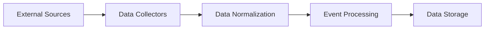
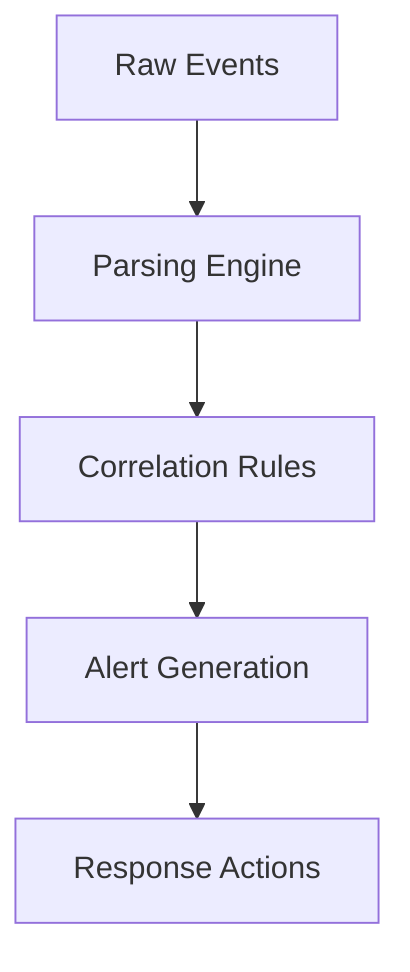

# STS-Securaa Solution Architecture

## 📋 Document Overview

**Document Name:** STS-Securaa Solution Architecture.pdf  
**Pages:** 8 pages  
**Category:** Hardware and Architecture  
**Last Updated:** As per document timestamp  

## 📝 Description

This comprehensive document presents the complete solution architecture for the STS-Securaa security platform. It provides detailed architectural views, component relationships, data flows, and integration patterns for implementing Securaa's enterprise security solutions.

## 🎯 Purpose

To provide architects, system integrators, and technical teams with a complete understanding of Securaa's solution architecture, enabling informed decision-making for implementation, integration, and customization of the security platform.

## 🏗️ Architecture Components

### 1. **Core Platform Architecture**

#### Security Intelligence & Analytics (SIA)
```yaml
# SIA Component Architecture
sia_components:
  data_collection_layer:
    components:
      - "Log Collectors (Syslog, Beats, Agents)"
      - "API Connectors (REST, GraphQL, SOAP)"
      - "Database Connectors (JDBC, ODBC)"
      - "Message Queue Consumers (Kafka, RabbitMQ)"
      - "File Processors (CSV, JSON, XML)"
    
    capabilities:
      - "Multi-format data ingestion"
      - "Real-time and batch processing"
      - "Protocol translation and normalization"
      - "Data validation and cleansing"
      - "Compression and encryption"
  
  processing_engine:
    components:
      - "Stream Processing Engine (Apache Kafka Streams)"
      - "Complex Event Processing (CEP)"
      - "Machine Learning Pipeline (MLflow)"
      - "Correlation Engine"
      - "Analytics Engine"
    
    features:
      - "Real-time analytics and correlation"
      - "Statistical analysis and trend detection"
      - "Anomaly detection using ML algorithms"
      - "Pattern recognition and classification"
      - "Risk scoring and threat assessment"
    
    performance:
      throughput: "100,000+ events/second"
      latency: "< 100ms for real-time processing"
      memory_usage: "32-64GB heap allocation"
      cpu_utilization: "16-32 cores optimal"
  
  storage_layer:
    hot_tier:
      technology: "Elasticsearch"
      purpose: "Real-time search and analytics"
      retention: "30-90 days"
      performance: "50,000+ IOPS"
      
    warm_tier:
      technology: "PostgreSQL + TimescaleDB"
      purpose: "Historical data and reports"
      retention: "1-2 years"
      performance: "10,000+ IOPS"
      
    cold_tier:
      technology: "Object Storage (S3, MinIO)"
      purpose: "Long-term archival"
      retention: "5-7 years"
      compression: "70-80% compression ratio"
  
  visualization_layer:
    dashboards:
      - "Executive Summary Dashboard"
      - "Security Operations Dashboard"
      - "Threat Intelligence Dashboard"
      - "Compliance Dashboard"
      - "Performance Monitoring Dashboard"
    
    reporting:
      - "Scheduled Report Generation"
      - "Ad-hoc Query Interface"
      - "Custom Report Builder"
      - "Data Export Capabilities"
      - "Alert and Notification System"
```

#### Security Orchestration, Automation and Response (SOAR)
```yaml
# SOAR Component Architecture
soar_components:
  workflow_engine:
    orchestration_capabilities:
      - "Visual Playbook Designer"
      - "Multi-step Workflow Execution"
      - "Conditional Logic and Branching"
      - "Parallel Task Execution"
      - "Error Handling and Recovery"
    
    execution_runtime:
      - "Python Script Engine"
      - "PowerShell Runner"
      - "Bash Script Executor"
      - "REST API Client"
      - "Database Query Engine"
    
    performance_metrics:
      concurrent_playbooks: 50
      execution_latency: "< 5 seconds"
      throughput: "1,000 tasks/minute"
      memory_per_workflow: "128MB average"
  
  integration_hub:
    supported_categories:
      - "SIEM Platforms (Splunk, QRadar, Sentinel)"
      - "Endpoint Security (CrowdStrike, Carbon Black)"
      - "Network Security (Palo Alto, Cisco ASA)"
      - "Vulnerability Management (Nessus, Qualys)"
      - "Ticketing Systems (ServiceNow, Jira)"
      - "Communication Tools (Slack, Teams, Email)"
    
    integration_patterns:
      - "REST API Integration"
      - "SOAP Web Services"
      - "Database Direct Connection"
      - "File-based Integration"
      - "Message Queue Integration"
    
    connection_management:
      - "Credential Vault Integration"
      - "Connection Pooling"
      - "Rate Limiting and Throttling"
      - "Circuit Breaker Pattern"
      - "Retry Logic with Backoff"
  
  case_management:
    incident_lifecycle:
      stages: ["Detection", "Triage", "Investigation", "Containment", "Eradication", "Recovery", "Lessons Learned"]
      automation_points: ["Auto-creation", "Enrichment", "Escalation", "Resolution", "Closure"]
      sla_management: "Configurable SLA tracking and alerts"
    
    collaboration_features:
      - "Multi-user Case Assignment"
      - "Comment and Note System"
      - "File Attachment Management"
      - "Activity Timeline"
      - "Stakeholder Notifications"
    
    metrics_tracking:
      - "Mean Time to Detection (MTTD)"
      - "Mean Time to Response (MTTR)"
      - "Case Resolution Rate"
      - "Analyst Productivity Metrics"
      - "Automation Success Rate"
  
  playbook_library:
    pre_built_playbooks:
      - "Malware Response"
      - "Phishing Investigation"
      - "Data Breach Response"
      - "Insider Threat Investigation"
      - "Network Intrusion Response"
      - "Vulnerability Management"
    
    custom_development:
      - "Drag-and-Drop Designer"
      - "Code-based Development"
      - "Template-based Creation"
      - "Version Control Integration"
      - "Testing and Validation Tools"
```

#### Threat Intelligence Platform (TIP)
```yaml
# TIP Component Architecture
tip_components:
  intelligence_feeds:
    commercial_feeds:
      providers: ["Recorded Future", "ThreatConnect", "FireEye", "Mandiant"]
      formats: ["STIX 2.0/2.1", "TAXII 2.0/2.1", "JSON", "XML", "CSV"]
      update_frequency: "Real-time to hourly"
      confidence_scoring: "Provider-based + platform enrichment"
    
    open_source_feeds:
      sources: ["MISP", "AlienVault OTX", "Abuse.ch", "EmergingThreats"]
      community_sharing: "Bi-directional feed sharing"
      data_validation: "Automated quality checks"
      deduplication: "Hash-based and semantic matching"
    
    internal_intelligence:
      sources: ["Incident Response", "Threat Hunting", "Honeypots", "Sandboxes"]
      contribution_workflow: "Review and approval process"
      attribution_tracking: "Source and analyst attribution"
  
  correlation_engine:
    matching_algorithms:
      - "Exact String Matching"
      - "Fuzzy String Matching"
      - "Regular Expression Patterns"
      - "Semantic Similarity"
      - "Machine Learning Classification"
    
    correlation_types:
      - "IOC Clustering"
      - "Campaign Attribution"
      - "Threat Actor Profiling"
      - "Attack Pattern Mapping"
      - "Infrastructure Correlation"
    
    performance_metrics:
      processing_speed: "10,000 IOCs/second"
      correlation_accuracy: "> 95%"
      false_positive_rate: "< 2%"
      memory_footprint: "16-32GB for large datasets"
  
  ioc_management:
    indicator_types:
      network: ["IP addresses", "Domains", "URLs", "Email addresses"]
      file: ["MD5", "SHA1", "SHA256", "File paths", "Registry keys"]
      behavioral: ["YARA rules", "Sigma rules", "ATT&CK techniques"]
    
    lifecycle_management:
      states: ["Active", "Deprecated", "Retired", "False Positive"]
      aging_policies: "Time-based and confidence-based expiration"
      validation_rules: "Format validation and sanity checks"
    
    enrichment_capabilities:
      - "Passive DNS Resolution"
      - "WHOIS Information"
      - "Geolocation Data"
      - "Malware Family Classification"
      - "Threat Actor Attribution"
  
  threat_hunting:
    hunting_capabilities:
      - "Hypothesis-driven Hunting"
      - "IOC-based Searches"
      - "Behavioral Analysis"
      - "Timeline Analysis"
      - "Statistical Anomaly Detection"
    
    data_sources:
      - "Network Traffic Logs"
      - "Endpoint Activity Logs"
      - "DNS Query Logs"
      - "Web Proxy Logs"
      - "Email Security Logs"
    
    hunting_tools:
      - "Query Builder Interface"
      - "Jupyter Notebook Integration"
      - "Custom Script Execution"
      - "Graph Visualization"
      - "Statistical Analysis Tools"
```

#### Cyber Security Asset Management (CSAM)
```yaml
# CSAM Component Architecture
csam_components:
  asset_discovery:
    discovery_methods:
      network_scanning:
        - "ICMP Ping Sweeps"
        - "Port Scanning (TCP/UDP)"
        - "Service Detection"
        - "OS Fingerprinting"
        - "SNMP Queries"
      
      active_directory:
        - "LDAP Queries"
        - "Computer Object Enumeration"
        - "Group Policy Information"
        - "User and Service Accounts"
      
      cloud_integration:
        - "AWS EC2/RDS Discovery"
        - "Azure VM/SQL Discovery"
        - "GCP Compute/Storage Discovery"
        - "Office 365 Asset Discovery"
      
      agent_based:
        - "Endpoint Agent Deployment"
        - "Software Inventory Collection"
        - "Configuration Gathering"
        - "Real-time Change Detection"
    
    discovery_scheduling:
      - "Continuous Discovery"
      - "Scheduled Scans (hourly/daily/weekly)"
      - "Event-triggered Discovery"
      - "Manual On-demand Scans"
  
  inventory_management:
    asset_categories:
      - "Physical Servers"
      - "Virtual Machines"
      - "Network Devices"
      - "Security Appliances"
      - "Workstations and Laptops"
      - "Mobile Devices"
      - "Cloud Resources"
      - "Software Applications"
    
    asset_attributes:
      identification: ["Asset ID", "Hostname", "IP Address", "MAC Address", "Serial Number"]
      technical: ["OS Type/Version", "Hardware Specs", "Installed Software", "Network Interfaces"]
      business: ["Owner", "Department", "Location", "Business Purpose", "Criticality Level"]
      security: ["Patch Level", "Vulnerability Status", "Compliance State", "Security Controls"]
    
    asset_relationships:
      - "Parent-Child Dependencies"
      - "Network Connections"
      - "Software Dependencies"
      - "Business Service Mappings"
      - "Data Flow Relationships"
  
  vulnerability_assessment:
    scanning_engines:
      - "Nessus Integration"
      - "Qualys VMDR"
      - "Rapid7 InsightVM"
      - "OpenVAS"
      - "Custom Vulnerability Checks"
    
    assessment_types:
      - "Authenticated Scans"
      - "Unauthenticated Scans"
      - "Web Application Scans"
      - "Database Security Scans"
      - "Configuration Audits"
    
    vulnerability_management:
      prioritization_factors:
        - "CVSS Score"
        - "Asset Criticality"
        - "Exploitability"
        - "Threat Intelligence"
        - "Business Impact"
      
      remediation_tracking:
        - "Patch Management Integration"
        - "Remediation Workflow"
        - "SLA Monitoring"
        - "Compliance Reporting"
  
  risk_scoring:
    risk_calculation_model:
      formula: "Risk = (Threat × Vulnerability × Asset Value) / Controls"
      factors:
        threat: "External threat landscape + internal threat profile"
        vulnerability: "Technical vulnerabilities + configuration weaknesses"
        asset_value: "Business criticality + data sensitivity"
        controls: "Implemented security controls + compensating measures"
    
    scoring_scales:
      - "Quantitative (0-100)"
      - "Qualitative (Critical/High/Medium/Low)"
      - "Business Impact (Financial scale)"
      - "Compliance Impact (Regulatory penalties)"
    
    risk_aggregation:
      - "Asset-level Risk Scores"
      - "Business Unit Risk Profiles"
      - "Geographic Risk Distribution"
      - "Technology Stack Risk Assessment"
      - "Trend Analysis and Forecasting"
```

### 2. **Integration Architecture**

#### Comprehensive API Gateway
```yaml
# API Gateway Architecture
api_gateway:
  gateway_features:
    routing:
      - "Path-based Routing"
      - "Header-based Routing"
      - "Load Balancing"
      - "Circuit Breaker"
      - "Retry Logic with Exponential Backoff"
    
    security:
      - "OAuth 2.0 / OpenID Connect"
      - "API Key Management"
      - "JWT Token Validation"
      - "Rate Limiting per Client"
      - "IP Whitelisting/Blacklisting"
    
    monitoring:
      - "Request/Response Logging"
      - "Performance Metrics"
      - "Error Rate Tracking"
      - "SLA Monitoring"
      - "Custom Analytics"
  
  api_versioning:
    strategies:
      - "URL Path Versioning (/v1/, /v2/)"
      - "Header Versioning"
      - "Query Parameter Versioning"
      - "Content Negotiation"
    
    compatibility:
      - "Backward Compatibility Guarantee"
      - "Deprecation Policies"
      - "Migration Assistance"
      - "Version Sunset Notifications"
  
  data_formats:
    request_response:
      - "JSON (Primary)"
      - "XML"
      - "Protocol Buffers"
      - "MessagePack"
      - "YAML (Configuration)"
    
    streaming:
      - "Server-Sent Events (SSE)"
      - "WebSocket Connections"
      - "GraphQL Subscriptions"
      - "gRPC Streaming"
  
  performance_optimization:
    caching:
      - "Response Caching"
      - "CDN Integration"
      - "Edge Caching"
      - "Cache Invalidation Strategies"
    
    compression:
      - "GZIP Compression"
      - "Brotli Compression"
      - "Content Optimization"
      - "Minification"
```

#### Enterprise Message Bus
```yaml
# Message Bus Architecture
message_bus:
  messaging_patterns:
    synchronous:
      - "Request-Reply"
      - "Remote Procedure Call (RPC)"
      - "Service Mesh Communication"
    
    asynchronous:
      - "Publish-Subscribe"
      - "Message Queues"
      - "Event Streaming"
      - "Event Sourcing"
  
  message_broker_technologies:
    apache_kafka:
      use_cases: ["High-throughput event streaming", "Log aggregation", "Real-time analytics"]
      performance: "Millions of messages/second"
      durability: "Persistent storage with replication"
      ordering: "Partition-level ordering guarantee"
    
    rabbitmq:
      use_cases: ["Complex routing", "Message acknowledgment", "Dead letter queues"]
      performance: "Hundreds of thousands of messages/second"
      reliability: "Message durability and acknowledgments"
      features: ["Complex routing topologies", "Message TTL", "Priority queues"]
    
    redis_streams:
      use_cases: ["Lightweight event streaming", "Session management", "Caching"]
      performance: "Very low latency (< 1ms)"
      persistence: "Configurable persistence options"
      scalability: "Redis Cluster support"
  
  message_formats:
    - "Apache Avro (Schema evolution)"
    - "Protocol Buffers (Performance)"
    - "JSON (Human readable)"
    - "MessagePack (Compact binary)"
    - "Apache Thrift (Cross-language)"
  
  quality_of_service:
    delivery_guarantees:
      - "At-most-once (Fire and forget)"
      - "At-least-once (Acknowledgment required)"
      - "Exactly-once (Idempotent processing)"
    
    ordering_guarantees:
      - "No ordering"
      - "Partition ordering"
      - "Global ordering"
    
    durability_options:
      - "In-memory only"
      - "Persistent storage"
      - "Replicated storage"
      - "Cross-datacenter replication"
```

## 📊 Architectural Diagrams

### High-Level Architecture

*Complete Securaa solution architecture with all components*

### Data Flow Architecture

*Data movement and processing flows across the platform*

### Integration Architecture

*External system integration patterns and interfaces*

### Deployment Architecture

*Physical and logical deployment topology options*

## 🔄 Data Flow Patterns

### 1. **Data Ingestion**


### 2. **Event Processing**


### 3. **Threat Intelligence**


## 🏭 Deployment Models

### 1. **On-Premises Deployment**

#### Single-Node Deployment
```yaml
# Single-node deployment configuration
single_node_deployment:
  target_environment:
    size: "Small to medium organizations"
    event_volume: "< 10,000 events/second"
    user_count: "< 50 concurrent users"
    data_retention: "90 days active, 1 year archive"
  
  server_specifications:
    cpu: "32 cores minimum"
    memory: "128GB RAM"
    storage: "2TB NVMe SSD primary + 5TB backup"
    network: "2x10GbE with redundancy"
  
  service_consolidation:
    application_tier:
      - "All platform components (SIA, SOAR, TIP, CSAM)"
      - "Web server (Nginx/Apache)"
      - "Application server (Tomcat/JBoss)"
      - "Message broker (embedded or lightweight)"
    
    data_tier:
      - "PostgreSQL (primary database)"
      - "Elasticsearch (single node)"
      - "Redis (caching and sessions)"
      - "File storage (local filesystem)"
  
  advantages:
    - "Lower hardware costs"
    - "Simplified management"
    - "Reduced network complexity"
    - "Faster initial deployment"
  
  limitations:
    - "Single point of failure"
    - "Limited scalability"
    - "Performance bottlenecks"
    - "Difficult rolling updates"
```

#### Multi-Node Deployment
```yaml
# Multi-node deployment architecture
multi_node_deployment:
  target_environment:
    size: "Large enterprise organizations"
    event_volume: "> 50,000 events/second"
    user_count: "> 100 concurrent users"
    data_retention: "1 year active, 7 years archive"
  
  node_distribution:
    web_tier:
      node_count: 2
      specifications:
        cpu: "16 cores"
        memory: "32GB"
        storage: "500GB SSD"
        purpose: "Load balancing and SSL termination"
    
    application_tier:
      node_count: 4
      specifications:
        cpu: "32 cores"
        memory: "128GB"
        storage: "1TB SSD"
        purpose: "Platform services and business logic"
    
    data_tier:
      node_count: 3
      specifications:
        cpu: "24 cores"
        memory: "256GB"
        storage: "5TB SSD + 10TB archive"
        purpose: "Database clustering and data storage"
    
    analytics_tier:
      node_count: 3
      specifications:
        cpu: "32 cores"
        memory: "256GB"
        storage: "2TB NVMe SSD"
        purpose: "Elasticsearch cluster for analytics"
  
  high_availability_features:
    load_balancing:
      - "Active-Active web tier"
      - "Session affinity management"
      - "Health check monitoring"
      - "Automatic failover"
    
    data_replication:
      - "PostgreSQL streaming replication"
      - "Elasticsearch cluster replication"
      - "Redis Sentinel for high availability"
      - "Cross-datacenter backup"
    
    service_mesh:
      - "Istio/Linkerd for service communication"
      - "Circuit breaker patterns"
      - "Retry logic with exponential backoff"
      - "Observability and tracing"
  
  deployment_automation:
    infrastructure_as_code:
      - "Terraform for infrastructure provisioning"
      - "Ansible for configuration management"
      - "Helm charts for Kubernetes deployment"
      - "GitOps workflow with ArgoCD"
    
    ci_cd_pipeline:
      - "Jenkins/GitLab CI for build automation"
      - "Automated testing (unit, integration, e2e)"
      - "Blue-green deployments"
      - "Rollback capabilities"
```

### 2. **Cloud Deployment**

#### Public Cloud Architectures
```yaml
# AWS deployment architecture
aws_deployment:
  compute_services:
    ec2_instances:
      web_tier: "3x m5.2xlarge (ALB + Auto Scaling)"
      app_tier: "6x c5.4xlarge (Auto Scaling)"
      data_tier: "3x r5.8xlarge (PostgreSQL cluster)"
      analytics: "3x i3.4xlarge (Elasticsearch cluster)"
    
    container_services:
      ecs_fargate: "For microservices deployment"
      eks_cluster: "For Kubernetes-based deployment"
      lambda_functions: "For serverless processing"
  
  storage_services:
    primary_storage: "EBS gp3 volumes with encryption"
    backup_storage: "S3 with lifecycle policies"
    archive_storage: "S3 Glacier for long-term retention"
    shared_storage: "EFS for shared file systems"
  
  networking:
    vpc_configuration:
      - "Multi-AZ deployment for high availability"
      - "Private subnets for database tier"
      - "Public subnets for load balancers"
      - "NAT gateways for outbound connectivity"
    
    security_groups:
      - "Restrictive inbound rules"
      - "Least privilege access"
      - "Application-specific port access"
      - "Database access from app tier only"
  
  managed_services:
    database: "RDS PostgreSQL Multi-AZ"
    caching: "ElastiCache Redis cluster"
    load_balancing: "Application Load Balancer"
    monitoring: "CloudWatch + X-Ray"
    security: "WAF + Shield + GuardDuty"

# Azure deployment architecture
azure_deployment:
  compute_services:
    virtual_machines:
      web_tier: "3x Standard_D8s_v3 (Load Balancer + VMSS)"
      app_tier: "6x Standard_F16s_v2 (Auto Scale)"
      data_tier: "3x Standard_E32s_v3 (Always On AG)"
      analytics: "3x Standard_L16s_v2 (Elasticsearch)"
    
    container_services:
      aci_instances: "For serverless containers"
      aks_cluster: "For Kubernetes orchestration"
      azure_functions: "For event-driven processing"
  
  storage_services:
    premium_ssd: "For high IOPS workloads"
    standard_ssd: "For general purpose storage"
    blob_storage: "For backup and archival"
    azure_files: "For shared file systems"
  
  networking:
    virtual_network:
      - "Multi-region deployment"
      - "Subnet segmentation by tier"
      - "Network Security Groups (NSGs)"
      - "Azure Firewall for centralized control"
    
    connectivity:
      - "ExpressRoute for hybrid connectivity"
      - "VPN Gateway for site-to-site"
      - "Private Link for service access"
      - "Application Gateway with WAF"

# GCP deployment architecture
gcp_deployment:
  compute_services:
    compute_engine:
      web_tier: "3x n2-standard-8 (Load Balancer + MIG)"
      app_tier: "6x c2-standard-16 (Auto Scaling)"
      data_tier: "3x n2-highmem-32 (Cloud SQL HA)"
      analytics: "3x n2-highcpu-32 (Elasticsearch)"
    
    container_services:
      gke_cluster: "For container orchestration"
      cloud_run: "For serverless containers"
      cloud_functions: "For event processing"
  
  storage_services:
    persistent_disks: "SSD for high performance"
    cloud_storage: "For backup and archival"
    filestore: "For shared NFS storage"
    cloud_bigtable: "For time-series data"
  
  networking:
    vpc_configuration:
      - "Global VPC with regional subnets"
      - "Firewall rules for security"
      - "Cloud NAT for outbound traffic"
      - "Private Google Access"
```

#### Private Cloud Integration
```yaml
# Private cloud deployment patterns
private_cloud_deployment:
  vmware_vsphere:
    infrastructure:
      - "vSphere 7.0+ cluster"
      - "vSAN for storage"
      - "NSX for networking"
      - "vRealize for automation"
    
    deployment_strategy:
      - "VM-based deployment"
      - "vSphere tags for asset management"
      - "DRS rules for placement"
      - "HA configuration for availability"
    
    integration_points:
      - "vCenter API for asset discovery"
      - "NSX API for network security"
      - "vRealize Orchestrator for automation"
      - "vSphere events for monitoring"
  
  openstack:
    services:
      - "Nova (Compute)"
      - "Neutron (Networking)"
      - "Cinder (Block Storage)"
      - "Swift (Object Storage)"
      - "Keystone (Identity)"
    
    deployment_approach:
      - "Heat templates for orchestration"
      - "Ansible for configuration"
      - "Kubernetes on OpenStack"
      - "Ceph for distributed storage"
  
  microsoft_azure_stack:
    components:
      - "Azure Stack Hub for on-premises"
      - "Azure Arc for hybrid management"
      - "Azure Resource Manager templates"
      - "Azure Monitor for observability"
    
    hybrid_features:
      - "Consistent APIs with public Azure"
      - "Hybrid identity with Azure AD"
      - "Data synchronization"
      - "Unified management portal"
```

#### Hybrid Cloud Strategies
```yaml
# Hybrid cloud architecture patterns
hybrid_cloud_patterns:
  data_residency_model:
    on_premises_components:
      - "Sensitive data storage"
      - "Compliance-critical processing"
      - "Legacy system integration"
      - "Real-time analytics"
    
    cloud_components:
      - "Burst computing capacity"
      - "Backup and disaster recovery"
      - "Development and testing"
      - "Archive storage"
    
    connectivity:
      - "Dedicated network connections"
      - "VPN tunnels for backup"
      - "Data sync mechanisms"
      - "Unified identity management"
  
  disaster_recovery_model:
    primary_site: "On-premises production"
    secondary_site: "Cloud-based DR"
    rpo_rto_targets:
      critical_systems: "RPO: 15 minutes, RTO: 1 hour"
      standard_systems: "RPO: 1 hour, RTO: 4 hours"
      archive_systems: "RPO: 24 hours, RTO: 24 hours"
    
    replication_strategy:
      - "Real-time database replication"
      - "Incremental backup to cloud"
      - "Configuration management sync"
      - "Automated failover testing"
  
  cloud_bursting_model:
    baseline_capacity: "On-premises infrastructure"
    burst_triggers:
      - "CPU utilization > 80%"
      - "Memory utilization > 85%"
      - "Queue depth > 1000 items"
      - "Response time > 5 seconds"
    
    burst_destinations:
      - "Public cloud auto-scaling groups"
      - "Container orchestration clusters"
      - "Serverless computing functions"
      - "Managed service endpoints"
```

### 3. **Container Deployment**

#### Kubernetes Architecture
```yaml
# Kubernetes deployment architecture
kubernetes_deployment:
  cluster_configuration:
    control_plane:
      nodes: 3
      specifications:
        cpu: "8 cores"
        memory: "16GB"
        storage: "100GB SSD"
      components:
        - "etcd cluster"
        - "kube-apiserver"
        - "kube-controller-manager"
        - "kube-scheduler"
    
    worker_nodes:
      node_pools:
        web_tier:
          count: 3
          instance_type: "n2-standard-4"
          taints: ["tier=web:NoSchedule"]
        
        app_tier:
          count: 6
          instance_type: "c2-standard-8"
          taints: ["tier=app:NoSchedule"]
        
        data_tier:
          count: 3
          instance_type: "n2-highmem-8"
          taints: ["tier=data:NoSchedule"]
  
  workload_distribution:
    sia_services:
      deployments:
        - "data-collector (DaemonSet)"
        - "analytics-engine (Deployment)"
        - "dashboard-service (Deployment)"
        - "report-generator (CronJob)"
      
      resource_requirements:
        requests: "4 CPU, 8GB memory"
        limits: "8 CPU, 16GB memory"
        storage: "100GB persistent volume"
    
    soar_services:
      deployments:
        - "workflow-engine (Deployment)"
        - "integration-hub (Deployment)"
        - "case-manager (Deployment)"
        - "playbook-executor (Job)"
      
      scaling_policy:
        min_replicas: 2
        max_replicas: 10
        target_cpu_utilization: 70
        target_memory_utilization: 80
    
    tip_services:
      deployments:
        - "feed-processor (Deployment)"
        - "correlation-engine (Deployment)"
        - "ioc-manager (Deployment)"
        - "hunting-service (Deployment)"
      
      persistent_storage:
        - "intelligence-db (StatefulSet)"
        - "ioc-cache (Redis cluster)"
        - "file-storage (NFS)"
    
    csam_services:
      deployments:
        - "asset-discovery (DaemonSet)"
        - "inventory-service (Deployment)"
        - "vulnerability-scanner (CronJob)"
        - "risk-calculator (Deployment)"
  
  service_mesh_integration:
    istio_configuration:
      components:
        - "Envoy proxy sidecars"
        - "Pilot for service discovery"
        - "Citadel for certificate management"
        - "Galley for configuration validation"
      
      features:
        - "Traffic management"
        - "Security policies"
        - "Observability"
        - "Distributed tracing"
    
    networking:
      ingress_controller: "Nginx or Istio Gateway"
      service_types: "ClusterIP, NodePort, LoadBalancer"
      network_policies: "Calico or Cilium"
      cni_plugin: "Flannel, Calico, or Cilium"
  
  storage_management:
    storage_classes:
      fast_ssd:
        provisioner: "kubernetes.io/gce-pd"
        parameters:
          type: "pd-ssd"
          replication-type: "regional-pd"
      
      standard_hdd:
        provisioner: "kubernetes.io/gce-pd"
        parameters:
          type: "pd-standard"
          replication-type: "none"
    
    persistent_volumes:
      database_storage: "100GB fast SSD per database pod"
      log_storage: "500GB standard HDD per log aggregator"
      backup_storage: "1TB object storage"
```

#### Microservices Architecture
```yaml
# Microservices design patterns
microservices_architecture:
  service_decomposition:
    domain_driven_design:
      bounded_contexts:
        - "Asset Management"
        - "Threat Intelligence"
        - "Incident Response"
        - "Vulnerability Management"
        - "Compliance Reporting"
      
      service_boundaries:
        - "Single responsibility principle"
        - "Loose coupling"
        - "High cohesion"
        - "Database per service"
    
    service_catalog:
      core_services:
        user_management:
          responsibility: "Authentication and authorization"
          technology: "Node.js + JWT"
          database: "PostgreSQL"
          api_type: "RESTful"
        
        asset_service:
          responsibility: "Asset inventory and lifecycle"
          technology: "Java Spring Boot"
          database: "PostgreSQL + Elasticsearch"
          api_type: "REST + GraphQL"
        
        threat_intel_service:
          responsibility: "Threat intelligence processing"
          technology: "Python + FastAPI"
          database: "MongoDB + Redis"
          api_type: "RESTful + WebSocket"
        
        workflow_service:
          responsibility: "SOAR workflow orchestration"
          technology: "Go + Gin"
          database: "PostgreSQL + etcd"
          api_type: "RESTful + gRPC"
      
      supporting_services:
        notification_service:
          responsibility: "Multi-channel notifications"
          technology: "Node.js + Express"
          integrations: ["Email", "Slack", "Teams", "SMS"]
        
        audit_service:
          responsibility: "Audit logging and compliance"
          technology: "Java + Kafka"
          storage: "Elasticsearch + S3"
        
        configuration_service:
          responsibility: "Centralized configuration"
          technology: "Spring Cloud Config"
          storage: "Git repository"
  
  inter_service_communication:
    synchronous_patterns:
      rest_apis:
        - "HTTP/HTTPS for request-response"
        - "OpenAPI 3.0 specifications"
        - "Content negotiation"
        - "Versioning strategies"
      
      grpc:
        - "High-performance RPC"
        - "Protocol buffer schemas"
        - "Streaming capabilities"
        - "Load balancing"
    
    asynchronous_patterns:
      event_driven:
        - "Domain events publication"
        - "Event sourcing"
        - "CQRS implementation"
        - "Saga patterns for distributed transactions"
      
      message_queues:
        - "Apache Kafka for event streaming"
        - "RabbitMQ for reliable messaging"
        - "Redis Pub/Sub for real-time updates"
        - "Dead letter queues for error handling"
  
  resilience_patterns:
    circuit_breaker:
      implementation: "Netflix Hystrix or resilience4j"
      configuration:
        failure_threshold: "50% in 20 requests"
        timeout: "5 seconds"
        recovery_time: "30 seconds"
    
    retry_logic:
      exponential_backoff: "Initial: 100ms, Max: 10s"
      max_attempts: 3
      jitter: "±25% randomization"
    
    bulkhead_pattern:
      resource_isolation: "Separate thread pools per service type"
      connection_pooling: "Dedicated pools per dependency"
      rate_limiting: "Per-service request limits"
  
  observability:
    distributed_tracing:
      tools: ["Jaeger", "Zipkin", "AWS X-Ray"]
      instrumentation: "OpenTelemetry"
      sampling_rate: "10% for production"
    
    metrics_collection:
      application_metrics: "Prometheus + Grafana"
      business_metrics: "Custom dashboards"
      infrastructure_metrics: "Node Exporter + cAdvisor"
    
    centralized_logging:
      log_aggregation: "ELK Stack or Fluentd + Loki"
      structured_logging: "JSON format with correlation IDs"
      log_levels: "DEBUG, INFO, WARN, ERROR, FATAL"
```

## 🔐 Security Architecture

### Comprehensive Identity and Access Management (IAM)
```yaml
# IAM Architecture and Implementation
iam_architecture:
  authentication_stack:
    multi_factor_authentication:
      primary_factors:
        - "Password/Passphrase"
        - "Smart Cards (PIV/CAC)"
        - "Biometric Authentication"
        - "Security Keys (FIDO2/WebAuthn)"
      
      secondary_factors:
        - "Time-based OTP (TOTP)"
        - "SMS/Voice Verification"
        - "Push Notifications"
        - "Hardware Tokens (RSA SecurID)"
        - "Biometric Verification"
      
      adaptive_authentication:
        risk_factors:
          - "Login location/IP address"
          - "Device fingerprinting"
          - "Time of access"
          - "User behavior patterns"
          - "Network context"
        
        response_actions:
          - "Additional authentication challenges"
          - "Session restrictions"
          - "Account lockout"
          - "Administrator notifications"
    
    single_sign_on:
      protocols:
        saml20:
          features: ["Web SSO", "Identity Federation", "Attribute Exchange"]
          use_cases: ["Enterprise applications", "Cloud services"]
          
        openid_connect:
          features: ["OAuth 2.0 extension", "ID tokens", "User info endpoint"]
          use_cases: ["Modern web applications", "Mobile apps", "APIs"]
        
        kerberos:
          features: ["Ticket-based authentication", "Mutual authentication"]
          use_cases: ["Windows domain", "Legacy applications"]
      
      identity_providers:
        - "Active Directory Federation Services (ADFS)"
        - "Azure Active Directory"
        - "Okta"
        - "Ping Identity"
        - "Auth0"
        - "Keycloak (Open Source)"
    
    directory_services:
      active_directory:
        integration_methods:
          - "LDAP over SSL/TLS"
          - "Kerberos authentication"
          - "Global Catalog queries"
          - "Group membership resolution"
        
        synchronization:
          - "User and group synchronization"
          - "Attribute mapping"
          - "Delta synchronization"
          - "Conflict resolution"
      
      ldap_directories:
        supported_schemas:
          - "RFC 2798 (inetOrgPerson)"
          - "RFC 2307 (Network Information Service)"
          - "Custom schema extensions"
        
        security_features:
          - "StartTLS encryption"
          - "Certificate-based authentication"
          - "Access control lists (ACLs)"
          - "Password policies"

  authorization_framework:
    role_based_access_control:
      role_hierarchy:
        system_administrator:
          permissions:
            - "platform:*"
            - "user:manage"
            - "system:configure"
            - "backup:manage"
            - "audit:access"
          
          restrictions:
            - "Cannot delete audit logs"
            - "Requires approval for user deletion"
            - "Session timeout: 4 hours"
        
        security_manager:
          permissions:
            - "incidents:*"
            - "threats:*"
            - "policies:manage"
            - "reports:*"
            - "integrations:configure"
          
          restrictions:
            - "Cannot access system configuration"
            - "Session timeout: 8 hours"
        
        soc_analyst:
          permissions:
            - "incidents:read,write,comment"
            - "threats:read"
            - "playbooks:execute"
            - "assets:read"
            - "reports:read,generate"
          
          restrictions:
            - "Cannot delete incidents"
            - "Cannot modify playbooks"
            - "Session timeout: 12 hours"
        
        threat_analyst:
          permissions:
            - "threats:*"
            - "iocs:*"
            - "hunting:*"
            - "intelligence:read,write"
            - "reports:threat_intel"
          
          restrictions:
            - "Cannot access incidents"
            - "Cannot modify system settings"
        
        auditor:
          permissions:
            - "*:read"
            - "audit_logs:read,export"
            - "compliance:*"
            - "reports:compliance"
          
          restrictions:
            - "No write permissions except reports"
            - "Cannot access credentials"
            - "Read-only system access"
    
    attribute_based_access_control:
      attributes:
        subject_attributes:
          - "User ID and role"
          - "Department and location"
          - "Clearance level"
          - "Employment status"
          - "Device compliance status"
        
        resource_attributes:
          - "Data classification level"
          - "Asset criticality"
          - "Geographic location"
          - "Compliance requirements"
          - "Data retention period"
        
        environment_attributes:
          - "Time of access"
          - "Network location"
          - "Risk score"
          - "Threat level"
          - "Maintenance windows"
      
      policy_examples:
        data_classification_policy: |
          PERMIT IF (
            subject.clearance_level >= resource.classification_level AND
            subject.department IN resource.authorized_departments AND
            environment.network_zone = "trusted"
          )
        
        time_based_policy: |
          PERMIT IF (
            subject.role = "soc_analyst" AND
            environment.time BETWEEN "06:00" AND "22:00" AND
            environment.day_of_week IN ["monday", "tuesday", "wednesday", "thursday", "friday"]
          )
        
        location_based_policy: |
          PERMIT IF (
            subject.location = resource.location OR
            (subject.device.vpn_connected = true AND subject.device.compliance = "compliant")
          )
```

### Data Security and Encryption
```yaml
# Comprehensive data protection strategy
data_security:
  encryption_at_rest:
    database_encryption:
      postgresql:
        method: "Transparent Data Encryption (TDE)"
        algorithm: "AES-256-GCM"
        key_management: "AWS KMS / Azure Key Vault / HashiCorp Vault"
        performance_impact: "< 5% overhead"
      
      elasticsearch:
        method: "Node-to-node encryption"
        algorithm: "AES-256-CBC"
        key_rotation: "Quarterly"
        index_encryption: "Per-index encryption keys"
      
      mongodb:
        method: "WiredTiger encryption"
        algorithm: "AES-256-CBC"
        key_derivation: "PBKDF2"
        metadata_encryption: "Enabled"
    
    file_system_encryption:
      linux_luks:
        algorithm: "AES-XTS-256"
        key_derivation: "PBKDF2"
        header_backup: "Required"
        passphrase_policy: "Complex passwords + key files"
      
      windows_bitlocker:
        algorithm: "AES-256-XTS"
        authentication: "TPM 2.0 + PIN"
        recovery_keys: "Escrowed in AD"
        compliance: "FIPS 140-2 Level 1"
    
    backup_encryption:
      encryption_scope: "Full backup encryption"
      key_management: "Separate encryption keys"
      compression: "Pre-encryption compression"
      verification: "Encrypted backup integrity checks"

  encryption_in_transit:
    web_traffic:
      tls_versions: ["TLS 1.2", "TLS 1.3"]
      cipher_suites:
        - "TLS_AES_256_GCM_SHA384"
        - "TLS_CHACHA20_POLY1305_SHA256"
        - "ECDHE-RSA-AES256-GCM-SHA384"
        - "ECDHE-RSA-CHACHA20-POLY1305"
      
      certificate_management:
        type: "RSA 4096-bit or ECC P-384"
        validity: "1-2 years maximum"
        san_certificates: "Wildcard and multi-domain"
        ocsp_stapling: "Enabled"
        hsts_policy: "max-age=31536000; includeSubDomains"
    
    database_connections:
      postgresql:
        ssl_mode: "require"
        certificate_verification: "full"
        protocol: "TLS 1.2+"
        client_certificates: "Mutual authentication"
      
      elasticsearch:
        transport_encryption: "TLS 1.2+"
        http_encryption: "HTTPS only"
        certificate_validation: "Strict"
    
    api_communications:
      rest_apis:
        protocol: "HTTPS only"
        authentication: "OAuth 2.0 / JWT"
        payload_encryption: "JWE for sensitive data"
        integrity: "Message signing with JWS"
      
      grpc:
        transport_security: "TLS 1.3"
        authentication: "mTLS certificates"
        payload_encryption: "Application-level encryption"

  key_management:
    key_hierarchy:
      master_keys:
        storage: "Hardware Security Module (HSM)"
        access_control: "Multi-person authorization"
        backup: "Geographically distributed"
        rotation: "Annual"
      
      data_encryption_keys:
        derivation: "From master keys using HKDF"
        rotation: "Quarterly"
        storage: "Encrypted key stores"
        access_logging: "All key operations logged"
      
      session_keys:
        generation: "Per-session unique keys"
        lifetime: "Session duration"
        storage: "Memory only"
        destruction: "Secure memory clearing"
    
    key_rotation_policies:
      automatic_rotation:
        triggers:
          - "Scheduled rotation (quarterly)"
          - "Compromise detection"
          - "Employee termination"
          - "Compliance requirements"
        
        process:
          - "Generate new key"
          - "Re-encrypt data with new key"
          - "Update key references"
          - "Securely destroy old key"
          - "Audit rotation completion"
    
    compliance_standards:
      fips_140_2:
        level: "Level 3 for HSMs"
        validation: "NIST validated modules"
        key_storage: "Tamper-evident enclosures"
      
      common_criteria:
        evaluation: "EAL 4+"
        protection_profiles: "Cryptographic modules"
        security_functions: "Key management and crypto operations"

  data_loss_prevention:
    classification_framework:
      public:
        description: "Information approved for public release"
        handling: "No special protection required"
        examples: ["Marketing materials", "Public documentation"]
      
      internal:
        description: "Information for internal use only"
        handling: "Basic access controls"
        examples: ["Internal procedures", "Employee directories"]
      
      confidential:
        description: "Sensitive business information"
        handling: "Strict access controls and encryption"
        examples: ["Financial data", "Customer information", "Security reports"]
      
      restricted:
        description: "Highly sensitive information"
        handling: "Maximum security controls"
        examples: ["Personal data", "Security configurations", "Cryptographic keys"]
    
    protection_mechanisms:
      content_inspection:
        techniques:
          - "Regular expression matching"
          - "Statistical analysis"
          - "Machine learning classification"
          - "Exact data matching (EDM)"
          - "Document fingerprinting"
        
        coverage:
          - "Email communications"
          - "File transfers"
          - "Web uploads"
          - "Database queries"
          - "API calls"
      
      data_masking:
        static_masking:
          - "Production data anonymization"
          - "Test data generation"
          - "Development environment protection"
        
        dynamic_masking:
          - "Real-time data obfuscation"
          - "Role-based data visibility"
          - "Query-level masking"
```

### Network Security Architecture
```yaml
# Advanced network security implementation
network_security:
  network_segmentation:
    zero_trust_architecture:
      principles:
        - "Never trust, always verify"
        - "Least privilege access"
        - "Assume breach"
        - "Continuous monitoring"
      
      implementation:
        micro_segmentation:
          - "Application-level segmentation"
          - "Workload isolation"
          - "East-west traffic inspection"
          - "Dynamic policy enforcement"
        
        software_defined_perimeter:
          - "Identity-based access"
          - "Encrypted communication channels"
          - "Application-specific access"
          - "Device trust verification"
    
    network_zones:
      dmz_zone:
        purpose: "External-facing services"
        allowed_services: ["Web servers", "Load balancers", "Reverse proxies"]
        security_controls: ["WAF", "DDoS protection", "IPS"]
        access_rules: "Inbound from internet, outbound to app zone"
      
      application_zone:
        purpose: "Application servers and services"
        allowed_services: ["App servers", "API gateways", "Message queues"]
        security_controls: ["Application firewalls", "Runtime protection"]
        access_rules: "Inbound from DMZ, outbound to data zone"
      
      data_zone:
        purpose: "Database and storage systems"
        allowed_services: ["Databases", "File servers", "Backup systems"]
        security_controls: ["Database firewalls", "Data encryption"]
        access_rules: "Inbound from app zone only"
      
      management_zone:
        purpose: "Administrative and monitoring systems"
        allowed_services: ["Monitoring", "Backup", "Management tools"]
        security_controls: ["Privileged access management", "Session recording"]
        access_rules: "Restricted admin access only"

  firewall_architecture:
    next_generation_firewall:
      capabilities:
        - "Application awareness and control"
        - "Intrusion prevention system (IPS)"
        - "Deep packet inspection (DPI)"
        - "SSL/TLS inspection"
        - "Advanced threat protection"
        - "User and application identification"
      
      policy_framework:
        default_deny: "All traffic denied by default"
        application_based: "Policies based on applications, not just ports"
        user_awareness: "Policies tied to user identity"
        threat_intelligence: "Dynamic policies based on threat feeds"
      
      high_availability:
        active_passive: "Primary with standby failover"
        active_active: "Load sharing across multiple units"
        clustering: "Centralized management and policy sync"
    
    web_application_firewall:
      owasp_protection:
        - "SQL Injection"
        - "Cross-Site Scripting (XSS)"
        - "Cross-Site Request Forgery (CSRF)"
        - "Remote File Inclusion"
        - "Local File Inclusion"
      
      custom_rules:
        - "API rate limiting"
        - "Geographic blocking"
        - "Bot detection and mitigation"
        - "Data loss prevention"
        - "Application-specific protection"
      
      learning_modes:
        - "Automatic rule learning"
        - "Behavior-based detection"
        - "Machine learning algorithms"
        - "Threat intelligence integration"

  intrusion_detection_prevention:
    network_ids_ips:
      detection_methods:
        signature_based:
          - "Known attack pattern matching"
          - "Regular expression rules"
          - "Protocol anomaly detection"
          - "Reputation-based blocking"
        
        behavioral_analysis:
          - "Traffic pattern analysis"
          - "Statistical anomaly detection"
          - "Machine learning models"
          - "User behavior analytics"
      
      deployment_models:
        inline_deployment:
          advantages: ["Real-time blocking", "Active protection"]
          disadvantages: ["Potential bottleneck", "Single point of failure"]
          use_cases: ["Critical network segments", "High-risk environments"]
        
        out_of_band_deployment:
          advantages: ["No performance impact", "High availability"]
          disadvantages: ["Detection only", "Response delay"]
          use_cases: ["Monitoring networks", "Compliance requirements"]
    
    host_based_ids:
      capabilities:
        - "File integrity monitoring"
        - "Log analysis and correlation"
        - "Registry monitoring (Windows)"
        - "Process and service monitoring"
        - "Network connection monitoring"
      
      integration:
        - "SIEM integration for correlation"
        - "Threat intelligence feeds"
        - "Automated response actions"
        - "Forensic data collection"

  secure_remote_access:
    vpn_solutions:
      site_to_site_vpn:
        protocols: ["IPSec", "MPLS", "SD-WAN"]
        encryption: ["AES-256", "ChaCha20"]
        authentication: ["Pre-shared keys", "Digital certificates"]
        redundancy: ["Primary and backup tunnels"]
      
      remote_access_vpn:
        protocols: ["SSL/TLS VPN", "IPSec VPN"]
        authentication: ["Multi-factor authentication"]
        client_management: ["Automated client deployment"]
        endpoint_compliance: ["Device health checks"]
    
    zero_trust_network_access:
      implementation:
        - "Identity verification before access"
        - "Application-specific access"
        - "Continuous trust verification"
        - "Encrypted micro-tunnels"
      
      benefits:
        - "Reduced attack surface"
        - "Better visibility and control"
        - "Improved user experience"
        - "Cloud-native architecture"

  network_monitoring:
    traffic_analysis:
      netflow_sflow:
        - "Traffic volume and patterns"
        - "Application identification"
        - "Performance monitoring"
        - "Capacity planning"
      
      packet_capture:
        - "Full packet inspection"
        - "Protocol analysis"
        - "Security investigation"
        - "Performance troubleshooting"
    
    security_monitoring:
      continuous_monitoring:
        - "Real-time threat detection"
        - "Anomaly identification"
        - "Compliance monitoring"
        - "Incident response support"
      
      threat_hunting:
        - "Proactive threat searching"
        - "IOC hunting"
        - "Behavioral analysis"
        - "Advanced persistent threat detection"
```

## 📈 Scalability and Performance

### Horizontal Scaling Strategies
```yaml
# Comprehensive scaling architecture
horizontal_scaling:
  load_balancing:
    application_load_balancers:
      layer_7_features:
        - "Content-based routing"
        - "SSL termination"
        - "HTTP/2 and WebSocket support"
        - "Request modification and headers"
        - "Health check monitoring"
      
      algorithms:
        round_robin: "Simple distribution"
        weighted_round_robin: "Capacity-based distribution"
        least_connections: "Load-based distribution"
        ip_hash: "Session affinity"
        geographic: "Location-based routing"
      
      health_monitoring:
        active_checks:
          - "HTTP health endpoints"
          - "TCP connection tests"
          - "Custom application checks"
          - "Deep health verification"
        
        passive_monitoring:
          - "Response time tracking"
          - "Error rate monitoring"
          - "Connection failure detection"
    
    database_load_balancing:
      read_replicas:
        - "Read traffic distribution"
        - "Automatic failover"
        - "Lag monitoring"
        - "Connection pooling"
      
      connection_pooling:
        - "PgBouncer for PostgreSQL"
        - "Elasticsearch cluster routing"
        - "Redis Cluster proxy"
        - "Connection lifecycle management"

  auto_scaling:
    kubernetes_horizontal_pod_autoscaler:
      metrics:
        cpu_utilization: "Target: 70%"
        memory_utilization: "Target: 80%"
        custom_metrics: "Queue depth, response time"
        external_metrics: "Load balancer metrics"
      
      scaling_policies:
        scale_up:
          threshold: "Metric > target for 2 minutes"
          cooldown: "3 minutes"
          max_replicas: "20 pods per service"
        
        scale_down:
          threshold: "Metric < target for 5 minutes"
          cooldown: "5 minutes"
          min_replicas: "2 pods per service"
    
    vertical_pod_autoscaler:
      resource_recommendations:
        - "CPU request/limit optimization"
        - "Memory request/limit tuning"
        - "Historical usage analysis"
        - "Workload pattern recognition"
    
    cluster_autoscaler:
      node_scaling:
        - "Pod scheduling failure detection"
        - "Node utilization monitoring"
        - "Automatic node provisioning"
        - "Cost optimization"

  data_partitioning:
    database_sharding:
      horizontal_partitioning:
        strategies:
          range_based: "Date ranges, ID ranges"
          hash_based: "Consistent hashing"
          directory_based: "Lookup service"
          geographic: "Location-based sharding"
        
        implementation:
          application_level: "Application-aware sharding"
          middleware_level: "Proxy-based sharding"
          database_level: "Native database sharding"
      
      sharding_considerations:
        - "Cross-shard queries complexity"
        - "Data consistency challenges"
        - "Rebalancing operations"
        - "Transaction management"
    
    elasticsearch_scaling:
      index_management:
        - "Time-based indices"
        - "Index lifecycle management"
        - "Hot-warm-cold architecture"
        - "Rollover policies"
      
      cluster_sizing:
        - "Master nodes: 3 dedicated"
        - "Data nodes: Based on storage needs"
        - "Ingest nodes: Based on ingestion rate"
        - "Coordinating nodes: For query load"

  caching_strategies:
    multi_level_caching:
      l1_application_cache:
        technology: "In-memory caches (Caffeine, Guava)"
        scope: "Application instance"
        ttl: "5-60 seconds"
        use_cases: ["Frequently accessed data", "Configuration"]
      
      l2_distributed_cache:
        technology: "Redis Cluster"
        scope: "Application cluster"
        ttl: "1-60 minutes"
        use_cases: ["Session data", "Computed results", "API responses"]
      
      l3_database_cache:
        technology: "PostgreSQL shared_buffers, Elasticsearch field cache"
        scope: "Database instance"
        management: "Database-managed"
        use_cases: ["Query result caching", "Index caching"]
    
    cache_patterns:
      cache_aside:
        - "Application manages cache"
        - "Lazy loading"
        - "Cache miss handling"
        - "Explicit cache invalidation"
      
      write_through:
        - "Cache updated on write"
        - "Data consistency"
        - "Write latency impact"
        - "Simplified application logic"
      
      write_behind:
        - "Asynchronous cache updates"
        - "Better write performance"
        - "Risk of data loss"
        - "Complex consistency management"

### Performance Optimization
```yaml
# Performance tuning and optimization
performance_optimization:
  database_optimization:
    postgresql_tuning:
      memory_configuration:
        shared_buffers: "25% of RAM"
        effective_cache_size: "75% of RAM"
        work_mem: "256MB - 1GB"
        maintenance_work_mem: "2GB"
        wal_buffers: "16MB"
      
      connection_optimization:
        max_connections: "100-500"
        connection_pooling: "PgBouncer with 50-100 pool size"
        statement_timeout: "30 seconds"
        idle_in_transaction_session_timeout: "60 seconds"
      
      query_optimization:
        indexing_strategy:
          - "B-tree indexes for equality and range queries"
          - "Hash indexes for equality queries"
          - "GIN indexes for full-text search"
          - "Partial indexes for filtered queries"
          - "Composite indexes for multi-column queries"
        
        query_analysis:
          - "EXPLAIN ANALYZE for query plans"
          - "pg_stat_statements for query statistics"
          - "Query optimization recommendations"
          - "Index usage monitoring"
    
    elasticsearch_optimization:
      cluster_configuration:
        heap_size: "50% of RAM, max 32GB"
        node_roles: "Dedicated master, data, ingest nodes"
        discovery_settings: "Zen discovery with minimum master nodes"
        network_settings: "Bind to specific interfaces"
      
      index_optimization:
        mapping_optimization:
          - "Explicit field mappings"
          - "Disable unused features (_all, _source)"
          - "Use appropriate field types"
          - "Configure analyzers properly"
        
        shard_strategy:
          - "Target shard size: 10-50GB"
          - "Number of shards: Based on data volume"
          - "Replica configuration: 1-2 replicas"
          - "Index lifecycle management"
      
      query_performance:
        - "Use filters instead of queries when possible"
        - "Optimize aggregations"
        - "Use scroll API for large result sets"
        - "Cache frequently used queries"

  application_optimization:
    jvm_tuning:
      garbage_collection:
        g1gc_settings:
          - "-XX:+UseG1GC"
          - "-XX:MaxGCPauseMillis=200"
          - "-XX:G1HeapRegionSize=16m"
          - "-XX:+G1UseAdaptiveIHOP"
        
        monitoring:
          - "GC log analysis"
          - "Pause time monitoring"
          - "Throughput measurement"
          - "Memory allocation patterns"
      
      memory_management:
        heap_sizing:
          - "Initial heap size: -Xms8g"
          - "Maximum heap size: -Xmx8g"
          - "Young generation: -XX:NewRatio=2"
          - "Metaspace: -XX:MetaspaceSize=256m"
        
        off_heap_optimization:
          - "Direct memory allocation"
          - "Memory-mapped files"
          - "Off-heap caching solutions"
    
    web_server_optimization:
      nginx_configuration:
        worker_processes: "auto (one per CPU core)"
        worker_connections: "4096 per worker"
        keepalive_timeout: "65 seconds"
        client_max_body_size: "100MB"
        gzip_compression: "Enabled for text content"
        
        performance_directives:
          - "sendfile on"
          - "tcp_nopush on"
          - "tcp_nodelay on"
          - "open_file_cache enabled"
      
      ssl_optimization:
        - "SSL session caching"
        - "OCSP stapling"
        - "HTTP/2 enabled"
        - "Modern cipher suites only"

  network_optimization:
    tcp_tuning:
      kernel_parameters:
        - "net.core.rmem_max = 268435456"
        - "net.core.wmem_max = 268435456"
        - "net.ipv4.tcp_rmem = 4096 87380 268435456"
        - "net.ipv4.tcp_wmem = 4096 65536 268435456"
        - "net.ipv4.tcp_congestion_control = bbr"
        - "net.core.netdev_max_backlog = 5000"
    
    application_level:
      connection_pooling:
        - "HTTP connection pooling"
        - "Database connection pooling"
        - "Message queue connection pooling"
      
      compression:
        - "Response compression (gzip/brotli)"
        - "Request compression"
        - "Image optimization"
        - "Asset minification"

### Monitoring and Observability
```yaml
# Comprehensive monitoring strategy
monitoring_observability:
  metrics_collection:
    infrastructure_metrics:
      system_metrics:
        - "CPU utilization"
        - "Memory usage"
        - "Disk I/O"
        - "Network traffic"
        - "File system usage"
      
      application_metrics:
        - "Request rate and latency"
        - "Error rates"
        - "Throughput"
        - "Queue depths"
        - "Cache hit rates"
      
      business_metrics:
        - "User login counts"
        - "Event processing rates"
        - "Incident resolution times"
        - "Threat detection rates"
        - "Asset discovery counts"
    
    monitoring_stack:
      prometheus:
        components:
          - "Prometheus server"
          - "Node exporter"
          - "Application exporters"
          - "Alertmanager"
          - "Pushgateway"
        
        configuration:
          scrape_interval: "15 seconds"
          retention: "15 days"
          storage: "Local SSD storage"
          federation: "Multi-cluster setup"
      
      grafana:
        features:
          - "Custom dashboards"
          - "Data source integration"
          - "Alerting rules"
          - "User management"
          - "Plugin ecosystem"
        
        dashboard_categories:
          - "Infrastructure overview"
          - "Application performance"
          - "Security metrics"
          - "Business KPIs"
          - "SLA monitoring"

  logging_architecture:
    centralized_logging:
      elk_stack:
        elasticsearch:
          - "Log storage and indexing"
          - "Search and analytics"
          - "Cluster architecture"
          - "Index lifecycle management"
        
        logstash:
          - "Log parsing and transformation"
          - "Multiple input sources"
          - "Output to various destinations"
          - "Plugin ecosystem"
        
        kibana:
          - "Log visualization"
          - "Search interface"
          - "Dashboard creation"
          - "Alerting capabilities"
      
      log_aggregation:
        structured_logging:
          format: "JSON format"
          fields: ["timestamp", "level", "service", "message", "correlation_id"]
          correlation: "Request tracking across services"
        
        log_levels:
          - "ERROR: Critical errors requiring attention"
          - "WARN: Potential issues"
          - "INFO: General application flow"
          - "DEBUG: Detailed diagnostic information"
    
    log_management:
      retention_policies:
        security_logs: "7 years"
        application_logs: "1 year"
        debug_logs: "30 days"
        performance_logs: "90 days"
      
      compression_archival:
        - "Automatic log compression"
        - "Archival to cold storage"
        - "Searchable archives"
        - "Compliance requirements"

  distributed_tracing:
    jaeger_implementation:
      components:
        - "Jaeger agent"
        - "Jaeger collector"
        - "Jaeger query service"
        - "Storage backend (Elasticsearch)"
      
      instrumentation:
        - "OpenTelemetry libraries"
        - "Automatic instrumentation"
        - "Custom span creation"
        - "Baggage propagation"
      
      analysis_capabilities:
        - "Request flow visualization"
        - "Latency analysis"
        - "Error propagation tracking"
        - "Performance bottleneck identification"

  alerting_strategy:
    alert_categories:
      critical_alerts:
        conditions:
          - "Service unavailability"
          - "Data corruption"
          - "Security breaches"
          - "System failures"
        
        response: "Immediate notification, on-call escalation"
        channels: ["PagerDuty", "SMS", "Phone calls"]
      
      warning_alerts:
        conditions:
          - "Performance degradation"
          - "Resource utilization"
          - "Error rate increase"
          - "SLA violations"
        
        response: "Notification during business hours"
        channels: ["Email", "Slack", "Teams"]
      
      informational_alerts:
        conditions:
          - "Deployment notifications"
          - "Maintenance windows"
          - "Trend analysis"
          - "Capacity planning"
        
        response: "Regular notifications"
        channels: ["Email", "Dashboard alerts"]
    
    alert_management:
      escalation_policies:
        - "Primary on-call engineer"
        - "Secondary escalation after 15 minutes"
        - "Manager escalation after 30 minutes"
        - "Executive escalation for critical issues"
      
      alert_fatigue_prevention:
        - "Alert correlation and grouping"
        - "Intelligent alert suppression"
        - "Dynamic thresholds"
        - "Alert trend analysis"
```

## 🔧 Technology Stack

### Backend Technologies
```yaml
# Comprehensive backend technology stack
backend_technologies:
  application_platforms:
    java_ecosystem:
      framework: "Spring Boot 3.x"
      version: "Java 17 LTS"
      features:
        - "Spring Security for authentication"
        - "Spring Data JPA for data access"
        - "Spring Cloud for microservices"
        - "Spring WebFlux for reactive programming"
      
      build_tools:
        maven: "Dependency management and build automation"
        gradle: "Alternative build system with performance benefits"
      
      testing_frameworks:
        - "JUnit 5 for unit testing"
        - "Mockito for mocking"
        - "TestContainers for integration testing"
        - "Spring Boot Test for application testing"
    
    python_ecosystem:
      framework: "FastAPI / Django"
      version: "Python 3.11+"
      libraries:
        - "SQLAlchemy for ORM"
        - "Celery for distributed task queue"
        - "Pandas for data manipulation"
        - "NumPy for numerical computing"
        - "Scikit-learn for machine learning"
      
      asynchronous_support:
        - "AsyncIO for concurrent programming"
        - "aiohttp for HTTP client/server"
        - "asyncpg for PostgreSQL async driver"
    
    nodejs_ecosystem:
      runtime: "Node.js 18 LTS"
      framework: "Express.js / NestJS"
      features:
        - "TypeScript for type safety"
        - "Prisma for database access"
        - "Socket.io for real-time communication"
        - "Bull for job queues"
      
      package_management:
        - "npm for package management"
        - "Yarn for alternative package manager"
        - "pnpm for disk-efficient installs"

  database_systems:
    relational_databases:
      postgresql:
        version: "14.x / 15.x"
        extensions:
          - "TimescaleDB for time-series data"
          - "PostGIS for geospatial data"
          - "pg_stat_statements for query analysis"
          - "pg_partman for table partitioning"
        
        high_availability:
          - "Streaming replication"
          - "Logical replication"
          - "Connection pooling with PgBouncer"
          - "Automatic failover with Patroni"
    
    nosql_databases:
      elasticsearch:
        version: "8.x"
        use_cases:
          - "Full-text search"
          - "Log analytics"
          - "Real-time data analysis"
          - "Application performance monitoring"
        
        cluster_setup:
          - "Master nodes for cluster management"
          - "Data nodes for storage"
          - "Ingest nodes for data preprocessing"
          - "Coordinating nodes for query routing"
      
      mongodb:
        version: "6.x"
        use_cases:
          - "Document storage"
          - "Threat intelligence data"
          - "Configuration management"
          - "Rapid prototyping"
        
        features:
          - "Replica sets for high availability"
          - "Sharding for horizontal scaling"
          - "Aggregation pipeline for analytics"
          - "Change streams for real-time updates"
    
    caching_solutions:
      redis:
        version: "7.x"
        deployment_modes:
          - "Standalone for development"
          - "Sentinel for high availability"
          - "Cluster for horizontal scaling"
        
        use_cases:
          - "Session storage"
          - "Application caching"
          - "Message broker"
          - "Real-time analytics"

  message_queues:
    apache_kafka:
      version: "3.x"
      components:
        - "Kafka brokers for message storage"
        - "Zookeeper for coordination"
        - "Kafka Connect for data integration"
        - "Schema Registry for data governance"
      
      use_cases:
        - "Event streaming"
        - "Log aggregation"
        - "Real-time analytics"
        - "Microservices communication"
    
    rabbitmq:
      version: "3.11.x"
      features:
        - "AMQP protocol support"
        - "Clustering for high availability"
        - "Federation for geographic distribution"
        - "Management plugin for monitoring"
      
      patterns:
        - "Work queues"
        - "Publish/Subscribe"
        - "Routing"
        - "Topics"
        - "RPC"

  search_engines:
    elasticsearch:
      advanced_features:
        - "Machine learning capabilities"
        - "Security features (X-Pack)"
        - "Monitoring and alerting"
        - "Graph analytics"
        - "SQL interface"
    
    apache_solr:
      version: "9.x"
      features:
        - "Faceted search"
        - "Real-time indexing"
        - "Distributed search"
        - "Rich document handling"

### Frontend Technologies
```yaml
# Modern frontend technology stack
frontend_technologies:
  web_frameworks:
    react_ecosystem:
      version: "React 18.x"
      state_management:
        - "Redux Toolkit for global state"
        - "React Query for server state"
        - "Zustand for lightweight state"
      
      ui_libraries:
        - "Material-UI for component library"
        - "Ant Design for enterprise UI"
        - "Chakra UI for modular design"
      
      development_tools:
        - "Create React App for scaffolding"
        - "Vite for fast development"
        - "Storybook for component development"
    
    vue_ecosystem:
      version: "Vue 3.x"
      composition_api: "For better code organization"
      state_management: "Pinia for state management"
      ui_frameworks:
        - "Vuetify for Material Design"
        - "Quasar for cross-platform development"
    
    angular_ecosystem:
      version: "Angular 15+"
      features:
        - "TypeScript by default"
        - "Angular CLI for development"
        - "RxJS for reactive programming"
        - "Angular Material for UI components"

  visualization_libraries:
    data_visualization:
      d3js:
        version: "7.x"
        capabilities:
          - "Custom interactive visualizations"
          - "Large dataset handling"
          - "Animation and transitions"
          - "SVG and Canvas rendering"
      
      chartjs:
        version: "4.x"
        chart_types:
          - "Line, Bar, Pie charts"
          - "Real-time data updates"
          - "Responsive design"
          - "Plugin ecosystem"
      
      plotly:
        version: "2.x"
        features:
          - "Interactive dashboards"
          - "3D visualizations"
          - "Statistical charts"
          - "Real-time streaming"
    
    dashboard_frameworks:
      grafana:
        version: "9.x"
        features:
          - "Multi-data source support"
          - "Custom panels and plugins"
          - "Alerting and notifications"
          - "User management and permissions"
      
      apache_superset:
        version: "2.x"
        capabilities:
          - "SQL Lab for data exploration"
          - "Rich set of visualizations"
          - "Dashboard building interface"
          - "Security and row-level security"

  mobile_development:
    react_native:
      version: "0.72.x"
      features:
        - "Cross-platform development"
        - "Native performance"
        - "Hot reloading"
        - "Large ecosystem"
    
    flutter:
      version: "3.x"
      advantages:
        - "Single codebase for multiple platforms"
        - "High performance"
        - "Rich UI widgets"
        - "Growing ecosystem"
    
    progressive_web_apps:
      technologies:
        - "Service Workers for offline support"
        - "Web App Manifest for installation"
        - "Push Notifications"
        - "Background Sync"

  development_tools:
    build_tools:
      webpack: "Module bundling and optimization"
      vite: "Fast development server and build tool"
      rollup: "ES module bundler"
      parcel: "Zero-configuration build tool"
    
    testing_frameworks:
      jest: "JavaScript testing framework"
      cypress: "End-to-end testing"
      playwright: "Cross-browser testing"
      testing_library: "Simple and complete testing utilities"
    
    code_quality:
      eslint: "JavaScript linting"
      prettier: "Code formatting"
      husky: "Git hooks"
      lint_staged: "Run linters on staged files"
```

## ⚠️ Architecture Considerations

### Scalability Planning
> **Design for Growth:** The architecture must accommodate 3-5 years of projected growth without major redesign. Consider both vertical and horizontal scaling options from the initial implementation.

```yaml
# Scalability planning framework
scalability_planning:
  growth_projections:
    data_volume:
      year_1: "10TB"
      year_3: "100TB"
      year_5: "500TB"
    
    user_base:
      current: "50 users"
      year_3: "500 users"
      year_5: "2000 users"
    
    event_processing:
      current: "10K events/sec"
      year_3: "100K events/sec"
      year_5: "1M events/sec"
  
  scaling_strategies:
    data_tier:
      - "Implement database sharding early"
      - "Use read replicas for read scaling"
      - "Implement data lifecycle management"
      - "Consider NoSQL for unstructured data"
    
    application_tier:
      - "Design stateless applications"
      - "Implement microservices architecture"
      - "Use container orchestration"
      - "Plan for auto-scaling capabilities"
    
    infrastructure:
      - "Use cloud-native services where possible"
      - "Implement infrastructure as code"
      - "Plan for multi-region deployment"
      - "Design for disaster recovery"
```

### Security by Design
> **Layered Security:** Implement security controls at every architectural layer, not as an afterthought. Security should be embedded in the design from the ground up.

```yaml
# Security-first architecture principles
security_by_design:
  design_principles:
    defense_in_depth:
      layers:
        - "Network security (firewalls, IPS)"
        - "Application security (WAF, input validation)"
        - "Data security (encryption, access controls)"
        - "Identity security (MFA, RBAC)"
        - "Endpoint security (agents, monitoring)"
    
    zero_trust_architecture:
      principles:
        - "Never trust, always verify"
        - "Least privilege access"
        - "Assume breach mentality"
        - "Continuous verification"
    
    privacy_by_design:
      requirements:
        - "Data minimization"
        - "Purpose limitation"
        - "Consent management"
        - "Right to erasure"
        - "Data portability"
  
  implementation_guidelines:
    secure_coding:
      - "Input validation and sanitization"
      - "Output encoding"
      - "Parameterized queries"
      - "Error handling"
      - "Logging and monitoring"
    
    infrastructure_security:
      - "Network segmentation"
      - "Encryption everywhere"
      - "Regular security assessments"
      - "Vulnerability management"
      - "Incident response planning"
```

### Integration Flexibility
> **Future-Proof Integrations:** Ensure architecture supports current and future integration requirements with minimal changes to core systems.

```yaml
# Integration architecture patterns
integration_flexibility:
  api_design_principles:
    restful_apis:
      guidelines:
        - "Resource-based URLs"
        - "HTTP methods for operations"
        - "Stateless communication"
        - "HATEOAS for discoverability"
        - "Consistent error handling"
    
    versioning_strategy:
      - "Semantic versioning (v1.2.3)"
      - "Backward compatibility guarantee"
      - "Deprecation warnings"
      - "Migration guidance"
      - "Multiple version support"
    
    event_driven_architecture:
      benefits:
        - "Loose coupling between systems"
        - "Scalable and resilient"
        - "Real-time data processing"
        - "Event sourcing capabilities"
      
      implementation:
        - "Apache Kafka for event streaming"
        - "CloudEvents standard format"
        - "Schema registry for governance"
        - "Dead letter queues for error handling"
  
  integration_patterns:
    enterprise_integration:
      - "Enterprise Service Bus (ESB)"
      - "Message Queue patterns"
      - "Publish-Subscribe model"
      - "Request-Reply pattern"
      - "Saga pattern for distributed transactions"
    
    cloud_integration:
      - "API Gateway for endpoint management"
      - "Service mesh for service communication"
      - "Serverless functions for processing"
      - "Event-driven architectures"
```

### Performance Considerations
> **Performance by Design:** Consider performance implications in every architectural decision. Performance cannot be an afterthought in high-volume security operations.

```yaml
# Performance-first architecture
performance_considerations:
  design_patterns:
    caching_strategies:
      levels:
        - "Browser caching for static content"
        - "CDN caching for global distribution"
        - "Application caching for computed results"
        - "Database caching for query results"
      
      cache_invalidation:
        strategies:
          - "Time-based expiration"
          - "Event-driven invalidation"
          - "Manual invalidation"
          - "Cache tags for selective invalidation"
    
    asynchronous_processing:
      use_cases:
        - "Background job processing"
        - "Bulk data operations"
        - "External API calls"
        - "Report generation"
        - "Email notifications"
      
      implementation:
        - "Message queues for task distribution"
        - "Worker processes for job execution"
        - "Progress tracking and status updates"
        - "Error handling and retry logic"
  
  performance_monitoring:
    key_metrics:
      - "Response time percentiles (P50, P95, P99)"
      - "Throughput (requests per second)"
      - "Error rates and types"
      - "Resource utilization (CPU, memory, disk)"
      - "Database query performance"
    
    performance_testing:
      types:
        - "Load testing for normal traffic"
        - "Stress testing for peak capacity"
        - "Spike testing for traffic bursts"
        - "Volume testing for large datasets"
        - "Endurance testing for long-term stability"
```

### Disaster Recovery and Business Continuity
> **Resilience Planning:** Design for failure at every level. Systems should be able to continue operating even when components fail.

```yaml
# Disaster recovery architecture
disaster_recovery:
  recovery_objectives:
    rpo_rto_targets:
      tier_1_critical:
        rpo: "15 minutes"
        rto: "1 hour"
        systems: ["Authentication", "Core APIs", "Real-time monitoring"]
      
      tier_2_important:
        rpo: "1 hour"
        rto: "4 hours"
        systems: ["Reporting", "Analytics", "Asset management"]
      
      tier_3_standard:
        rpo: "24 hours"
        rto: "24 hours"
        systems: ["Archive data", "Historical reports", "Training systems"]
  
  backup_strategies:
    data_backup:
      - "Real-time replication for critical data"
      - "Incremental backups every 4 hours"
      - "Full backups daily"
      - "Off-site backup storage"
      - "Cross-region replication"
    
    configuration_backup:
      - "Infrastructure as code versioning"
      - "Application configuration management"
      - "Security policy backup"
      - "Integration configuration backup"
  
  failover_mechanisms:
    automatic_failover:
      - "Database automatic failover"
      - "Load balancer health checks"
      - "DNS failover for services"
      - "Application-level circuit breakers"
    
    manual_failover:
      - "Cross-region failover procedures"
      - "Service migration processes"
      - "Data synchronization verification"
      - "Rollback procedures"
```

### Compliance and Governance
> **Regulatory Compliance:** Ensure architecture meets regulatory requirements and supports compliance reporting and auditing.

```yaml
# Compliance architecture framework
compliance_governance:
  regulatory_frameworks:
    gdpr_compliance:
      requirements:
        - "Data protection by design and default"
        - "Consent management"
        - "Right to erasure"
        - "Data portability"
        - "Breach notification"
      
      implementation:
        - "Personal data inventory"
        - "Consent tracking system"
        - "Data deletion workflows"
        - "Export functionality"
        - "Incident response procedures"
    
    sox_compliance:
      requirements:
        - "Financial data controls"
        - "Access controls and segregation"
        - "Change management processes"
        - "Audit trails"
        - "Documentation requirements"
      
      implementation:
        - "Role-based access controls"
        - "Approval workflows"
        - "Change tracking systems"
        - "Comprehensive audit logging"
        - "Document management systems"
  
  audit_capabilities:
    audit_logging:
      scope:
        - "User authentication and authorization"
        - "Data access and modifications"
        - "System configuration changes"
        - "Administrative actions"
        - "Integration activities"
      
      format:
        - "Structured logging format (JSON)"
        - "Tamper-evident logging"
        - "Long-term retention"
        - "Searchable and reportable"
    
    compliance_reporting:
      - "Automated compliance reports"
      - "Real-time compliance monitoring"
      - "Exception reporting"
      - "Trend analysis"
      - "Executive dashboards"
```

## 🔗 Related Documents

### Architecture and Design
- [Prerequisites for SIA, SOAR, TIP & CSAM](./Prerequisites-for-SIA-SOAR-TIP-CSAM-README.md) - Comprehensive implementation prerequisites and system requirements
- [SIA Hardware Specs](./SIA-Hardware-Specs-README.md) - Detailed hardware specifications and performance requirements
- [Prerequisites for SIA, SOAR, TIP & CSAM (Edited)](./Prerequisites-for-SIA-SOAR-TIP-CSAM-Edited-README.md) - Updated system requirements and enhanced configurations

### Implementation and Deployment
- [Securaa Installation and Deployment Guide](./Securaa-Installation-and-Deployment-Guide-README.md) - Step-by-step deployment procedures and configuration
- [Prerequisites for SOAR](./Prerequisites-for-SOAR-README.md) - SOAR-specific prerequisites and requirements
- [Securaa Prerequisites For SOAR & TIP](./Securaa-Prerequisites-For-SOAR-TIP-README.md) - Combined SOAR and TIP deployment requirements

### Product Information
- [Securaa Datasheet Integrations](./Securaa-Datasheet-Integrations-README.md) - Integration capabilities and technical specifications
- [Securaa Datasheet Playbooks](./Securaa-Datasheet-Playbooks-README.md) - Automation and orchestration capabilities
- [Securaa POC Prerequisites For SOAR](./Securaa-POC-Prerequisites-For-SOAR-README.md) - Proof of concept deployment requirements

### Administration and Management
- [Securaa CSAM Administration Guide](./Securaa-CSAM-Administration-Guide-README.md) - Asset management platform administration
- [Securaa TIP Administration Guide v2](./Securaa-TIP-Administration-Guide-v2-README.md) - Threat intelligence platform management

## 📞 Support Information

### Technical Architecture Support
For architecture design, consultation, and implementation planning:

- **Solution Architects:** Expert consultation on architecture design patterns and best practices
  - Email: architects@securaa.com
  - Phone: +1-800-SECURAA (Option 2)
  - Available: Monday-Friday, 8 AM - 6 PM EST

- **Technical Consultation:** Architecture review and optimization services
  - Email: technical-consulting@securaa.com
  - Scheduling: https://calendly.com/securaa-architects
  - Response SLA: 24 hours for standard queries, 4 hours for urgent issues

### Implementation Services
Professional services for architecture implementation and customization:

- **Professional Services:** End-to-end implementation and customization
  - Email: services@securaa.com
  - Phone: +1-800-SECURAA (Option 3)
  - Engagement types: Assessment, Implementation, Optimization, Training

- **Integration Services:** Third-party integration and API development
  - Email: integrations@securaa.com
  - Specializations: SIEM, SOAR, Threat Intelligence, Asset Management
  - Custom development and enterprise integration patterns

### Documentation and Training
Access to technical documentation and training resources:

- **Technical Documentation:** Complete architecture guides and implementation documentation
  - Portal: https://docs.securaa.com/architecture
  - API Documentation: https://api.securaa.com/docs
  - Best Practices: https://docs.securaa.com/best-practices

- **Training and Certification:** Architecture and implementation training programs
  - Email: training@securaa.com
  - Online Learning: https://learn.securaa.com
  - Certification Programs: Solution Architect, Implementation Specialist

### Community and Resources
Community support and additional resources:

- **Community Forums:** User community and knowledge sharing
  - Forum: https://community.securaa.com
  - Architecture Discussions: https://community.securaa.com/architecture
  - Best Practices Sharing: https://community.securaa.com/best-practices

- **Knowledge Base:** Searchable knowledge base with solutions and guides
  - Portal: https://kb.securaa.com
  - Architecture Patterns: https://kb.securaa.com/patterns
  - Troubleshooting: https://kb.securaa.com/troubleshooting

### Emergency Support
For critical architecture or implementation issues:

- **24/7 Emergency Support:** Critical issue escalation
  - Phone: +1-800-SECURAA (Option 1)
  - Email: emergency@securaa.com
  - Severity 1 Response: 1 hour
  - Severity 2 Response: 4 hours

---

*This comprehensive README provides detailed overview of the STS-Securaa Solution Architecture document. For complete technical specifications, detailed implementation guidance, and architecture blueprints, refer to the complete PDF document and related technical documentation.*