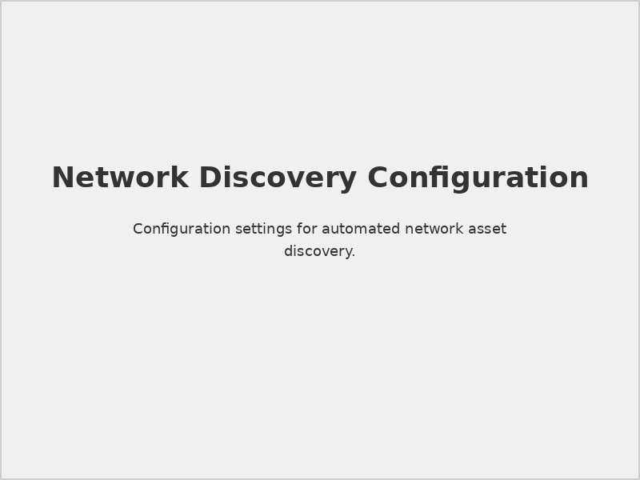
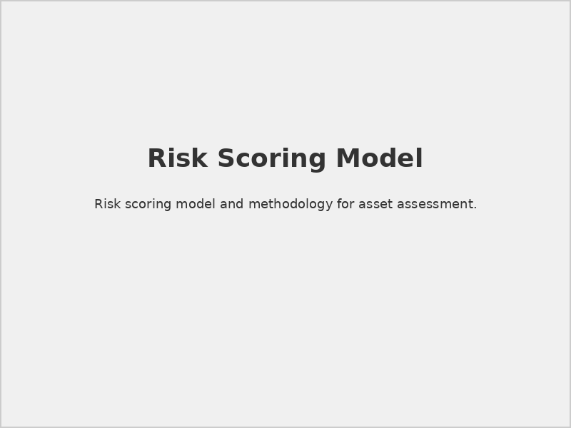
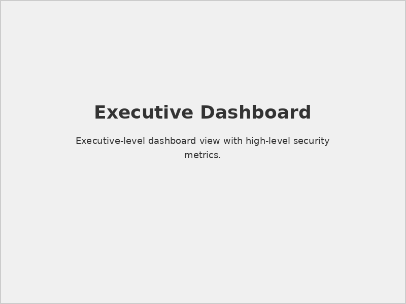
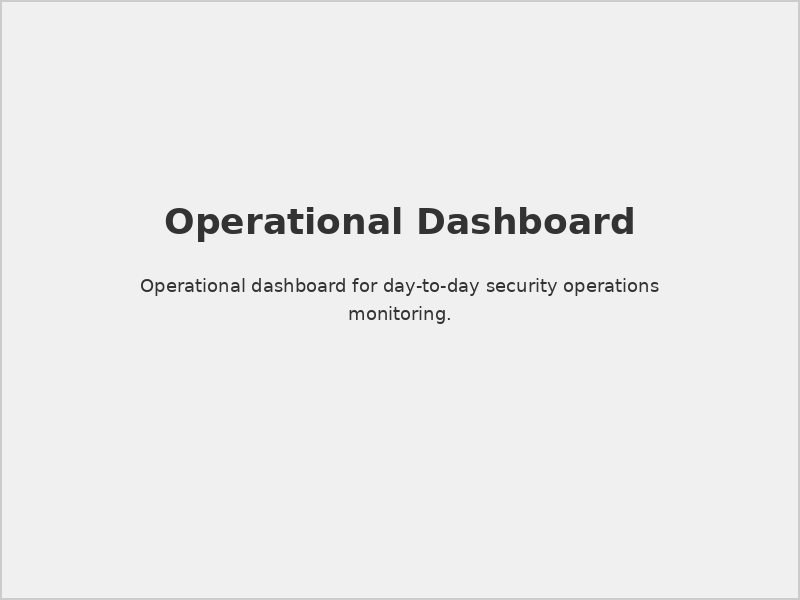

# Securaa CSAM Administration Guide

## 📋 Document Overview

**Document Name:** Securaa CSAM Administration Guide.pdf  
**Pages:** Multiple pages  
**Category:** Administration Guides  
**Last Updated:** As per document timestamp  

## 📝 Description

This comprehensive administration guide provides detailed instructions for managing and administering the Securaa Cyber Security Asset Management (CSAM) platform. It covers user management, system configuration, asset management, reporting, and maintenance procedures.

## 🎯 Purpose

To enable system administrators and security teams to effectively manage the CSAM platform, ensuring optimal performance, security, and operational efficiency in cybersecurity asset management.

## 🔧 CSAM Platform Overview

### Core Functionality
- **Asset Discovery:** Automated discovery and inventory of IT assets
- **Vulnerability Management:** Security posture assessment and tracking
- **Risk Assessment:** Asset-based risk scoring and prioritization
- **Compliance Monitoring:** Regulatory compliance tracking and reporting

### Key Benefits
- Comprehensive asset visibility
- Automated vulnerability assessment
- Risk-based prioritization
- Compliance automation
- Centralized asset management

## 👥 User Management

### 1. **User Roles and Permissions**

#### Administrator Role
- **System Configuration:** Full system configuration access
- **User Management:** Create, modify, and delete user accounts
- **Asset Management:** Complete asset management capabilities
- **Reporting:** Access to all reports and analytics

#### Security Analyst Role
- **Asset Monitoring:** View and analyze asset information
- **Vulnerability Assessment:** Conduct security assessments
- **Risk Analysis:** Perform risk assessments and analysis
- **Reporting:** Generate security and compliance reports

#### Auditor Role
- **Read-Only Access:** View-only access to asset information
- **Compliance Reporting:** Access to compliance and audit reports
- **Risk Visibility:** View risk assessments and scores
- **Audit Trails:** Access to system audit logs

#### Asset Manager Role
- **Asset Operations:** Manage asset lifecycle and information
- **Configuration Management:** Update asset configurations
- **Asset Reporting:** Generate asset-focused reports
- **Asset Classification:** Classify and categorize assets

### 2. **User Account Management**

#### Creating User Accounts
```bash
# Example user creation process
1. Navigate to User Management console
2. Click "Add New User"
3. Enter user details and assign roles
4. Set initial password and security settings
5. Configure notification preferences
```

#### User Authentication
- **Local Authentication:** Built-in user database
- **LDAP Integration:** Active Directory integration
- **SAML SSO:** Single sign-on capabilities
- **Multi-Factor Authentication:** Enhanced security options

## 🏗️ System Configuration

### 1. **Asset Discovery Configuration**

#### Network Scanning

*Network scanning configuration interface*

#### Scanning Schedules
- **Continuous Scanning:** Real-time asset discovery
- **Scheduled Scans:** Periodic comprehensive scans
- **On-Demand Scans:** Manual scanning capabilities
- **Incremental Scans:** Change-based discovery

#### Discovery Rules
```yaml
# Example discovery configuration
discovery_rules:
  network_ranges:
    - "192.168.1.0/24"
    - "10.0.0.0/8"
  scan_types:
    - port_scan
    - service_detection
    - os_fingerprinting
  exclusions:
    - "192.168.1.1"
    - "critical-server.company.com"
```

### 2. **Vulnerability Assessment Configuration**

#### Vulnerability Scanners
- **Integrated Scanners:** Built-in vulnerability assessment
- **External Scanners:** Third-party scanner integration
- **Custom Scans:** Customized vulnerability checks
- **Compliance Scans:** Regulatory compliance assessments

#### Assessment Policies
- **Scan Frequency:** Automated scanning schedules
- **Severity Thresholds:** Risk-based assessment criteria
- **Remediation Workflows:** Automated response procedures
- **Notification Rules:** Alert and notification configuration

### 3. **Risk Management Configuration**

#### Risk Scoring Models

*Risk scoring algorithm configuration*

#### Risk Factors
- **Asset Criticality:** Business importance weighting
- **Vulnerability Severity:** Security impact assessment
- **Threat Intelligence:** External threat context
- **Exposure Metrics:** Network exposure evaluation

## 📊 Asset Management

### 1. **Asset Inventory**

#### Asset Categories
- **Servers:** Physical and virtual servers
- **Workstations:** Desktop and laptop computers
- **Network Devices:** Routers, switches, firewalls
- **Mobile Devices:** Smartphones and tablets
- **Cloud Assets:** Cloud-based resources and services

#### Asset Attributes
```json
{
  "asset_id": "SRV-001",
  "hostname": "web-server-01",
  "ip_address": "192.168.1.100",
  "operating_system": "Ubuntu 20.04 LTS",
  "criticality": "High",
  "owner": "IT Department",
  "location": "Data Center A",
  "tags": ["web", "production", "customer-facing"]
}
```

### 2. **Asset Lifecycle Management**

#### Lifecycle Stages
- **Discovery:** Initial asset identification
- **Registration:** Asset inventory registration
- **Classification:** Security and business classification
- **Monitoring:** Continuous security monitoring
- **Decommissioning:** Secure asset retirement

#### Asset Updates
- **Automated Updates:** System-driven asset information updates
- **Manual Updates:** User-initiated asset modifications
- **Bulk Operations:** Mass asset management operations
- **Change Tracking:** Asset modification history

## 📈 Reporting and Analytics

### 1. **Dashboard Overview**

#### Executive Dashboard

*High-level security posture overview*

#### Operational Dashboard

*Detailed operational metrics and KPIs*

### 2. **Report Types**

#### Asset Reports
- **Asset Inventory Report:** Complete asset listing
- **Asset Classification Report:** Asset categorization summary
- **Asset Change Report:** Asset modification tracking
- **Asset Lifecycle Report:** Lifecycle stage analysis

#### Vulnerability Reports
- **Vulnerability Summary:** High-level vulnerability overview
- **Detailed Vulnerability Report:** Comprehensive vulnerability analysis
- **Trend Analysis:** Vulnerability trend tracking
- **Remediation Status:** Fix implementation tracking

#### Risk Reports
- **Risk Assessment Report:** Organization-wide risk analysis
- **Critical Asset Report:** High-risk asset identification
- **Risk Trend Analysis:** Risk posture trending
- **Executive Risk Summary:** Leadership risk briefing

#### Compliance Reports
- **Compliance Status Report:** Regulatory compliance overview
- **Audit Trail Report:** System activity logging
- **Policy Compliance Report:** Security policy adherence
- **Certification Reports:** Compliance certification support

## 🔧 System Maintenance

### 1. **Regular Maintenance Tasks**

#### Database Maintenance
```sql
-- Example database maintenance
-- Update statistics
ANALYZE TABLE assets;
-- Clean old data
DELETE FROM audit_logs WHERE created_date < DATE_SUB(NOW(), INTERVAL 1 YEAR);
-- Optimize tables
OPTIMIZE TABLE vulnerability_scans;
```

#### System Updates
- **Security Patches:** Regular security update application
- **Feature Updates:** Platform feature enhancements
- **Configuration Updates:** System configuration optimization
- **Performance Tuning:** System performance optimization

### 2. **Backup and Recovery**

#### Backup Procedures
- **Database Backups:** Regular automated database backups
- **Configuration Backups:** System configuration snapshots
- **Asset Data Backups:** Asset inventory data protection
- **Report Backups:** Historical report archival

#### Recovery Procedures
- **System Recovery:** Complete system restoration
- **Data Recovery:** Selective data restoration
- **Configuration Recovery:** Configuration rollback procedures
- **Disaster Recovery:** Business continuity planning

## ⚠️ Best Practices

> **Security Recommendation:** Regularly review and update user permissions to maintain principle of least privilege.

> **Performance Tip:** Schedule intensive scans during off-peak hours to minimize impact on network performance.

> **Compliance Note:** Maintain detailed audit logs for regulatory compliance and forensic analysis.

## 🔗 Related Documents

- [STS-Securaa Solution Architecture](./STS-Securaa-Solution-Architecture-README.md) - Platform architecture
- [Securaa Installation and Deployment Guide](./Securaa-Installation-and-Deployment-Guide-README.md) - Installation procedures
- [Prerequisites for SIA, SOAR, TIP & CSAM](./Prerequisites-for-SIA-SOAR-TIP-CSAM-README.md) - System requirements

## 📞 Support Information

For CSAM administration support:

- **Technical Support:** Expert assistance with platform administration
- **Training Resources:** Administrator training and certification
- **Best Practices:** Implementation and operational guidance
- **Community Forums:** User community and knowledge sharing

---

*This README provides an overview of the Securaa CSAM Administration Guide. For detailed administration procedures and advanced configuration options, refer to the complete PDF document.*