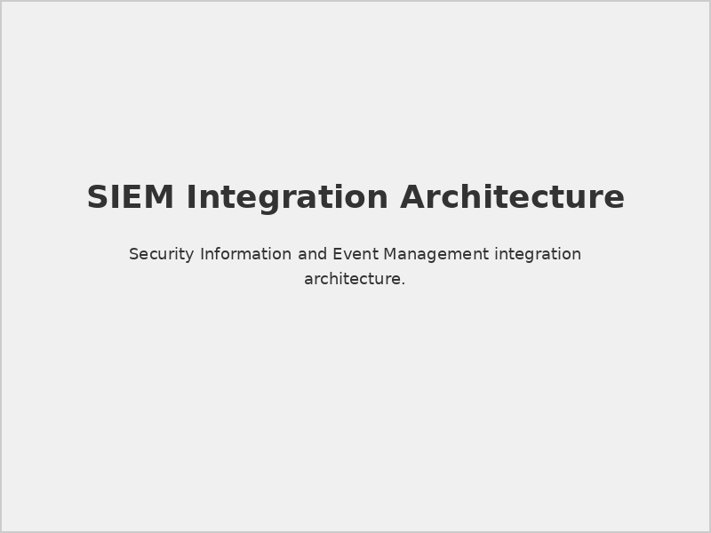
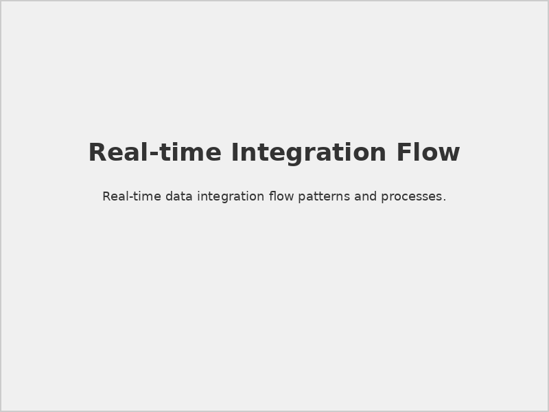
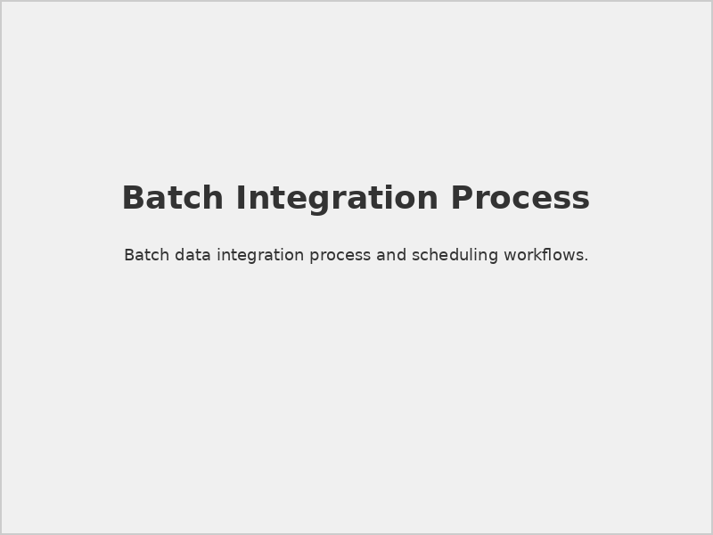
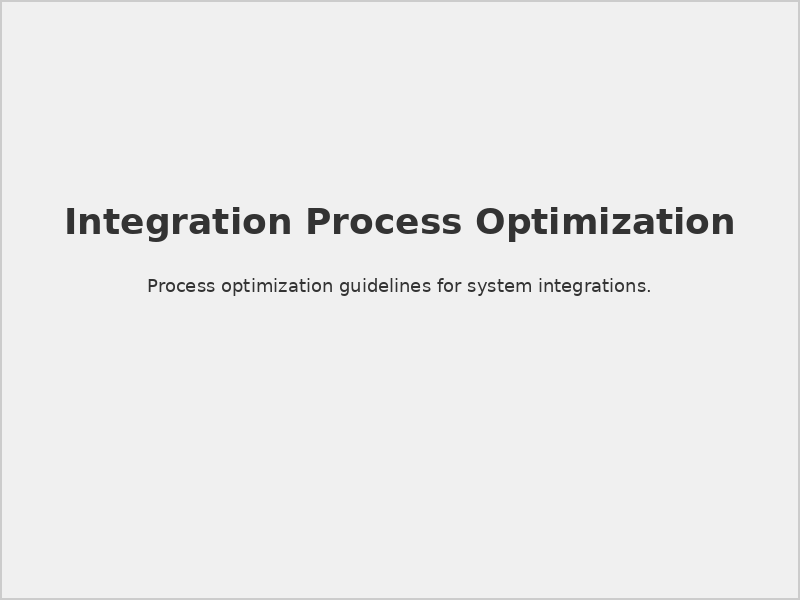

# Securaa Datasheet Integrations

## 📋 Document Overview

**Document Name:** Securaa Datasheet Integrations.pdf  
**Pages:** Multiple pages  
**Category:** Product Datasheets  
**Last Updated:** As per document timestamp  

## 📝 Description

This comprehensive datasheet provides detailed information about Securaa's extensive integration capabilities with third-party security tools, platforms, and services. It outlines supported integrations, implementation methods, and technical specifications for seamless security ecosystem connectivity.

## 🎯 Purpose

To provide technical teams, architects, and decision-makers with complete integration specifications and capabilities, enabling informed planning for Securaa platform implementation within existing security infrastructures.

## 🔗 Integration Categories

### 1. **SIEM Integrations**

#### Supported SIEM Platforms
- **Splunk Enterprise/Cloud**
  - Real-time event streaming
  - Custom app deployment
  - Advanced correlation rules
  - Dashboard integration

- **IBM QRadar**
  - DSM integration
  - Custom rule development
  - Threat intelligence feeds
  - Automated response actions

- **ArcSight ESM**
  - Connector framework integration
  - Custom parsing rules
  - Real-time correlation
  - Executive dashboards

- **LogRhythm**
  - SmartResponse integration
  - Metadata integration
  - Alarm enrichment
  - Automated workflows

#### Integration Methods

*SIEM integration patterns and data flows*

### 2. **Security Tool Integrations**

#### Endpoint Detection and Response (EDR)
- **CrowdStrike Falcon**
- **Microsoft Defender ATP**
- **Carbon Black**
- **SentinelOne**
- **Cybereason**

#### Network Security
- **Palo Alto Networks**
- **Cisco ASA/Firepower**
- **Fortinet FortiGate**
- **Check Point**
- **Juniper SRX**

#### Vulnerability Management
- **Tenable Nessus**
- **Qualys VMDR**
- **Rapid7 InsightVM**
- **OpenVAS**
- **Greenbone Security Manager**

#### Identity and Access Management
- **Active Directory**
- **Azure AD**
- **Okta**
- **Ping Identity**
- **CyberArk**

## 📊 Integration Specifications

### 1. **Technical Requirements**

#### API Specifications
```yaml
# Integration API Requirements
api_requirements:
  authentication:
    - oauth2
    - api_key
    - certificate_based
  protocols:
    - REST/HTTP
    - SOAP
    - GraphQL
  data_formats:
    - JSON
    - XML
    - CSV
    - STIX/TAXII
  rate_limits:
    - requests_per_minute: 1000
    - burst_capacity: 5000
```

#### Data Exchange Formats
- **STIX/TAXII 2.1:** Threat intelligence sharing
- **CEF (Common Event Format):** Log data standardization
- **LEEF (Log Event Extended Format):** IBM format support
- **Syslog RFC 3164/5424:** Standard logging protocol
- **JSON/XML:** Structured data exchange

### 2. **Integration Patterns**

#### Real-time Integration

*Real-time data exchange and processing*

#### Batch Integration

*Scheduled batch data processing workflows*

#### Hybrid Integration
- **Critical Data:** Real-time processing
- **Historical Data:** Batch processing
- **Configuration Data:** On-demand sync
- **Reporting Data:** Scheduled updates

## 🔧 Implementation Methods

### 1. **Direct API Integration**

#### REST API Integration
```python
# Example REST API integration
import requests

def securaa_integration():
    headers = {
        'Authorization': 'Bearer <api_token>',
        'Content-Type': 'application/json'
    }
    
    data = {
        'event_type': 'security_alert',
        'severity': 'high',
        'source_ip': '192.168.1.100',
        'indicators': ['malware_detected', 'c2_communication']
    }
    
    response = requests.post(
        'https://api.securaa.com/v2/events',
        headers=headers,
        json=data
    )
    
    return response.json()
```

#### GraphQL Integration
```graphql
# Example GraphQL query
query GetThreatIntelligence($indicators: [String!]!) {
  threatIntelligence(indicators: $indicators) {
    indicator
    confidence
    severity
    description
    sources {
      name
      lastUpdated
    }
  }
}
```

### 2. **Agent-Based Integration**

#### Lightweight Agents
- **Resource Efficiency:** Minimal system impact
- **Auto-Discovery:** Automatic service detection
- **Secure Communication:** Encrypted data transmission
- **Health Monitoring:** Agent status monitoring

#### Agent Configuration
```json
{
  "agent_config": {
    "collection_interval": "60s",
    "log_sources": [
      "/var/log/security.log",
      "/var/log/auth.log"
    ],
    "filters": {
      "severity": ["warning", "error", "critical"],
      "keywords": ["failed login", "malware", "intrusion"]
    },
    "encryption": {
      "enabled": true,
      "algorithm": "AES-256-GCM"
    }
  }
}
```

### 3. **Message Queue Integration**

#### Supported Message Brokers
- **Apache Kafka:** High-throughput streaming
- **RabbitMQ:** Reliable message delivery
- **Amazon SQS:** Cloud-native queuing
- **Azure Service Bus:** Enterprise messaging

#### Queue Configuration
```yaml
# Kafka Integration Example
kafka_config:
  brokers:
    - "kafka-broker-1:9092"
    - "kafka-broker-2:9092"
  topics:
    security_events: "securaa.security.events"
    threat_intel: "securaa.threat.intelligence"
  consumer_group: "securaa-consumers"
  security:
    protocol: "SASL_SSL"
    mechanism: "PLAIN"
```

## 📈 Integration Benefits

### 1. **Operational Efficiency**

#### Automated Workflows
- **Alert Correlation:** Cross-platform alert correlation
- **Response Automation:** Automated incident response
- **Data Enrichment:** Contextual information enhancement
- **Reporting Automation:** Unified security reporting

#### Process Optimization

*Before and after integration process comparison*

### 2. **Enhanced Security Posture**

#### Unified Visibility
- **Single Pane of Glass:** Centralized security monitoring
- **Comprehensive Coverage:** Multi-tool security coverage
- **Threat Correlation:** Advanced threat detection
- **Risk Assessment:** Holistic risk evaluation

#### Improved Response Times
- **Faster Detection:** Reduced mean time to detection (MTTD)
- **Rapid Response:** Automated response capabilities
- **Coordinated Actions:** Multi-tool response coordination
- **Evidence Collection:** Automated forensic data gathering

## 🔧 Configuration Examples

### 1. **Splunk Integration**

#### App Installation
```bash
# Splunk App Installation
cd $SPLUNK_HOME/etc/apps
tar -xzf securaa-splunk-app.tgz
/opt/splunk/bin/splunk restart
```

#### Data Input Configuration
```conf
# inputs.conf
[tcp://9999]
connection_host = ip
sourcetype = securaa:events
index = security

[script://./bin/securaa_threat_intel.py]
interval = 300
sourcetype = securaa:threat_intel
index = threat_intelligence
```

### 2. **QRadar Integration**

#### DSM Installation
```bash
# QRadar DSM Deployment
cd /opt/qradar/bin
./contentManagement.pl -a import -f securaa-dsm.xml
./qradarsystemctl restart ariel
```

#### Log Source Configuration
```xml
<!-- QRadar Log Source -->
<logSource>
    <name>Securaa Platform</name>
    <type>Securaa</type>
    <protocol>syslog</protocol>
    <identifier>securaa.company.com</identifier>
</logSource>
```

## ⚠️ Integration Considerations

### 1. **Performance Impact**

> **Network Bandwidth:** Consider data volume and network capacity when implementing real-time integrations.

> **System Resources:** Monitor CPU and memory usage on integrated systems during high-volume data processing.

> **API Rate Limits:** Implement proper throttling and error handling for API-based integrations.

### 2. **Security Considerations**

> **Data Encryption:** Ensure all integration communications use appropriate encryption standards.

> **Authentication:** Implement strong authentication mechanisms for all integration points.

> **Access Control:** Apply principle of least privilege for integration service accounts.

## 🔗 Related Documents

- [STS-Securaa Solution Architecture](./STS-Securaa-Solution-Architecture-README.md) - Overall architecture
- [Securaa Installation and Deployment Guide](./Securaa-Installation-and-Deployment-Guide-README.md) - Installation procedures
- [Securaa Datasheet Playbooks](./Securaa-Datasheet-Playbooks-README.md) - Automation capabilities

## 📞 Support Information

For integration support and consultation:

- **Integration Engineering:** Specialized integration support team
- **Professional Services:** Custom integration development
- **Partner Support:** Third-party vendor coordination
- **Documentation:** Complete integration guides and APIs

---

*This README provides an overview of the Securaa Datasheet Integrations document. For detailed integration procedures, API specifications, and configuration examples, refer to the complete PDF document.*