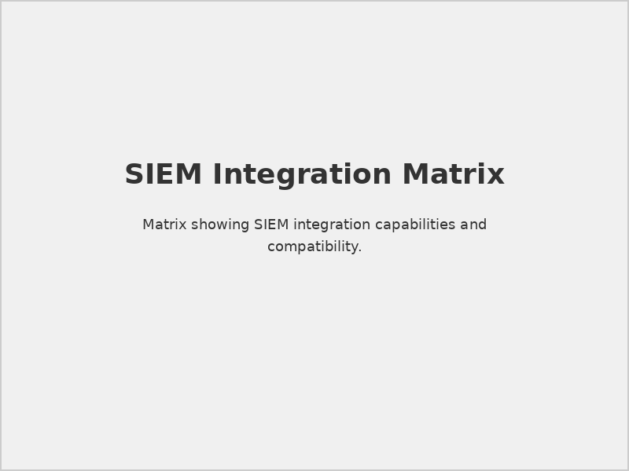

# Securaa Datasheet Integrations

## 📋 Document Overview

**Document Name:** Securaa Datasheet Integrations.pdf  
**Pages:** Multiple pages  
**Category:** Product Datasheets  
**Last Updated:** As per document timestamp  

## 📝 Description

This comprehensive datasheet provides detailed information about Securaa's extensive integration capabilities with third-party security tools, platforms, and services. Securaa is a comprehensive SOC automation product suite built entirely on NoCode, dramatically reducing the time required to implement, configure, and customize security operations.

## 🎯 Purpose

Securaa is a versatile and user-friendly security management platform that simplifies threat monitoring and incident response for SOC teams. With unlimited integrations support, 1000+ automated tasks and playbooks, Securaa empowers businesses to effectively manage their security applications, resources, and operations without the need for scripting or complex operations.

## 🌟 Key Features

- **Comprehensive SOC Automation:** Includes SOAR, TIP, and Cyber Asset Management
- **NoCode Platform:** Accessible even to low-skilled resources with visual interface
- **Unlimited Integrations:** Supports unlimited integrations with security tools
- **1000+ Automated Tasks:** Pre-built playbooks and automated workflows
- **User-Friendly Interface:** Visual control and management interface
- **Reduced Response Time:** Streamlined processes to identify and respond to threats promptly

## 🔗 Supported Integration Categories

### 1. **SIEM Platforms**

The following SIEM platforms are supported with comprehensive integration capabilities:

| S.No | Product | Version | Key Capabilities |
|------|---------|---------|------------------|
| 1    | IBM QRadar On Cloud (QROC) | v7.4.1 | Get Offenses, Asset Management, Reference Sets, Event Processing |
| 2    | RSA NetWitness | V11 | Incident Management, Alert Processing, Time Range Queries |
| 3    | Wazuh | Latest | Alert Fetching, Auto Provisioning, Advanced Threat Protection |
| 4    | LogRhythm | Latest | Alert Management, Case Creation and Updates |
| 5    | RSA Platform | V11.3.2.0 | Comprehensive incident and alert management |
| 6    | Azure Sentinel | V1.0 | JIT Management, Storage Operations, Security Center Integration |
| 7    | Splunk | V9.0.3 | Search Operations, Case Management, Index Operations |
| 8    | HP ArcSight ESM | V7.0 | Incident Workflow, Watchlist Management, Security Events |
| 9    | Securonix | V6.3.1 | Threat Actions, Policy Management, User Operations |
| 10   | Google Chronicle | V1.0 | Domain/IP Reputation, IOC Management, Asset Monitoring |
| 11   | Elastic Search SIEM | V7.6.0 | Case Management, Event Processing, Alert Operations |

### 2. **Security Tool Categories**

#### Vulnerability Scanners
Comprehensive vulnerability management and scanning capabilities with automated remediation workflows.

#### Endpoint Security
Advanced endpoint detection and response integrations for comprehensive threat hunting and incident response.

#### Network Security  
Firewall and network security platform integrations for automated policy management and threat blocking.

#### Cloud Security
Multi-cloud security platform integrations including AWS, Azure, and GCP security services.

#### Identity and Access Management
Identity platforms for user management, access control, and authentication workflows.

#### Threat Intelligence
Threat intelligence feeds and platforms for enrichment and proactive threat hunting.

#### Email Security
Email security solutions for phishing detection, malware analysis, and automated response.

#### Malware Analysis
Sandbox and malware analysis platforms for file and URL detonation capabilities.

## 📊 Integration Overview

### Total Integration Count
Based on the comprehensive datasheet, Securaa supports **294 different integrations** across multiple security categories, providing one of the most extensive integration libraries in the security automation market.

### Integration Highlights
- **Unlimited Integration Support:** No restrictions on the number of integrations
- **1000+ Automated Tasks:** Pre-built automation workflows and playbooks
- **NoCode Implementation:** Visual interface for easy configuration
- **Real-time Data Processing:** Immediate threat detection and response
- **Bi-directional Communication:** Full API integration capabilities

### Key Integration Categories Summary
1. **SIEM Platforms** - 11+ major platforms supported
2. **Vulnerability Scanners** - Comprehensive scanning tool integration
3. **Endpoint Security** - EDR and antivirus platform connectivity
4. **Network Security** - Firewall and network monitoring tools
5. **Cloud Security** - Multi-cloud platform support (AWS, Azure, GCP)
6. **Identity Management** - Identity and access management systems
7. **Threat Intelligence** - Multiple threat feed sources
8. **Email Security** - Email protection and analysis platforms
9. **Malware Analysis** - Sandbox and analysis tool integration
10. **Utilities and Servers** - Supporting tools and webhook capabilities

## 📈 Implementation Benefits

### Operational Efficiency
- **Reduced Implementation Time:** NoCode approach dramatically reduces deployment time
- **Simplified Management:** Visual interface accessible to all skill levels
- **Streamlined Processes:** Automated workflows eliminate manual tasks
- **Enhanced Response Time:** Faster threat identification and response

### Technical Advantages  
- **Seamless Connectivity:** Native API integrations with all major security tools
- **Scalable Architecture:** Unlimited integration support without performance impact
- **Flexible Configuration:** Customizable workflows and automation rules
- **Comprehensive Coverage:** End-to-end security ecosystem integration

## 📊 Visual References

### Integration Architecture

*Comprehensive integration topology and data flow patterns*

### SIEM Integration Matrix

*Detailed SIEM platform integration capabilities and features*

## ⚠️ Important Considerations

### Integration Requirements
> **API Access:** Ensure proper API credentials and permissions are configured for all integrated platforms.

> **Network Connectivity:** Verify network connectivity and firewall rules for seamless data exchange.

> **Data Formatting:** Securaa automatically handles data format conversions for integrated platforms.

### Performance Guidelines
> **Scalability:** Unlimited integration support ensures no performance degradation with additional tools.

> **Real-time Processing:** Immediate data processing and automated response capabilities.

> **Resource Management:** Efficient resource utilization across all integrated platforms.

### Security Considerations
> **Secure Communications:** All integrations use secure API communications and encrypted data transfer.

> **Access Control:** Role-based access control for integration management and configuration.

> **Compliance:** Integrations maintain compliance requirements across all connected platforms.

## 🔗 Related Documents

- [Prerequisites for SIA, SOAR, TIP & CSAM](./Prerequisites-for-SIA-SOAR-TIP-CSAM-README.md) - Platform prerequisites and setup requirements
- [Securaa Datasheet Playbooks](./Securaa-Datasheet-Playbooks-README.md) - Automated playbook capabilities
- [Securaa Installation and Deployment Guide](./Securaa-Installation-and-Deployment-Guide-README.md) - Installation procedures
- [STS-Securaa Solution Architecture](./STS-Securaa-Solution-Architecture-README.md) - Complete solution architecture

## 📞 Support Information

For integration planning and technical support:

- **Integration Support:** integrations@securaa.io
- **Technical Documentation:** Comprehensive integration guides available
- **Professional Services:** Custom integration development and consultation
- **Community Support:** User forums and knowledge base

### Additional Resources
- Integration configuration templates
- API documentation and testing tools
- Best practices and implementation guides
- Custom integration development services

---

*This README provides comprehensive details based on the Securaa Datasheet Integrations document. The datasheet demonstrates Securaa's extensive integration capabilities across 294 different security platforms, enabling comprehensive SOC automation and security orchestration.*

#### Data Exchange Formats
- **STIX/TAXII 2.1:** Threat intelligence sharing
- **CEF (Common Event Format):** Log data standardization
- **LEEF (Log Event Extended Format):** IBM format support
- **Syslog RFC 3164/5424:** Standard logging protocol
- **JSON/XML:** Structured data exchange

### 2. **Integration Patterns**

#### Real-time Integration

*Real-time data exchange and processing*

#### Batch Integration

*Scheduled batch data processing workflows*

#### Hybrid Integration
- **Critical Data:** Real-time processing
- **Historical Data:** Batch processing
- **Configuration Data:** On-demand sync
- **Reporting Data:** Scheduled updates

## 🔧 Implementation Methods

### 1. **Direct API Integration**

#### REST API Integration
```python
# Example REST API integration
import requests

def securaa_integration():
    headers = {
        'Authorization': 'Bearer <api_token>',
        'Content-Type': 'application/json'
    }
    
    data = {
        'event_type': 'security_alert',
        'severity': 'high',
        'source_ip': '192.168.1.100',
        'indicators': ['malware_detected', 'c2_communication']
    }
    
    response = requests.post(
        'https://api.securaa.com/v2/events',
        headers=headers,
        json=data
    )
    
    return response.json()
```

#### GraphQL Integration
```graphql
# Example GraphQL query
query GetThreatIntelligence($indicators: [String!]!) {
  threatIntelligence(indicators: $indicators) {
    indicator
    confidence
    severity
    description
    sources {
      name
      lastUpdated
    }
  }
}
```

### 2. **Agent-Based Integration**

#### Lightweight Agents
- **Resource Efficiency:** Minimal system impact
- **Auto-Discovery:** Automatic service detection
- **Secure Communication:** Encrypted data transmission
- **Health Monitoring:** Agent status monitoring

#### Agent Configuration
```json
{
  "agent_config": {
    "collection_interval": "60s",
    "log_sources": [
      "/var/log/security.log",
      "/var/log/auth.log"
    ],
    "filters": {
      "severity": ["warning", "error", "critical"],
      "keywords": ["failed login", "malware", "intrusion"]
    },
    "encryption": {
      "enabled": true,
      "algorithm": "AES-256-GCM"
    }
  }
}
```

### 3. **Message Queue Integration**

#### Supported Message Brokers
- **Apache Kafka:** High-throughput streaming
- **RabbitMQ:** Reliable message delivery
- **Amazon SQS:** Cloud-native queuing
- **Azure Service Bus:** Enterprise messaging

#### Queue Configuration
```yaml
# Kafka Integration Example
kafka_config:
  brokers:
    - "kafka-broker-1:9092"
    - "kafka-broker-2:9092"
  topics:
    security_events: "securaa.security.events"
    threat_intel: "securaa.threat.intelligence"
  consumer_group: "securaa-consumers"
  security:
    protocol: "SASL_SSL"
    mechanism: "PLAIN"
```

## 📈 Integration Benefits

### 1. **Operational Efficiency**

#### Automated Workflows
- **Alert Correlation:** Cross-platform alert correlation
- **Response Automation:** Automated incident response
- **Data Enrichment:** Contextual information enhancement
- **Reporting Automation:** Unified security reporting

#### Process Optimization

*Before and after integration process comparison*

### 2. **Enhanced Security Posture**

#### Unified Visibility
- **Single Pane of Glass:** Centralized security monitoring
- **Comprehensive Coverage:** Multi-tool security coverage
- **Threat Correlation:** Advanced threat detection
- **Risk Assessment:** Holistic risk evaluation

#### Improved Response Times
- **Faster Detection:** Reduced mean time to detection (MTTD)
- **Rapid Response:** Automated response capabilities
- **Coordinated Actions:** Multi-tool response coordination
- **Evidence Collection:** Automated forensic data gathering

## 🔧 Configuration Examples

### 1. **Splunk Integration**

#### App Installation
```bash
# Splunk App Installation
cd $SPLUNK_HOME/etc/apps
tar -xzf securaa-splunk-app.tgz
/opt/splunk/bin/splunk restart
```

#### Data Input Configuration
```conf
# inputs.conf
[tcp://9999]
connection_host = ip
sourcetype = securaa:events
index = security

[script://./bin/securaa_threat_intel.py]
interval = 300
sourcetype = securaa:threat_intel
index = threat_intelligence
```

### 2. **QRadar Integration**

#### DSM Installation
```bash
# QRadar DSM Deployment
cd /opt/qradar/bin
./contentManagement.pl -a import -f securaa-dsm.xml
./qradarsystemctl restart ariel
```

#### Log Source Configuration
```xml
<!-- QRadar Log Source -->
<logSource>
    <name>Securaa Platform</name>
    <type>Securaa</type>
    <protocol>syslog</protocol>
    <identifier>securaa.company.com</identifier>
</logSource>
```

## ⚠️ Integration Considerations

### 1. **Performance Impact**

> **Network Bandwidth:** Consider data volume and network capacity when implementing real-time integrations.

> **System Resources:** Monitor CPU and memory usage on integrated systems during high-volume data processing.

> **API Rate Limits:** Implement proper throttling and error handling for API-based integrations.

### 2. **Security Considerations**

> **Data Encryption:** Ensure all integration communications use appropriate encryption standards.

> **Authentication:** Implement strong authentication mechanisms for all integration points.

> **Access Control:** Apply principle of least privilege for integration service accounts.

## 🔗 Related Documents

- [STS-Securaa Solution Architecture](./STS-Securaa-Solution-Architecture-README.md) - Overall architecture
- [Securaa Installation and Deployment Guide](./Securaa-Installation-and-Deployment-Guide-README.md) - Installation procedures
- [Securaa Datasheet Playbooks](./Securaa-Datasheet-Playbooks-README.md) - Automation capabilities

## 📞 Support Information

For integration support and consultation:

- **Integration Engineering:** Specialized integration support team
- **Professional Services:** Custom integration development
- **Partner Support:** Third-party vendor coordination
- **Documentation:** Complete integration guides and APIs

---

*This README provides an overview of the Securaa Datasheet Integrations document. For detailed integration procedures, API specifications, and configuration examples, refer to the complete PDF document.*