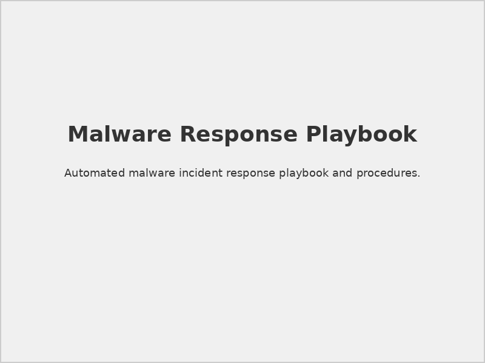
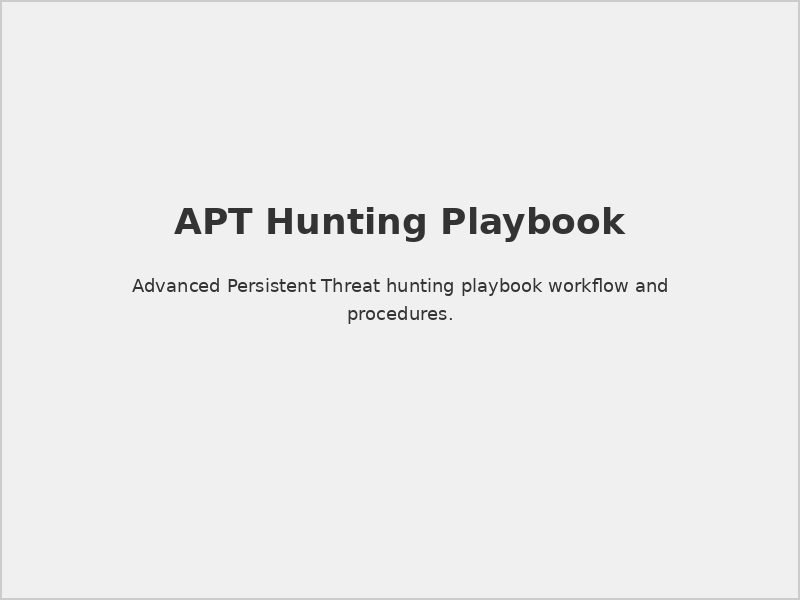
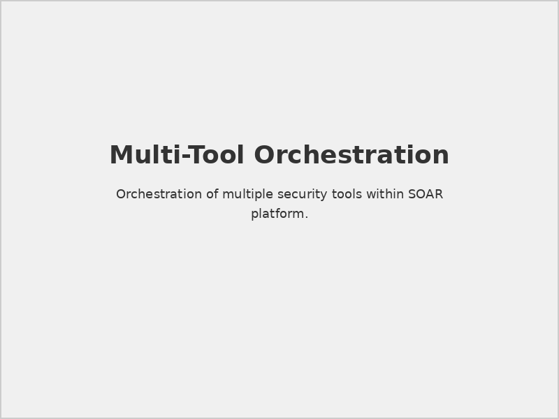
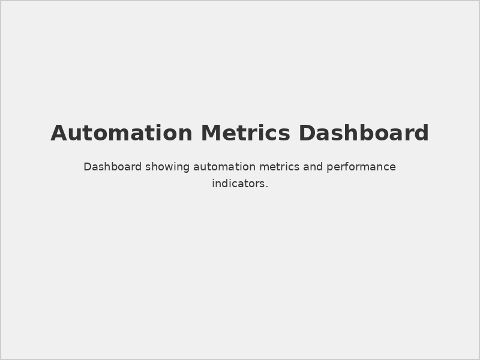

# Securaa Datasheet Playbooks

## 📋 Document Overview

**Document Name:** Securaa Datasheet Playbooks.pdf  
**Pages:** Multiple pages  
**Category:** Product Datasheets  
**Last Updated:** As per document timestamp  

## 📝 Description

This comprehensive datasheet provides detailed information about Securaa's automated playbook capabilities, including pre-built security automation workflows, custom playbook development, and orchestration features for security operations center (SOC) automation.

## 🎯 Purpose

To provide security teams, SOC analysts, and automation engineers with complete specifications and capabilities for implementing automated security response playbooks within the Securaa platform ecosystem.

## 🤖 Playbook Overview

### Core Automation Capabilities
- **Incident Response Automation:** Automated incident handling workflows
- **Threat Hunting Playbooks:** Systematic threat discovery procedures
- **Compliance Automation:** Regulatory compliance checking and reporting
- **Integration Orchestration:** Multi-tool workflow coordination
- **Custom Logic Development:** Flexible automation scripting

### Key Benefits
- **Reduced Response Time:** Automated rapid response capabilities
- **Consistent Processes:** Standardized security procedures
- **Scalable Operations:** Handle increased security event volumes
- **Analyst Efficiency:** Focus on high-value analysis tasks
- **Process Documentation:** Built-in procedure documentation

## 📚 Pre-Built Playbook Library

### 1. **Incident Response Playbooks**

#### Malware Detection Response

*Automated malware detection and containment workflow*

**Workflow Steps:**
1. **Detection:** Malware signature or behavior detection
2. **Isolation:** Automatic endpoint isolation
3. **Analysis:** Automated malware analysis
4. **Containment:** Network and system containment
5. **Eradication:** Malware removal procedures
6. **Recovery:** System restoration and monitoring
7. **Documentation:** Incident documentation and reporting

#### Phishing Email Response
```yaml
# Phishing Response Playbook
playbook_name: "Phishing Email Response"
trigger: "email_security_alert"
actions:
  - name: "quarantine_email"
    parameters:
      email_id: "{{alert.email_id}}"
      action: "quarantine"
  - name: "block_sender"
    parameters:
      sender: "{{alert.sender_address}}"
      duration: "24h"
  - name: "scan_recipients"
    parameters:
      recipients: "{{alert.recipients}}"
      scan_type: "full_system"
  - name: "create_incident"
    parameters:
      severity: "medium"
      category: "phishing"
```

#### Data Breach Response
- **Immediate Actions:** Containment and assessment
- **Investigation:** Forensic data collection
- **Notification:** Regulatory and stakeholder notification
- **Remediation:** Security control improvements
- **Recovery:** Business operation restoration

### 2. **Threat Hunting Playbooks**

#### Advanced Persistent Threat (APT) Hunting

*Systematic APT detection and investigation workflow*

**Hunt Methodology:**
1. **Hypothesis Formation:** Threat actor behavior modeling
2. **Data Collection:** Multi-source data gathering
3. **Analysis:** Pattern recognition and correlation
4. **Investigation:** Deep-dive threat analysis
5. **Attribution:** Threat actor identification
6. **IOC Generation:** Indicator creation and sharing

#### Insider Threat Detection
```python
# Insider Threat Hunting Logic
def insider_threat_hunt():
    indicators = [
        "unusual_file_access",
        "off_hours_activity", 
        "privilege_escalation",
        "data_exfiltration_patterns"
    ]
    
    for user in get_high_privilege_users():
        risk_score = calculate_risk_score(user, indicators)
        if risk_score > THRESHOLD:
            create_investigation_case(user, risk_score)
            notify_security_team(user, risk_score)
```

#### Command and Control (C2) Detection
- **Network Analysis:** Suspicious communication patterns
- **DNS Analysis:** Malicious domain identification
- **Behavioral Analysis:** Anomalous network behavior
- **Temporal Analysis:** Communication timing patterns

### 3. **Compliance Automation Playbooks**

#### PCI DSS Compliance Checking
- **Network Segmentation:** Cardholder data environment validation
- **Access Controls:** User access verification
- **Encryption:** Data protection validation
- **Logging:** Audit trail verification
- **Vulnerability Management:** Security scanning compliance

#### GDPR Data Protection
- **Data Discovery:** Personal data identification
- **Access Logging:** Data access audit trails
- **Breach Detection:** Data breach identification
- **Notification:** Automated breach notification
- **Rights Management:** Data subject rights automation

## 🔧 Custom Playbook Development

### 1. **Playbook Development Framework**

#### Visual Playbook Editor

*Drag-and-drop playbook development interface*

#### Playbook Components
- **Triggers:** Event-based playbook initiation
- **Actions:** Automated response steps
- **Decisions:** Conditional logic branches
- **Integrations:** Third-party tool interactions
- **Notifications:** Stakeholder communication

### 2. **Scripting Capabilities**

#### Python Integration
```python
# Custom Python Action Example
from securaa.playbooks import Action, PlaybookContext

class CustomThreatAnalysis(Action):
    def execute(self, context: PlaybookContext):
        threat_data = context.get_parameter('threat_indicators')
        
        # Perform custom analysis
        analysis_result = self.analyze_threat(threat_data)
        
        # Update context with results
        context.set_variable('analysis_score', analysis_result.score)
        context.set_variable('threat_category', analysis_result.category)
        
        return self.success(analysis_result)
```

#### PowerShell Integration
```powershell
# Windows Environment Automation
param(
    [string]$ComputerName,
    [string]$ThreatHash
)

# Isolate infected endpoint
Invoke-Command -ComputerName $ComputerName -ScriptBlock {
    netsh advfirewall set allprofiles state on
    netsh advfirewall firewall add rule name="Block All" dir=out action=block
}

# Collect forensic data
$ForensicData = Get-WinEvent -FilterHashtable @{LogName='Security'; ID=4624,4625}
Export-Csv -Path "\\forensics\$ComputerName-$(Get-Date -Format 'yyyyMMdd').csv"
```

### 3. **Playbook Testing and Validation**

#### Test Environment
- **Sandbox Testing:** Isolated playbook execution
- **Dry Run Mode:** Validation without actions
- **Simulation Framework:** Controlled test scenarios
- **Performance Testing:** Scalability validation

#### Quality Assurance
```yaml
# Playbook Testing Configuration
test_config:
  environment: "sandbox"
  test_data: "sample_security_events.json"
  validation_rules:
    - execution_time: "< 30s"
    - success_rate: "> 95%"
    - error_handling: "complete"
  reporting:
    format: "junit"
    output: "test_results/"
```

## 📊 Orchestration Capabilities

### 1. **Multi-Tool Orchestration**

#### Workflow Coordination

*Coordinated security tool automation workflow*

#### Integration Patterns
- **Sequential Execution:** Step-by-step tool coordination
- **Parallel Processing:** Simultaneous multi-tool actions
- **Conditional Branching:** Logic-based workflow decisions
- **Error Handling:** Robust failure recovery mechanisms

### 2. **Event-Driven Automation**

#### Trigger Types
- **SIEM Alerts:** Security event-triggered automation
- **Threat Intelligence:** IOC-based automated response
- **System Events:** Infrastructure event automation
- **Schedule-Based:** Time-driven automation execution
- **Manual Triggers:** Analyst-initiated automation

#### Event Processing
```json
{
  "event_processor": {
    "filters": [
      {
        "field": "severity",
        "operator": ">=",
        "value": "high"
      },
      {
        "field": "source",
        "operator": "in",
        "value": ["endpoint", "network", "email"]
      }
    ],
    "enrichment": [
      "threat_intelligence_lookup",
      "asset_context_addition",
      "user_behavior_analysis"
    ],
    "routing": {
      "malware_detected": "malware_response_playbook",
      "phishing_detected": "phishing_response_playbook",
      "data_exfiltration": "data_breach_playbook"
    }
  }
}
```

## 📈 Performance and Metrics

### 1. **Automation Metrics**

#### Key Performance Indicators
- **Mean Time to Response (MTTR):** Incident response speed
- **Automation Success Rate:** Playbook execution success
- **False Positive Reduction:** Accuracy improvements
- **Analyst Productivity:** Efficiency gains
- **Cost Reduction:** Operational cost savings

#### Metrics Dashboard

*Playbook performance and effectiveness metrics*

### 2. **Scalability Features**

#### High-Volume Processing
- **Queue Management:** Efficient task queuing
- **Resource Allocation:** Dynamic resource scaling
- **Load Balancing:** Distributed processing
- **Priority Handling:** Critical task prioritization

#### Performance Optimization
```yaml
# Performance Configuration
performance_config:
  execution_engine:
    max_concurrent_playbooks: 50
    thread_pool_size: 20
    memory_limit: "2GB"
  queue_management:
    max_queue_size: 1000
    priority_levels: 5
    retention_period: "7d"
  monitoring:
    metrics_collection: true
    performance_alerts: true
    resource_tracking: true
```

## 🔒 Security and Governance

### 1. **Access Control**

#### Playbook Permissions
- **Developer Access:** Playbook creation and modification
- **Operator Access:** Playbook execution permissions
- **Reviewer Access:** Playbook review and approval
- **Administrator Access:** Complete playbook management

#### Approval Workflows
- **Development Review:** Code quality and security review
- **Security Approval:** Security team validation
- **Management Approval:** Business impact assessment
- **Production Deployment:** Controlled release process

### 2. **Audit and Compliance**

#### Execution Logging
- **Complete Audit Trail:** Every action logged
- **Parameter Tracking:** Input/output documentation
- **Performance Logging:** Execution time and resource usage
- **Error Documentation:** Failure analysis and reporting

#### Compliance Features
- **Regulatory Mapping:** Compliance requirement alignment
- **Evidence Collection:** Automated compliance evidence
- **Reporting Automation:** Compliance report generation
- **Change Management:** Controlled playbook modifications

## ⚠️ Best Practices

> **Testing Requirement:** Always test playbooks in sandbox environments before production deployment.

> **Documentation Standard:** Maintain comprehensive playbook documentation for operational transparency.

> **Version Control:** Implement proper versioning for playbook change management.

> **Monitoring Essential:** Continuously monitor playbook performance and effectiveness.

## 🔗 Related Documents

- [STS-Securaa Solution Architecture](./STS-Securaa-Solution-Architecture-README.md) - Platform architecture
- [Securaa Datasheet Integrations](./Securaa-Datasheet-Integrations-README.md) - Integration capabilities
- [Securaa Installation and Deployment Guide](./Securaa-Installation-and-Deployment-Guide-README.md) - Platform setup

## 📞 Support Information

For playbook development and automation support:

- **Automation Engineering:** Specialized playbook development team
- **Training Services:** Playbook development and automation training
- **Professional Services:** Custom automation solution development
- **Community Resources:** Playbook sharing and collaboration platform

---

*This README provides an overview of the Securaa Datasheet Playbooks document. For detailed playbook specifications, development guides, and automation examples, refer to the complete PDF document.*