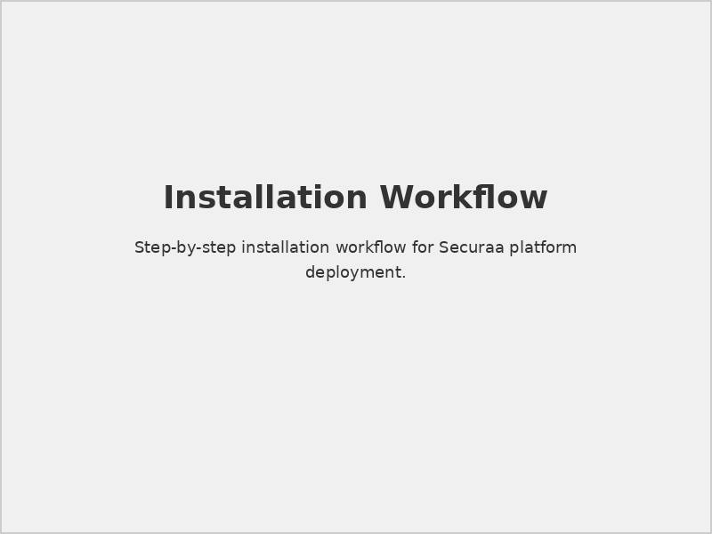
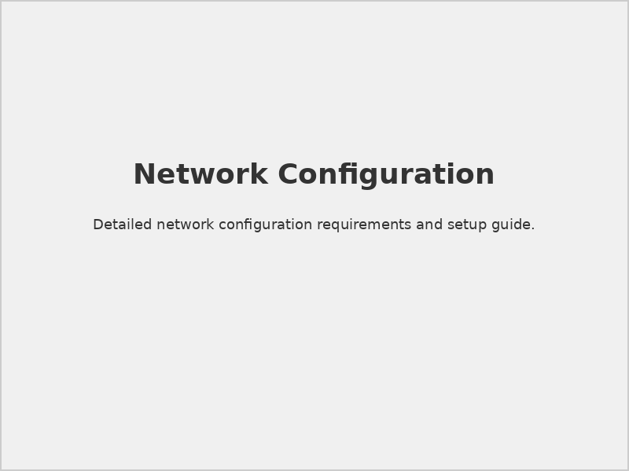

# Securaa Installation and Deployment Guide

## 📋 Document Overview

**Document Name:** Securaa Installation and Deployment Guide.pdf  
**Pages:** Multiple pages  
**Category:** Installation and Deployment  
**Last Updated:** As per document timestamp  

## 📝 Description

This comprehensive guide provides step-by-step instructions for installing and deploying the complete Securaa security platform. It covers installation procedures, configuration steps, validation processes, and troubleshooting guidelines for successful deployment.

## 🎯 Purpose

To enable system administrators and deployment teams to successfully install, configure, and deploy Securaa security solutions in various environments with confidence and reliability.

## 🚀 Installation Overview

### 1. **Pre-Installation Steps**

#### Environment Preparation
- [ ] Verify system prerequisites
- [ ] Validate hardware requirements
- [ ] Confirm network configuration
- [ ] Prepare installation media

#### Security Setup
- [ ] Configure firewall rules
- [ ] Set up SSL certificates
- [ ] Prepare user accounts
- [ ] Establish security policies

### 2. **Installation Process**

#### Core Platform Installation
- **Step 1:** Base system installation
- **Step 2:** Database setup and configuration
- **Step 3:** Application server deployment
- **Step 4:** Web interface installation

#### Component Installation
- **SIA Module:** Security Intelligence & Analytics
- **SOAR Module:** Security Orchestration & Response
- **TIP Module:** Threat Intelligence Platform
- **CSAM Module:** Cyber Security Asset Management

### 3. **Configuration Steps**

#### System Configuration
- Database connection settings
- Network interface configuration
- Storage allocation and management
- Performance optimization parameters

#### Security Configuration
- User authentication setup
- Role-based access control
- Encryption configuration
- Audit logging configuration

## 📊 Installation Workflow

### Installation Process Flow

*Step-by-step installation process visualization*

### Component Dependencies

*Required installation sequence for components*

### Network Configuration

*Network configuration requirements and setup*

## 🔧 Deployment Scenarios

### 1. **Single-Server Deployment**

#### Use Cases
- Small to medium organizations
- Proof of concept deployments
- Development environments
- Limited resource scenarios

#### Installation Steps
```bash
# Example installation commands
sudo ./install-securaa.sh --mode single-server
sudo systemctl enable securaa-platform
sudo systemctl start securaa-platform
```

#### Configuration Files
- `/etc/securaa/platform.conf` - Main configuration
- `/etc/securaa/database.conf` - Database settings
- `/etc/securaa/security.conf` - Security parameters

### 2. **Multi-Server Deployment**

#### Use Cases
- Large enterprise environments
- High availability requirements
- Scalability needs
- Performance optimization

#### Architecture Components
- **Frontend Servers:** Web interface and API gateways
- **Application Servers:** Core processing engines
- **Database Servers:** Data storage and management
- **Storage Servers:** File and log storage

#### Load Balancer Configuration
```nginx
upstream securaa_backend {
    server server1.securaa.local:8080;
    server server2.securaa.local:8080;
    server server3.securaa.local:8080;
}
```

### 3. **Cloud Deployment**

#### AWS Deployment
- **EC2 Instances:** Compute resources
- **RDS:** Managed database services
- **S3:** Storage services
- **ELB:** Load balancing

#### Azure Deployment
- **Virtual Machines:** Compute instances
- **Azure SQL:** Database services
- **Blob Storage:** File storage
- **Application Gateway:** Load balancing

#### GCP Deployment
- **Compute Engine:** VM instances
- **Cloud SQL:** Database services
- **Cloud Storage:** Object storage
- **Cloud Load Balancing:** Traffic distribution

## 🔒 Security Hardening

### System Security
- [ ] Disable unnecessary services
- [ ] Configure host-based firewall
- [ ] Apply security patches
- [ ] Set up system monitoring

### Application Security
- [ ] Configure SSL/TLS encryption
- [ ] Set up authentication mechanisms
- [ ] Implement access controls
- [ ] Enable audit logging

### Database Security
- [ ] Database user management
- [ ] Encryption at rest configuration
- [ ] Backup encryption setup
- [ ] Connection security settings

## 📋 Post-Installation Tasks

### 1. **System Validation**

#### Functional Testing
- [ ] User authentication verification
- [ ] Core functionality testing
- [ ] Integration connectivity testing
- [ ] Performance baseline establishment

#### Security Testing
- [ ] Security configuration validation
- [ ] Vulnerability assessment
- [ ] Penetration testing (if required)
- [ ] Compliance checking

### 2. **Performance Optimization**

#### System Tuning
- Database query optimization
- Application server tuning
- Memory allocation optimization
- Network performance tuning

#### Monitoring Setup
- Performance metrics collection
- Health status monitoring
- Alert configuration
- Dashboard creation

### 3. **Backup Configuration**

#### Backup Strategy
- **Database Backups:** Regular automated backups
- **Configuration Backups:** System configuration snapshots
- **Log Backups:** Security and audit log archival
- **Application Backups:** Application code and updates

#### Disaster Recovery
- Recovery time objective (RTO) planning
- Recovery point objective (RPO) planning
- Backup testing procedures
- Failover process documentation

## 🔍 Troubleshooting Guide

### Common Installation Issues

#### Database Connection Problems
```sql
-- Check database connectivity
SELECT 1;
-- Verify user permissions
SHOW GRANTS FOR 'securaa_user'@'localhost';
```

#### Network Connectivity Issues
```bash
# Test network connectivity
telnet database-server 5432
ping application-server
nslookup securaa.company.com
```

#### Service Startup Issues
```bash
# Check service status
systemctl status securaa-platform
# View service logs
journalctl -u securaa-platform -f
# Check configuration syntax
./validate-config.sh
```

### Performance Issues
- **Slow Response Times:** Database optimization, indexing
- **High Memory Usage:** Memory allocation tuning
- **Network Latency:** Network configuration optimization
- **Disk I/O Issues:** Storage performance tuning

## ⚠️ Important Notes

> **Backup Reminder:** Always create backups before starting installation or making configuration changes.

> **Security Warning:** Ensure all security configurations are properly applied before connecting to production networks.

> **Testing Requirement:** Thoroughly test all functionality in a non-production environment before production deployment.

## 🔗 Related Documents

- [Prerequisites for SIA, SOAR, TIP & CSAM](./Prerequisites-for-SIA-SOAR-TIP-CSAM-README.md) - Pre-installation requirements
- [SIA Hardware Specs](./SIA-Hardware-Specs-README.md) - Hardware requirements
- [STS-Securaa Solution Architecture](./STS-Securaa-Solution-Architecture-README.md) - Architecture overview
- [Securaa CSAM Administration Guide](./Securaa-CSAM-Administration-Guide-README.md) - Post-installation administration

## 📞 Support Information

For installation and deployment assistance:

- **Technical Support:** 24/7 technical support during installation
- **Professional Services:** Expert installation and configuration services
- **Documentation:** Complete installation documentation and FAQs
- **Community:** User community forums and knowledge base

---

*This README provides an overview of the Securaa Installation and Deployment Guide. For detailed installation procedures and troubleshooting steps, refer to the complete PDF document.*