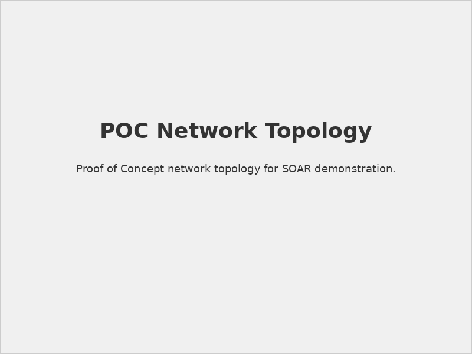
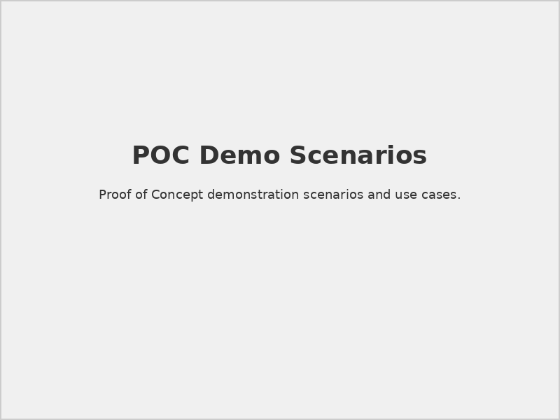

# Securaa POC Prerequisites For SOAR

## 📋 Document Overview

**Document Name:** Securaa POC Prerequisites For SOAR.pdf  
**Pages:** Multiple pages  
**Category:** Prerequisites and Setup  
**Document Type:** Proof of Concept (POC)  
**Last Updated:** As per document timestamp  

## 📝 Description

This specialized document provides streamlined prerequisites and requirements specifically designed for Proof of Concept (POC) deployments of Securaa's Security Orchestration, Automation and Response (SOAR) platform. It focuses on rapid deployment scenarios with reduced complexity for evaluation purposes.

## 🎯 Purpose

To enable organizations to quickly evaluate Securaa SOAR capabilities through simplified POC deployments, providing essential requirements while minimizing infrastructure complexity and deployment time.

## 🚀 POC Deployment Overview

### POC Objectives
- **Capability Demonstration:** Showcase core SOAR functionality
- **Integration Testing:** Validate key system integrations
- **Performance Evaluation:** Assess platform performance
- **User Experience:** Evaluate interface and usability
- **ROI Assessment:** Measure potential operational benefits

### POC Scope Limitations
- **Reduced Scale:** Limited user and data volumes
- **Simplified Integrations:** Core integrations only
- **Temporary Environment:** Non-production deployment
- **Evaluation Period:** Time-limited assessment
- **Basic Security:** Simplified security configuration

## 🔧 Simplified Technical Requirements

### 1. **Minimal Infrastructure Requirements**

#### Single-Server Deployment
```yaml
# POC Server Specifications
poc_server:
  hardware:
    cpu_cores: 8
    memory_gb: 32
    storage_gb: 500
    storage_type: "SSD"
    network: "1 Gbps"
  
  virtualization:
    vcpu: 8
    vram_gb: 32
    vdisk_gb: 500
    vm_type: "Standard_D8s_v3" # Azure example
```

#### Container-Based Deployment
```docker
# Docker Compose for POC
version: '3.8'
services:
  soar-platform:
    image: securaa/soar:latest
    ports:
      - "443:443"
      - "8443:8443"
    environment:
      - ENVIRONMENT=poc
      - DEBUG_MODE=enabled
    volumes:
      - soar_data:/var/lib/securaa
      - soar_logs:/var/log/securaa
  
  database:
    image: postgres:14
    environment:
      - POSTGRES_DB=securaa_poc
      - POSTGRES_USER=securaa
      - POSTGRES_PASSWORD=SecurePassword123
    volumes:
      - db_data:/var/lib/postgresql/data

volumes:
  soar_data:
  soar_logs:
  db_data:
```

### 2. **Operating System Requirements (Simplified)**

#### Supported Platforms
- **Linux:** Ubuntu 20.04 LTS, CentOS 8, RHEL 8
- **Cloud:** AWS EC2, Azure VM, GCP Compute Engine
- **Container:** Docker 20.10+, Kubernetes 1.20+
- **Virtualization:** VMware vSphere 7.0, Hyper-V 2019

#### Basic Configuration
```bash
#!/bin/bash
# POC Environment Setup Script

echo "Setting up Securaa SOAR POC environment..."

# Update system
apt update && apt upgrade -y

# Install required packages
apt install -y docker.io docker-compose nginx certbot

# Configure firewall (simplified)
ufw allow 22/tcp
ufw allow 80/tcp
ufw allow 443/tcp
ufw --force enable

# Start services
systemctl enable docker
systemctl start docker

echo "POC environment setup complete!"
```

## 🌐 Simplified Network Configuration

### 1. **Basic Network Requirements**

#### Port Configuration (Minimal)
| Service | Port | Protocol | Access | Notes |
|---------|------|----------|--------|-------|
| Web UI | 443 | HTTPS | External | SSL required |
| API | 8443 | HTTPS | Internal | REST API |
| SSH | 22 | SSH | Admin | Secure access |
| HTTP Redirect | 80 | HTTP | External | Redirect to HTTPS |

#### Network Diagram

*Simplified network topology for POC deployment*

### 2. **DNS and SSL (Simplified)**

#### DNS Configuration
```bash
# Simple DNS setup for POC
echo "192.168.1.100 soar-poc.company.local" >> /etc/hosts

# Or use public DNS for cloud deployments
# soar-poc.company.com -> Public IP
```

#### SSL Certificate (Self-Signed for POC)
```bash
# Generate self-signed certificate for POC
openssl req -x509 -nodes -days 365 -newkey rsa:2048 \
    -keyout /etc/ssl/private/soar-poc.key \
    -out /etc/ssl/certs/soar-poc.crt \
    -subj "/C=US/ST=State/L=City/O=Company/CN=soar-poc.company.local"
```

## 📊 POC Database Configuration

### 1. **Database Setup (Containerized)**

#### PostgreSQL Configuration
```sql
-- POC Database Initialization
CREATE DATABASE securaa_poc;
CREATE USER securaa_poc WITH PASSWORD 'PocPassword123';
GRANT ALL PRIVILEGES ON DATABASE securaa_poc TO securaa_poc;

-- Basic configuration for POC
ALTER SYSTEM SET shared_buffers = '4GB';
ALTER SYSTEM SET effective_cache_size = '12GB';
ALTER SYSTEM SET work_mem = '64MB';
ALTER SYSTEM SET max_connections = 50;

SELECT pg_reload_conf();
```

#### Data Retention (POC Settings)
```yaml
# POC Data Retention Policy
data_retention:
  events: "30 days"
  cases: "90 days"
  logs: "7 days"
  playbook_history: "30 days"
  audit_trail: "90 days"
```

### 2. **Sample Data Setup**

#### Test Data Generation
```python
# POC Test Data Generator
import json
import random
from datetime import datetime, timedelta

def generate_poc_events(count=1000):
    events = []
    for i in range(count):
        event = {
            "id": f"event_{i:04d}",
            "timestamp": (datetime.now() - timedelta(days=random.randint(0, 30))).isoformat(),
            "severity": random.choice(["low", "medium", "high", "critical"]),
            "source": random.choice(["firewall", "endpoint", "email", "web"]),
            "description": f"POC test event #{i}",
            "status": "open"
        }
        events.append(event)
    return events

# Generate and save test data
test_events = generate_poc_events()
with open('poc_test_data.json', 'w') as f:
    json.dump(test_events, f, indent=2)
```

## 🔗 Essential Integrations for POC

### 1. **Priority Integrations**

#### SIEM Integration (Choose One)
```yaml
# Simplified SIEM Integration Options
siem_options:
  option_1:
    platform: "Splunk"
    connection: "HTTP Event Collector"
    setup_time: "30 minutes"
    data_source: "Sample security events"
  
  option_2:
    platform: "ELK Stack"
    connection: "Elasticsearch API"
    setup_time: "45 minutes"
    data_source: "Simulated log data"
  
  option_3:
    platform: "Syslog"
    connection: "Syslog receiver"
    setup_time: "15 minutes"
    data_source: "System logs"
```

#### Email Integration
```python
# Simple email integration for POC
smtp_config = {
    "smtp_server": "smtp.gmail.com",  # or company SMTP
    "port": 587,
    "username": "poc-soar@company.com",
    "password": "app_password",
    "use_tls": True
}

# Test email function
def send_poc_notification(subject, body, recipients):
    import smtplib
    from email.mime.text import MimeText
    
    msg = MimeText(body)
    msg['Subject'] = f"[SOAR POC] {subject}"
    msg['From'] = smtp_config['username']
    msg['To'] = ', '.join(recipients)
    
    with smtplib.SMTP(smtp_config['smtp_server'], smtp_config['port']) as server:
        server.starttls()
        server.login(smtp_config['username'], smtp_config['password'])
        server.send_message(msg)
```

### 2. **Mock Integrations**

#### Simulated Security Tools
```yaml
# Mock integration endpoints for POC
mock_integrations:
  endpoint_security:
    name: "Mock EDR"
    endpoints: 
      - "GET /api/v1/endpoints"
      - "POST /api/v1/isolate"
      - "GET /api/v1/threats"
  
  network_security:
    name: "Mock Firewall"
    endpoints:
      - "GET /api/v1/rules"
      - "POST /api/v1/block"
      - "GET /api/v1/logs"
  
  vulnerability_scanner:
    name: "Mock Vuln Scanner"
    endpoints:
      - "GET /api/v1/scans"
      - "POST /api/v1/scan"
      - "GET /api/v1/vulnerabilities"
```

## 👥 POC User Setup

### 1. **User Accounts (Simplified)**

#### Default POC Users
```json
{
  "poc_users": [
    {
      "username": "poc_admin",
      "role": "Administrator",
      "email": "poc-admin@company.com",
      "password": "PocAdmin123!",
      "permissions": "full_access"
    },
    {
      "username": "poc_analyst",
      "role": "SOC Analyst", 
      "email": "poc-analyst@company.com",
      "password": "PocAnalyst123!",
      "permissions": "analyst_access"
    },
    {
      "username": "poc_viewer",
      "role": "Read Only",
      "email": "poc-viewer@company.com", 
      "password": "PocViewer123!",
      "permissions": "read_only"
    }
  ]
}
```

#### Authentication (Simplified)
- **Local Authentication:** Built-in user database
- **LDAP Integration:** Optional for existing environments
- **SSO:** Simplified SAML/OIDC if required
- **MFA:** Optional for security demonstration

### 2. **Access Control (Basic)**

#### Role Definitions
| Role | Permissions | Use Case |
|------|-------------|----------|
| **POC Admin** | Full system access | Demonstration and configuration |
| **POC Analyst** | Case and playbook access | Operational workflow demonstration |
| **POC Viewer** | Read-only access | Executive and stakeholder reviews |

## 📈 POC Success Metrics

### 1. **Evaluation Criteria**

#### Functional Testing
```yaml
# POC Success Criteria
success_metrics:
  core_functionality:
    - case_management: "Create, update, close cases"
    - playbook_execution: "Run 3+ sample playbooks"
    - integration_demo: "2+ working integrations"
    - reporting: "Generate sample reports"
  
  performance:
    - response_time: "< 3 seconds for UI operations"
    - playbook_execution: "< 60 seconds for sample playbooks"
    - concurrent_users: "Support 10 simultaneous users"
  
  usability:
    - user_training: "< 2 hours for basic operations"
    - workflow_efficiency: "Reduce manual steps by 50%"
    - error_rate: "< 5% user errors during demo"
```

#### Demo Scenarios

*Structured demo scenarios for POC evaluation*

### 2. **Documentation and Deliverables**

#### POC Report Template
```markdown
# Securaa SOAR POC Report

## Executive Summary
- [POC objectives and outcomes]

## Technical Evaluation
- [Platform performance and capabilities]

## Integration Results  
- [Integration success and challenges]

## User Feedback
- [Stakeholder feedback and requirements]

## Recommendations
- [Next steps and implementation recommendations]
```

## ⚠️ POC Limitations and Considerations

> **Security Warning:** POC environments use simplified security configurations. Do not use in production.

> **Data Limitation:** POC uses test data only. Real production data should not be used.

> **Scalability Note:** POC infrastructure is not sized for production workloads.

> **Support Scope:** POC support is limited to evaluation period and core functionality.

## 🔄 POC to Production Migration

### Migration Planning
- **Infrastructure Scaling:** Production-grade infrastructure requirements
- **Security Hardening:** Full security configuration implementation
- **Data Migration:** Procedure for moving POC configurations
- **Integration Expansion:** Additional integration implementations
- **Training Requirements:** Comprehensive user training programs

## 🔗 Related Documents

- [Prerequisites for SOAR](./Prerequisites-for-SOAR-README.md) - Full production requirements
- [Prerequisites for SIA, SOAR, TIP & CSAM](./Prerequisites-for-SIA-SOAR-TIP-CSAM-README.md) - Complete platform prerequisites
- [Securaa Installation and Deployment Guide](./Securaa-Installation-and-Deployment-Guide-README.md) - Full installation procedures
- [Securaa Datasheet Playbooks](./Securaa-Datasheet-Playbooks-README.md) - Automation capabilities

## 📞 Support Information

For POC deployment and evaluation support:

- **POC Support Team:** Dedicated POC assistance and guidance
- **Demo Engineering:** Custom demonstration scenarios
- **Evaluation Assistance:** POC success criteria and metrics
- **Migration Planning:** POC to production transition support

---

*This README provides an overview of the Securaa POC Prerequisites For SOAR document. For detailed POC setup procedures and evaluation guidelines, refer to the complete PDF document.*