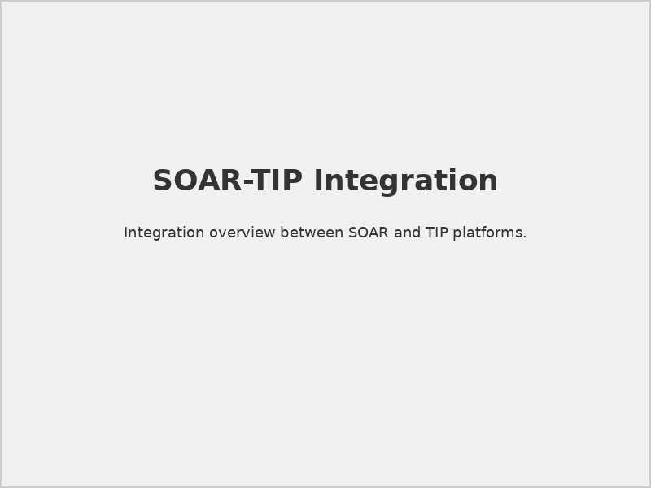
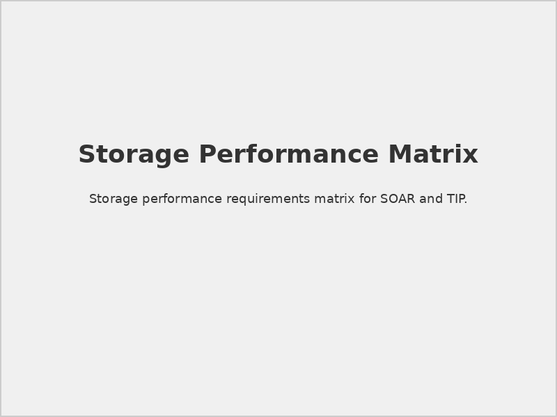
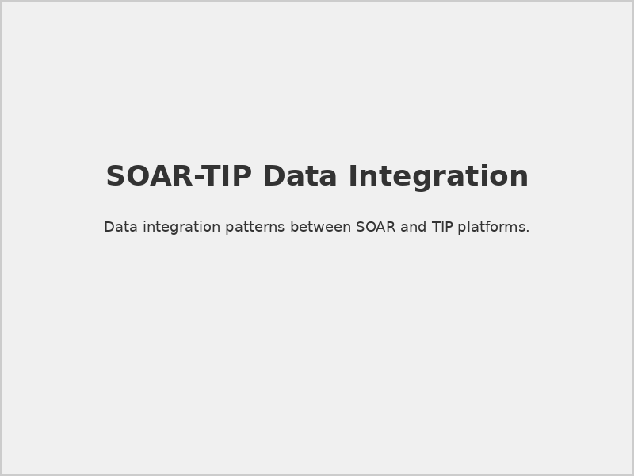
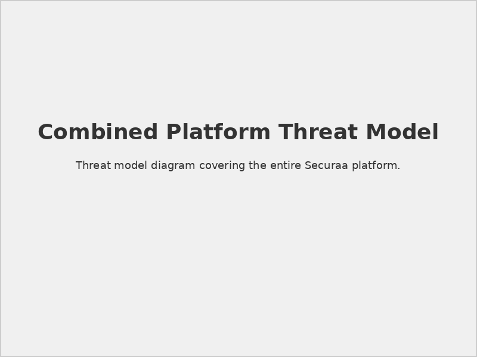
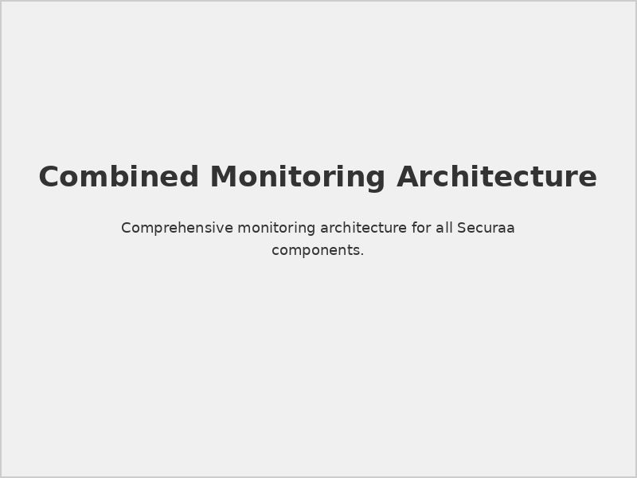

# Securaa Prerequisites For SOAR & TIP

## 📋 Document Overview

**Document Name:** Securaa Prerequisites For SOAR & TIP.pdf  
**Pages:** Multiple pages  
**Category:** Prerequisites and Setup  
**Scope:** Combined SOAR and TIP Deployment  
**Last Updated:** As per document timestamp  

## 📝 Description

This comprehensive document provides integrated prerequisites and requirements for joint deployment of Securaa's Security Orchestration, Automation and Response (SOAR) and Threat Intelligence Platform (TIP) solutions. It addresses the synergistic requirements and optimizations for combined platform deployment.

## 🎯 Purpose

To enable technical teams to prepare environments for integrated SOAR and TIP platform deployment, leveraging shared infrastructure and optimized configurations for enhanced security operations capabilities.

## 🔄 Integrated Platform Overview

### Combined Solution Benefits
- **Enhanced Automation:** TIP-driven automated response workflows
- **Intelligent Orchestration:** Threat intelligence-informed automation
- **Unified Operations:** Single platform for analysis and response
- **Shared Resources:** Optimized infrastructure utilization
- **Integrated Analytics:** Comprehensive security intelligence

### Platform Synergies

*Integrated SOAR and TIP platform architecture and data flows*

## 🏗️ Infrastructure Requirements (Combined)

### 1. **Enhanced Server Specifications**

#### Production Deployment (SOAR + TIP)
```yaml
# Combined Platform Infrastructure
combined_infrastructure:
  large_deployment:
    cpu_cores: 32
    memory_gb: 128
    storage_primary_tb: 5
    storage_backup_tb: 10
    network_bandwidth: "25 Gbps"
    storage_type: "NVMe SSD with high IOPS"
  
  medium_deployment:
    cpu_cores: 24
    memory_gb: 96
    storage_primary_tb: 2
    storage_backup_tb: 5
    network_bandwidth: "10 Gbps"
    storage_type: "Enterprise SSD"
  
  small_deployment:
    cpu_cores: 16
    memory_gb: 64
    storage_primary_tb: 1
    storage_backup_tb: 2
    network_bandwidth: "10 Gbps"
    storage_type: "High-performance SSD"
```

#### Resource Allocation Strategy
- **SOAR Components:** 60% of total resources
- **TIP Components:** 30% of total resources
- **Shared Services:** 10% of total resources (databases, caching, etc.)

### 2. **Storage Architecture (Optimized)**

#### Data Storage Distribution
```yaml
# Storage allocation for combined deployment
storage_allocation:
  soar_data:
    cases_incidents: "20%"
    playbook_logs: "15%"
    integration_data: "10%"
  
  tip_data:
    threat_intelligence: "30%"
    ioc_database: "15%"
    feed_cache: "5%"
  
  shared_data:
    system_logs: "3%"
    backup_space: "2%"
```

#### Performance Requirements

*Storage performance requirements for different data types*

## 🌐 Enhanced Network Requirements

### 1. **Network Architecture (Integrated)**

#### Network Segmentation
```yaml
# Network segmentation for SOAR+TIP
network_segments:
  management_network:
    subnet: "10.100.0.0/24"
    purpose: "Platform management and administration"
    security_zone: "management"
  
  soar_processing:
    subnet: "10.101.0.0/24"
    purpose: "SOAR automation and orchestration"
    security_zone: "processing"
  
  tip_intelligence:
    subnet: "10.102.0.0/24"
    purpose: "Threat intelligence processing"
    security_zone: "intelligence"
  
  integration_network:
    subnet: "10.103.0.0/24"
    purpose: "External system integrations"
    security_zone: "integration"
  
  shared_services:
    subnet: "10.104.0.0/24"
    purpose: "Databases, messaging, caching"
    security_zone: "shared"
```

#### Bandwidth Planning
| Component | Peak Usage | Sustained Usage | Notes |
|-----------|------------|-----------------|-------|
| **TIP Feed Processing** | 2 Gbps | 500 Mbps | Threat intelligence ingestion |
| **SOAR Automation** | 1 Gbps | 200 Mbps | API calls and integrations |
| **Inter-Platform Comm** | 500 Mbps | 100 Mbps | SOAR-TIP data exchange |
| **User Interface** | 100 Mbps | 50 Mbps | Web UI and dashboards |
| **Backup/Replication** | 5 Gbps | 1 Gbps | Data protection activities |

### 2. **Port Configuration (Comprehensive)**

#### Application Ports
| Service | Port | Protocol | Direction | Component | Purpose |
|---------|------|----------|-----------|-----------|---------|
| Web UI | 443 | HTTPS | Inbound | Both | User interface |
| SOAR API | 8443 | HTTPS | Bidirectional | SOAR | REST/GraphQL API |
| TIP API | 8444 | HTTPS | Bidirectional | TIP | Threat intelligence API |
| TI Feeds | 8445 | HTTPS | Inbound | TIP | External feed ingestion |
| Webhooks | 9443 | HTTPS | Inbound | SOAR | External notifications |
| Inter-Platform | 7443 | HTTPS | Internal | Both | SOAR-TIP communication |

#### Database Ports
| Database | Port | Protocol | Access | Purpose |
|----------|------|----------|--------|---------|
| PostgreSQL (Primary) | 5432 | PostgreSQL | Internal | Main application database |
| Elasticsearch | 9200,9300 | HTTP/Transport | Internal | Search and analytics |
| Redis Cluster | 6379,16379 | Redis/Cluster | Internal | Caching and sessions |
| InfluxDB | 8086 | HTTP | Internal | Time-series metrics |

## 📊 Database Architecture (Enhanced)

### 1. **Multi-Database Strategy**

#### Database Distribution
```sql
-- PostgreSQL: Primary application database
-- Databases for combined deployment
CREATE DATABASE securaa_soar;
CREATE DATABASE securaa_tip;
CREATE DATABASE securaa_shared;

-- Optimized configuration for combined workload
ALTER SYSTEM SET shared_buffers = '32GB';
ALTER SYSTEM SET effective_cache_size = '96GB';
ALTER SYSTEM SET work_mem = '512MB';
ALTER SYSTEM SET maintenance_work_mem = '4GB';
ALTER SYSTEM SET max_connections = 500;
ALTER SYSTEM SET max_parallel_workers = 16;
```

#### Elasticsearch Configuration
```yaml
# Elasticsearch cluster for combined deployment
elasticsearch_config:
  cluster_name: "securaa-combined"
  nodes: 3
  node_roles:
    - master: true
      data: true
      ingest: true
  
  indices:
    soar_cases:
      shards: 3
      replicas: 1
      refresh_interval: "5s"
    
    tip_intelligence:
      shards: 5
      replicas: 1
      refresh_interval: "30s"
    
    unified_events:
      shards: 6
      replicas: 1
      refresh_interval: "1s"
  
  memory_settings:
    heap_size: "16g"
    field_data_cache: "40%"
    query_cache: "10%"
```

### 2. **Data Integration Patterns**

#### Cross-Platform Data Flow

*Data sharing and integration patterns between SOAR and TIP*

#### Threat Intelligence Enrichment
```python
# Example: TIP enrichment for SOAR cases
class ThreatIntelligenceEnrichment:
    def __init__(self, tip_client, soar_client):
        self.tip = tip_client
        self.soar = soar_client
    
    def enrich_case(self, case_id):
        case = self.soar.get_case(case_id)
        indicators = self.extract_indicators(case)
        
        # Query TIP for threat intelligence
        threat_intel = self.tip.query_indicators(indicators)
        
        # Enrich case with threat intelligence
        enriched_data = self.correlate_intelligence(case, threat_intel)
        
        # Update SOAR case
        self.soar.update_case(case_id, enriched_data)
        
        return enriched_data
```

## 🔗 Integration Requirements (Combined)

### 1. **Enhanced SIEM Integration**

#### Multi-Platform SIEM Support
```yaml
# Enhanced SIEM integration for SOAR+TIP
siem_integrations:
  splunk_enterprise:
    soar_integration:
      - case_creation_from_alerts
      - automated_response_actions
      - investigation_enrichment
    tip_integration:
      - threat_intelligence_feeds
      - ioc_hunting_searches
      - threat_context_enrichment
  
  qradar:
    soar_integration:
      - offense_to_case_mapping
      - automated_rule_updates
      - response_orchestration
    tip_integration:
      - reference_set_updates
      - threat_feed_integration
      - attribution_data_sharing
```

#### Data Exchange Formats
- **STIX/TAXII 2.1:** Standardized threat intelligence exchange
- **CEF/LEEF:** Normalized log event formats
- **MISP:** Malware information sharing platform
- **OpenIOC:** Indicator of compromise format
- **YARA:** Malware identification rules

### 2. **Unified API Framework**

#### Combined API Architecture
```yaml
# Unified API gateway configuration
api_gateway:
  endpoints:
    soar:
      base_path: "/api/v2/soar"
      authentication: "oauth2"
      rate_limit: "1000/minute"
    
    tip:
      base_path: "/api/v2/tip"
      authentication: "oauth2"
      rate_limit: "2000/minute"
    
    unified:
      base_path: "/api/v2/unified"
      authentication: "oauth2"
      rate_limit: "500/minute"
  
  cross_platform:
    data_sharing: "enabled"
    event_streaming: "kafka"
    authentication: "shared_tokens"
```

## 🔐 Enhanced Security Requirements

### 1. **Comprehensive Security Architecture**

#### Zero Trust Implementation
```yaml
# Zero Trust configuration for combined platform
zero_trust_config:
  identity_verification:
    continuous_authentication: true
    risk_based_access: true
    device_compliance: required
  
  network_security:
    micro_segmentation: enabled
    east_west_encryption: required
    traffic_inspection: deep_packet_inspection
  
  data_protection:
    encryption_at_rest: "AES-256"
    encryption_in_transit: "TLS 1.3"
    key_rotation: "90 days"
    data_classification: enabled
```

#### Threat Model Considerations

*Comprehensive threat model for integrated SOAR and TIP deployment*

### 2. **Compliance Requirements**

#### Regulatory Frameworks
- **SOC 2 Type II:** Security controls and procedures
- **ISO 27001:** Information security management
- **NIST Cybersecurity Framework:** Security control implementation
- **GDPR:** Data protection and privacy requirements
- **PCI DSS:** Payment card industry compliance (if applicable)

#### Audit and Logging
```yaml
# Comprehensive audit configuration
audit_config:
  log_sources:
    - platform_activities
    - user_authentication
    - data_access
    - configuration_changes
    - integration_activities
  
  retention_periods:
    security_logs: "7 years"
    audit_trails: "7 years"
    performance_logs: "1 year"
    debug_logs: "30 days"
  
  siem_forwarding:
    enabled: true
    format: "CEF"
    encryption: "TLS 1.3"
    compression: "gzip"
```

## 📈 Performance Optimization (Combined)

### 1. **Resource Optimization**

#### Memory Management
```yaml
# Optimized memory allocation
memory_optimization:
  jvm_settings:
    elasticsearch_heap: "16g"
    application_heap: "8g"
    cache_allocation: "24g"
  
  database_buffers:
    postgresql_shared_buffers: "32g"
    postgresql_effective_cache: "96g"
  
  application_caches:
    threat_intelligence_cache: "8g"
    case_data_cache: "4g"
    session_cache: "2g"
```

#### CPU Optimization
- **Thread Pool Management:** Optimized for concurrent processing
- **Process Isolation:** Separate processes for SOAR and TIP
- **Resource Scheduling:** Priority-based task scheduling
- **Load Balancing:** Intelligent workload distribution

### 2. **Monitoring and Alerting (Enhanced)**

#### Comprehensive Monitoring

*Monitoring architecture for integrated SOAR and TIP platforms*

#### Performance Metrics
```yaml
# Key performance indicators
performance_metrics:
  soar_metrics:
    - playbook_execution_time
    - case_resolution_time
    - automation_success_rate
    - integration_response_time
  
  tip_metrics:
    - threat_feed_processing_rate
    - intelligence_query_response_time
    - ioc_enrichment_accuracy
    - feed_ingestion_latency
  
  combined_metrics:
    - cross_platform_data_sync_time
    - unified_dashboard_load_time
    - combined_workflow_efficiency
    - overall_system_availability
```

## ⚠️ Implementation Considerations

> **Resource Planning:** Combined deployment requires careful resource planning to avoid performance bottlenecks.

> **Data Synchronization:** Ensure proper data synchronization mechanisms between SOAR and TIP components.

> **Backup Strategy:** Implement comprehensive backup strategy covering both platforms and shared data.

> **Disaster Recovery:** Plan for coordinated disaster recovery across both platforms.

## 🔗 Related Documents

- [Prerequisites for SOAR](./Prerequisites-for-SOAR-README.md) - SOAR-specific requirements
- [Prerequisites for SIA, SOAR, TIP & CSAM](./Prerequisites-for-SIA-SOAR-TIP-CSAM-README.md) - Complete platform prerequisites
- [STS-Securaa Solution Architecture](./STS-Securaa-Solution-Architecture-README.md) - Architecture overview
- [Securaa TIP Administration Guide v2](./Securaa-TIP-Administration-Guide-v2-README.md) - TIP administration
- [Securaa Installation and Deployment Guide](./Securaa-Installation-and-Deployment-Guide-README.md) - Installation procedures

## 📞 Support Information

For combined SOAR and TIP deployment support:

- **Solution Architecture:** Combined platform architecture consultation
- **Integration Engineering:** Cross-platform integration support
- **Performance Optimization:** Combined platform tuning and optimization
- **Security Consultation:** Comprehensive security implementation guidance

---

*This README provides an overview of the Securaa Prerequisites For SOAR & TIP document. For detailed technical specifications and integrated deployment procedures, refer to the complete PDF document.*