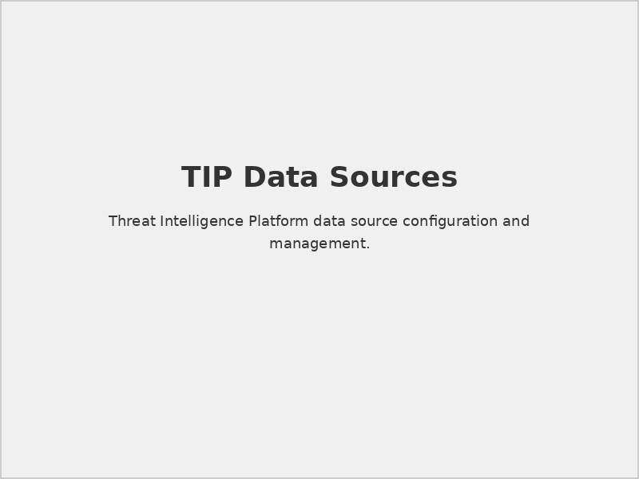
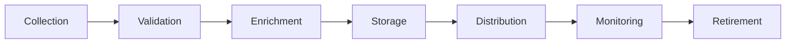
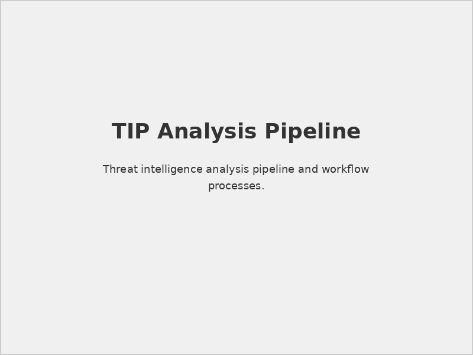
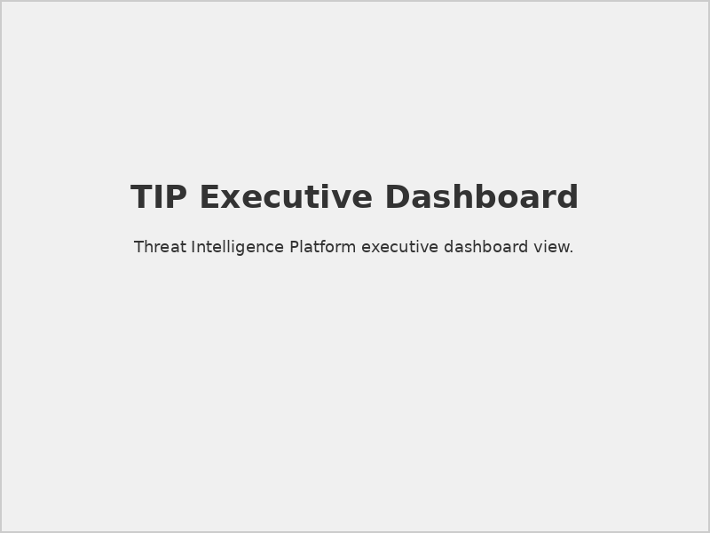
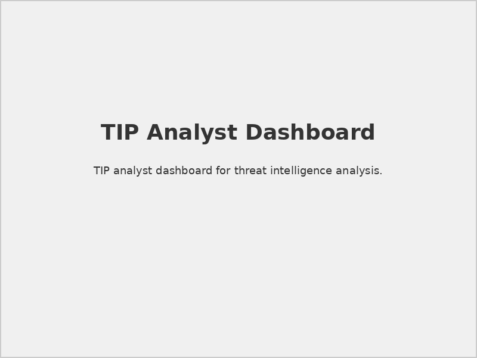

# Securaa TIP Administration Guide v2

## 📋 Document Overview

**Document Name:** Securaa TIP Administration Guide_v2.pdf  
**Pages:** Multiple pages  
**Category:** Administration Guides  
**Version:** 2.0  
**Last Updated:** As per document timestamp  

## 📝 Description

This updated administration guide provides comprehensive instructions for managing and administering the Securaa Threat Intelligence Platform (TIP). Version 2 includes enhanced features, improved workflows, and advanced threat intelligence capabilities for modern cybersecurity operations.

## 🎯 Purpose

To enable security analysts, threat intelligence teams, and system administrators to effectively deploy, configure, and manage the TIP platform for optimal threat intelligence operations and decision-making.

## 🔍 TIP Platform Overview

### Core Capabilities
- **Threat Data Aggregation:** Multi-source threat intelligence collection
- **IOC Management:** Indicators of Compromise processing and storage
- **Threat Analysis:** Advanced threat correlation and analysis
- **Intelligence Sharing:** Collaborative threat intelligence distribution
- **Automated Enrichment:** Context-aware threat data enhancement

### Key Features (v2)
- Enhanced API capabilities
- Machine learning-based threat scoring
- Improved threat hunting workflows
- Advanced visualization dashboards
- Real-time threat feed processing

## 🔧 System Administration

### 1. **Platform Configuration**

#### Initial Setup
```yaml
# TIP Configuration Example
tip_config:
  data_sources:
    - name: "Commercial Feed A"
      type: "STIX/TAXII"
      endpoint: "https://feed.provider.com/taxii2/"
      authentication: "api_key"
    - name: "Open Source Intel"
      type: "RSS"
      endpoint: "https://osint.feed.com/rss"
      refresh_interval: "1h"
  
  processing:
    confidence_threshold: 75
    auto_enrichment: true
    duplicate_detection: true
    
  storage:
    retention_period: "365d"
    archive_threshold: "90d"
```

#### Data Source Management

*Threat intelligence data source configuration interface*

### 2. **User Management and Roles**

#### Role-Based Access Control
- **TI Analyst:** Full threat intelligence analysis capabilities
- **Threat Hunter:** Advanced hunting and investigation tools
- **SOC Operator:** Operational threat intelligence consumption
- **Administrator:** Complete system administration access
- **Read-Only User:** View-only access to threat intelligence

#### User Permissions Matrix
| Function | Analyst | Hunter | SOC Operator | Admin | Read-Only |
|----------|---------|--------|--------------|-------|-----------|
| View Intelligence | ✓ | ✓ | ✓ | ✓ | ✓ |
| Create IOCs | ✓ | ✓ | ✗ | ✓ | ✗ |
| Threat Hunting | ✗ | ✓ | ✗ | ✓ | ✗ |
| System Config | ✗ | ✗ | ✗ | ✓ | ✗ |
| User Management | ✗ | ✗ | ✗ | ✓ | ✗ |

## 📊 Threat Intelligence Management

### 1. **IOC Management**

#### Indicator Types
- **File Hashes:** MD5, SHA1, SHA256 checksums
- **Network Indicators:** IP addresses, domains, URLs
- **Email Indicators:** Email addresses, subject patterns
- **Registry Keys:** Windows registry modifications
- **Behavioral Patterns:** Attack technique indicators

#### IOC Lifecycle


### 2. **Threat Feed Management**

#### Feed Categories
- **Commercial Feeds:** Paid threat intelligence services
- **Government Feeds:** National cybersecurity organizations
- **Industry Feeds:** Sector-specific threat intelligence
- **Open Source:** Publicly available threat data
- **Internal Sources:** Organization-specific intelligence

#### Feed Configuration
```json
{
  "feed_id": "commercial_feed_001",
  "name": "Premium Threat Intel Feed",
  "provider": "ThreatIntel Corp",
  "format": "STIX 2.1",
  "update_frequency": "15min",
  "confidence_scoring": "provider_weighted",
  "tags": ["apt", "malware", "phishing"],
  "filtering_rules": {
    "min_confidence": 70,
    "exclude_tags": ["test", "exercise"],
    "geographic_filter": ["US", "EU"]
  }
}
```

### 3. **Threat Analysis Workflows**

#### Analysis Pipeline

*Threat intelligence analysis and enrichment workflow*

#### Enrichment Processes
- **Contextual Analysis:** Threat actor attribution and campaign mapping
- **Technical Analysis:** Malware family identification and behavior analysis
- **Temporal Analysis:** Attack timeline and trend analysis
- **Geospatial Analysis:** Geographic threat distribution analysis

## 🔍 Threat Hunting Operations

### 1. **Hunt Management**

#### Hunt Planning
- **Hypothesis Development:** Threat-based hunting hypotheses
- **Data Requirements:** Identifying necessary data sources
- **Tool Selection:** Appropriate hunting tools and techniques
- **Success Metrics:** Defining hunt success criteria

#### Hunt Execution
```python
# Example threat hunting query
hunt_query = {
    "timeframe": "last_30_days",
    "indicators": [
        {"type": "ip", "value": "192.168.1.100"},
        {"type": "domain", "value": "malicious.example.com"}
    ],
    "data_sources": ["network_logs", "dns_logs", "proxy_logs"],
    "correlation_rules": ["lateral_movement", "data_exfiltration"]
}
```

### 2. **Investigation Tools**

#### Query Interface
- **Advanced Search:** Complex multi-indicator searches
- **Timeline Analysis:** Chronological threat activity analysis
- **Graph Visualization:** Relationship mapping and analysis
- **Statistical Analysis:** Trend and pattern identification

#### Collaboration Features
- **Case Management:** Investigation case tracking
- **Analyst Notes:** Collaborative analysis documentation
- **Evidence Collection:** Digital evidence preservation
- **Report Generation:** Investigation report creation

## 📈 Analytics and Reporting

### 1. **Threat Intelligence Dashboards**

#### Executive Dashboard

*High-level threat intelligence overview for leadership*

#### Analyst Dashboard

*Detailed threat intelligence operational dashboard*

### 2. **Reporting Capabilities**

#### Automated Reports
- **Daily Threat Briefing:** Current threat landscape summary
- **Weekly Intelligence Summary:** Comprehensive threat analysis
- **Monthly Trend Report:** Long-term threat trend analysis
- **Incident-Driven Reports:** Event-specific intelligence reports

#### Custom Reports
```yaml
# Custom Report Configuration
report_config:
  name: "APT Campaign Analysis"
  frequency: "weekly"
  data_sources:
    - "apt_indicators"
    - "campaign_tracking"
    - "attribution_data"
  filters:
    - threat_actor: ["APT1", "APT28", "APT29"]
    - confidence: ">= 80"
    - timeframe: "last_7_days"
  output_format: "PDF"
  distribution: ["soc@company.com", "ciso@company.com"]
```

## 🔧 Integration Management

### 1. **SIEM Integration**

#### Integration Patterns
- **Real-time Feeds:** Live threat intelligence streaming
- **Batch Updates:** Scheduled intelligence updates
- **On-Demand Queries:** Interactive intelligence lookups
- **Alert Enrichment:** Automatic alert context enhancement

#### Configuration Example
```xml
<!-- SIEM Integration Configuration -->
<integration>
    <destination>splunk_enterprise</destination>
    <format>CEF</format>
    <frequency>real-time</frequency>
    <filters>
        <confidence_min>75</confidence_min>
        <severity>high,critical</severity>
    </filters>
</integration>
```

### 2. **API Management**

#### API Endpoints
- **REST API:** Standard HTTP-based interface
- **GraphQL:** Flexible query interface
- **Webhook Support:** Event-driven notifications
- **Bulk Operations:** High-volume data operations

#### API Security
- **Authentication:** API key and OAuth 2.0 support
- **Rate Limiting:** API usage control and protection
- **Audit Logging:** Complete API access logging
- **Data Validation:** Input validation and sanitization

## 🔒 Security and Compliance

### 1. **Data Protection**

#### Encryption
- **Data at Rest:** Database encryption with AES-256
- **Data in Transit:** TLS 1.3 for all communications
- **Key Management:** Hardware security module (HSM) support
- **Certificate Management:** Automated certificate lifecycle

#### Access Controls
- **Multi-Factor Authentication:** Enhanced login security
- **IP Restrictions:** Geographic and network-based access control
- **Session Management:** Secure session handling
- **Privilege Escalation:** Controlled administrative access

### 2. **Compliance Features**

#### Audit Capabilities
- **Activity Logging:** Comprehensive user activity tracking
- **Data Lineage:** Intelligence source and modification tracking
- **Retention Policies:** Automated data lifecycle management
- **Compliance Reporting:** Regulatory compliance documentation

## ⚠️ Best Practices

> **Intelligence Quality:** Implement rigorous confidence scoring and source validation to maintain high-quality threat intelligence.

> **Performance Optimization:** Regular maintenance of threat intelligence databases for optimal query performance.

> **Privacy Protection:** Ensure proper handling of sensitive threat intelligence data and implement appropriate sharing controls.

## 🔗 Related Documents

- [STS-Securaa Solution Architecture](./STS-Securaa-Solution-Architecture-README.md) - Platform architecture
- [Prerequisites for SIA, SOAR, TIP & CSAM](./Prerequisites-for-SIA-SOAR-TIP-CSAM-README.md) - System requirements
- [Securaa Installation and Deployment Guide](./Securaa-Installation-and-Deployment-Guide-README.md) - Installation procedures

## 📞 Support Information

For TIP administration and operations:

- **Technical Support:** 24/7 threat intelligence platform support
- **Threat Intelligence Services:** Expert threat analysis and research
- **Training Programs:** TIP administration and analysis training
- **Professional Services:** Custom threat intelligence solutions

---

*This README provides an overview of the Securaa TIP Administration Guide v2. For detailed configuration procedures, advanced features, and troubleshooting guidance, refer to the complete PDF document.*